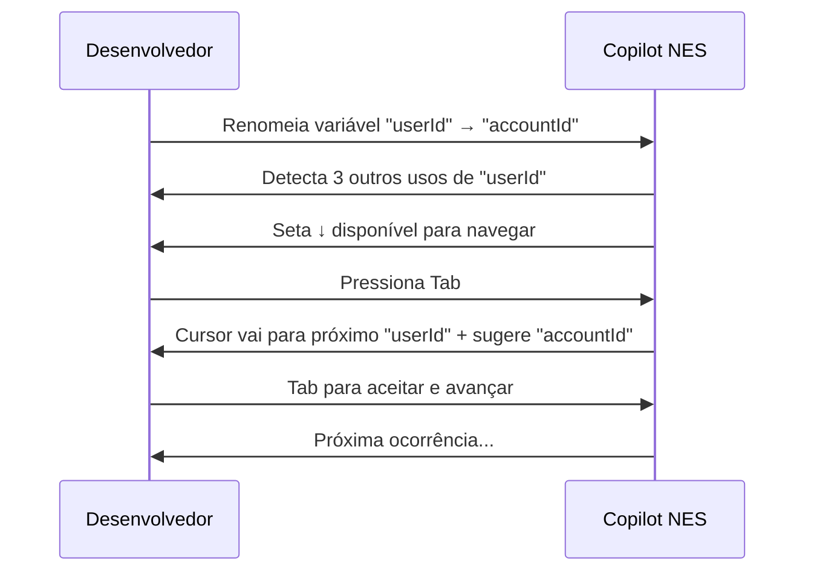
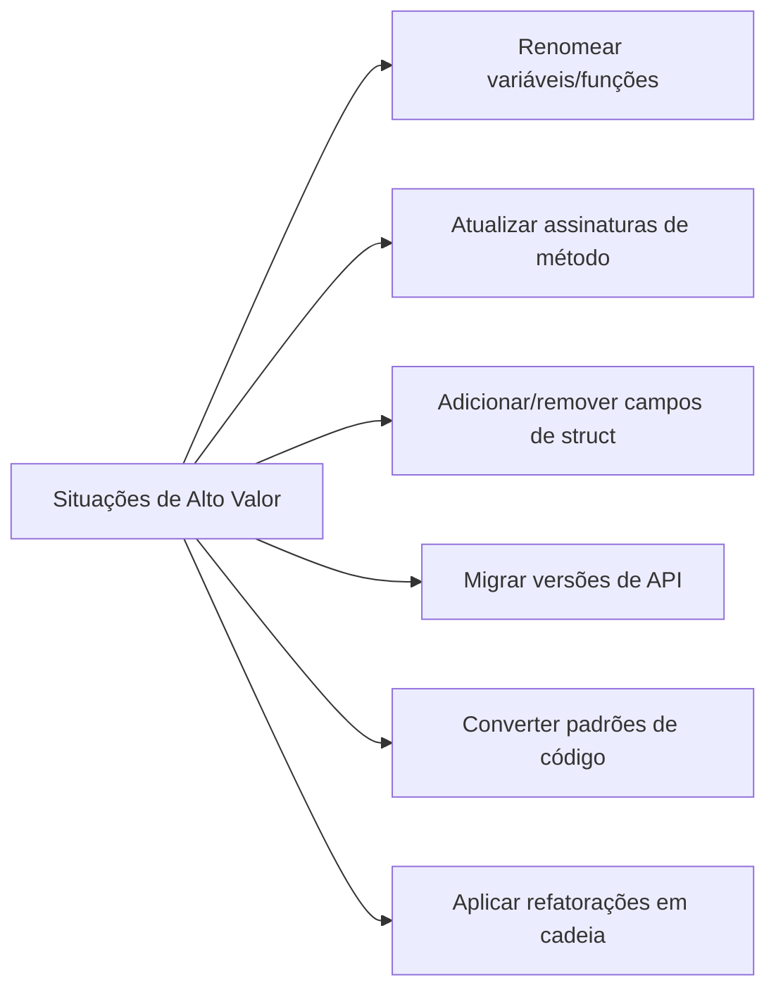

# 03 — Next Edit Suggestions

> **Objetivo:** Entender e usar o Next Edit Suggestions (NES) — o modo do Copilot que prevê onde você vai editar em seguida e o que vai escrever.

---

## O que é Next Edit Suggestions

Next Edit Suggestions (NES) é uma capacidade do GitHub Copilot que vai além do completion linear. Enquanto completions clássicas sugerem o que vem logo após o cursor, o NES:

1. **Observa** a edição que você acabou de fazer
2. **Prevê** quais outros pontos do arquivo precisam de mudanças relacionadas
3. **Navega** o cursor até esses pontos automaticamente
4. **Sugere** o que escrever em cada ponto



> 📌 **Referência:** docs.github.com/en/copilot/using-github-copilot/using-next-edit-suggestions

---

## Como Funciona na Prática

### Cenário: Renomear um parâmetro

```typescript
// Você muda a assinatura da função:
// ANTES
function createUser(userId: string, userName: string) {
    const query = `INSERT INTO users VALUES ($userId, $userName)`;
    logger.info(`Creating user ${userId}`);
    return db.execute(query, { userId, userName });
}

// DEPOIS — você muda "userId" para "accountId" na assinatura
function createUser(accountId: string, userName: string) {
    // ↓ NES detecta os outros usos e propõe edições em cadeia
    const query = `INSERT INTO users VALUES ($accountId, $userName)`;
    //                                        ↑ sugestão automática
```

### Cenário: Adicionar um novo campo a uma struct

```go
// Você adiciona "Email" à struct User:
type User struct {
    ID   int
    Name string
    Email string  // ← você adicionou
}

// NES pode sugerir edições em:
// - Função de criação (NewUser)
// - Função de serialização (ToJSON)
// - Testes que usam User{}
```

---

## Controles do NES

| Ação | Tecla | Resultado |
|------|-------|-----------|
| Navegar para próxima sugestão | `Tab` (quando seta ↓ aparece) | Move cursor + mostra sugestão |
| Aceitar sugestão no novo local | `Tab` | Aplica e avança |
| Pular sugestão | `Esc` | Descarta a sugestão atual |
| Aceitar parcialmente | `Ctrl+→` | Aceita palavra por palavra |

**Indicador visual:** Uma seta `↓` aparece na gutter (margem esquerda) do editor indicando que há uma próxima edição sugerida.

---

## Quando o NES é Mais Útil



### ✅ NES funciona bem para:
- Edições **estruturalmente relacionadas** no mesmo arquivo
- Mudanças que seguem um **padrão repetível**
- Refatorações onde a primeira edição implica as seguintes

### ❌ NES não substitui:
- Rename global em múltiplos arquivos (use o rename do IDE)
- Refatorações que exigem análise semântica complexa
- Mudanças que requerem contexto fora do arquivo atual

---

## Ativar e Configurar o NES

### Verificar se está ativo

O NES requer:
- GitHub Copilot instalado e autenticado
- VS Code com a extensão Copilot atualizada

### Configuração no VS Code

```json
// settings.json
{
  // NES é habilitado por padrão quando Copilot está ativo
  // Não há configuração específica para ligar/desligar o NES
  // isoladamente — ele faz parte do sistema de sugestões inline

  "editor.inlineSuggest.enabled": true,
  "github.copilot.nextEditSuggestions.enabled": true
}
```

> 📌 **Referência:** docs.github.com/en/copilot/using-github-copilot/using-next-edit-suggestions#enabling-or-disabling-next-edit-suggestions

---

## Comparativo: Completion Clássica vs NES

| Aspecto | Completion Clássica | Next Edit Suggestions |
|---------|--------------------|-----------------------|
| **Gatilho** | Cursor parado / digitando | Após fazer uma edição |
| **Foco** | O que vem após o cursor | Onde editar em seguida |
| **Navegação** | Não move o cursor | Move cursor para o próximo ponto |
| **Contexto** | Local (próximo ao cursor) | Estrutural (relações no arquivo) |
| **Caso de uso principal** | Gerar código novo | Propagar mudanças relacionadas |

---

## ✅ Pontos-chave do Capítulo

- NES prevê **onde você vai editar em seguida**, não só o que vem após o cursor
- Funciona melhor para mudanças em cadeia: renomear, adicionar campos, migrar APIs
- A seta `↓` na margem indica que há uma sugestão de próximo edit disponível
- `Tab` navega até o próximo ponto E aceita a sugestão — dois passos em um
- NES opera dentro do arquivo atual; para mudanças cross-file, use ferramentas de rename do IDE
- Está habilitado por padrão com o Copilot ativo

---

## 🔗 Próxima Aula

👉 [04 — Copilot Chat](./04-copilot-chat.md)
