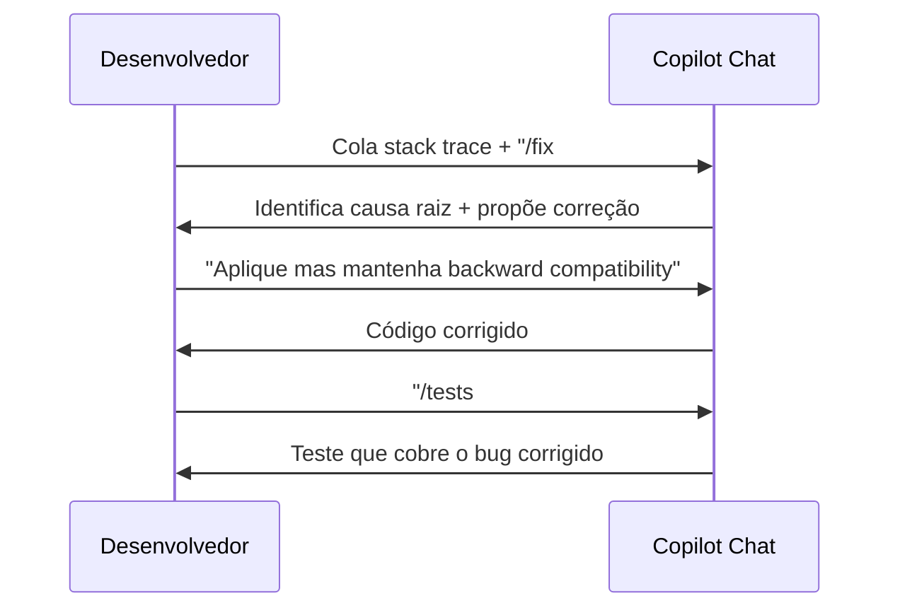

# 04 — Copilot Chat

> **Objetivo:** Usar o Copilot Chat com proficiência — variáveis de contexto, participantes, slash commands e padrões que maximizam a qualidade das respostas.

---

## O que é o Copilot Chat

Copilot Chat é a interface conversacional do GitHub Copilot integrada ao IDE. Diferente das completions inline (que operam na linha do cursor), o Chat permite:

- Fazer perguntas sobre código existente
- Solicitar explicações, refatorações e geração de código
- Referenciar arquivos, símbolos e trechos específicos como contexto
- Executar comandos especializados via slash commands

> 📌 **Referência:** docs.github.com/en/copilot/using-github-copilot/copilot-chat/asking-github-copilot-questions-in-your-ide

---

## Abrir o Chat

| Método | VS Code | JetBrains |
|--------|---------|-----------|
| Painel lateral | `Ctrl+Alt+I` | `Ctrl+Shift+I` |
| Chat inline no editor | `Ctrl+I` | `Ctrl+Shift+G` |
| Menu de contexto | Clic direito → "Copilot" | Clic direito → "GitHub Copilot" |

### Tipos de Janela de Chat

```
┌─ Chat Panel (lateral) ──────────────┐
│ Conversas persistentes na sessão    │
│ Suporta histórico                   │
│ Ideal para perguntas longas         │
└─────────────────────────────────────┘

┌─ Inline Chat (no editor) ───────────┐
│ Abre direto no código selecionado   │
│ Resultado aplicado inline           │
│ Ideal para edições rápidas          │
└─────────────────────────────────────┘
```

---

## Variáveis de Contexto (Chat Variables)

As variáveis permitem referenciar contexto específico na sua mensagem:

| Variável | O que inclui | Exemplo de uso |
|----------|-------------|----------------|
| `#file` | Arquivo específico | `Explique #file:auth.ts` |
| `#selection` | Código selecionado no editor | `Refatore #selection para usar async/await` |
| `#codebase` | Busca semântica no workspace | `Como #codebase trata autenticação?` |
| `#editor` | Conteúdo do arquivo ativo | `O que faz este arquivo? #editor` |
| `#terminalLastCommand` | Último comando + output do terminal | `Por que #terminalLastCommand falhou?` |
| `#terminalSelection` | Seleção no terminal integrado | `Explique #terminalSelection` |
| `#symbol` | Símbolo específico (função, classe) | `Explique #symbol:UserService` |

> 📌 **Referência:** docs.github.com/en/copilot/using-github-copilot/copilot-chat/asking-github-copilot-questions-in-your-ide#chat-context

---

## Participantes de Chat (@ mentions)

Os participantes são agentes especializados acessíveis via `@`:

| Participante | Especialidade |
|-------------|--------------|
| `@workspace` | Entende a estrutura completa do projeto |
| `@vscode` | Responde sobre configurações e extensões do VS Code |
| `@terminal` | Auxilia com comandos e scripts de terminal |
| `@github` | Acessa dados do GitHub: issues, PRs, repos |

```
Exemplos:
@workspace Como este projeto gerencia dependências?
@vscode Como configuro o formatter para TypeScript?
@terminal Qual comando limpa o cache do Docker?
@github Quais issues estão abertas com label "bug"?
```

> 📌 **Referência:** docs.github.com/en/copilot/using-github-copilot/copilot-chat/asking-github-copilot-questions-in-your-ide#using-chat-participants

---

## Slash Commands

Slash commands ativam comportamentos especializados do Copilot:

| Comando | O que faz |
|---------|-----------|
| `/explain` | Explica o código selecionado ou referenciado |
| `/fix` | Propõe correção para o código ou erro selecionado |
| `/tests` | Gera testes para o código selecionado |
| `/doc` | Gera documentação (docstring, JSDoc, etc.) |
| `/new` | Cria um novo arquivo ou projeto |
| `/newNotebook` | Cria um Jupyter Notebook |
| `/clear` | Limpa o histórico da conversa atual |

```
Exemplos de uso:
/explain #selection
/fix #terminalLastCommand
/tests #file:paymentService.ts
/doc #symbol:calculateTax
```

> 📌 **Referência:** docs.github.com/en/copilot/using-github-copilot/copilot-chat/asking-github-copilot-questions-in-your-ide#slash-commands

---

## Padrões de Prompt Eficazes no Chat

### ✅ Com contexto explícito

```
❌ "Esse código tem um bug"
✅ "/fix #selection — o cálculo de desconto não considera itens com preço zero"
```

### ✅ Com instrução de formato

```
❌ "Me ajuda com os testes"
✅ "/tests #file:orderService.ts — gere testes Jest com describe/it, cubra edge cases de pedido vazio e quantidade negativa"
```

### ✅ Iterativo

```
Turno 1: "Explique como #file:authMiddleware.ts valida o token"
Turno 2: "Agora refatore para suportar tokens de refresh sem alterar a assinatura pública"
Turno 3: "/tests — gere testes para os dois fluxos"
```

---

## Fluxo Típico de Debugging com Chat



---

## Chat no GitHub.com

O Copilot Chat também está disponível diretamente em github.com:

- **Em qualquer repositório**: pergunta sobre o código sem abrir o IDE
- **Em Pull Requests**: solicita explicação das mudanças, pede sugestões de revisão
- **Em Issues**: gera plano de implementação a partir da descrição

> 📌 **Referência:** docs.github.com/en/copilot/using-github-copilot/copilot-chat/asking-github-copilot-questions-in-githubcom

---

## ✅ Pontos-chave do Capítulo

- `Ctrl+Alt+I` abre o painel de chat; `Ctrl+I` abre o chat inline no editor
- Variáveis (`#file`, `#selection`, `#codebase`) injetam contexto preciso na mensagem
- Participantes (`@workspace`, `@vscode`, `@terminal`, `@github`) especializam o comportamento
- Slash commands (`/explain`, `/fix`, `/tests`, `/doc`) ativam tarefas pré-definidas
- Chat iterativo produz melhores resultados do que uma única mensagem longa
- O Chat no github.com funciona sem abrir o IDE — útil para revisões e triagem

---

## 🔗 Próxima Seção

👉 [Exercícios do Capítulo 07](./05-exercicios.md)
