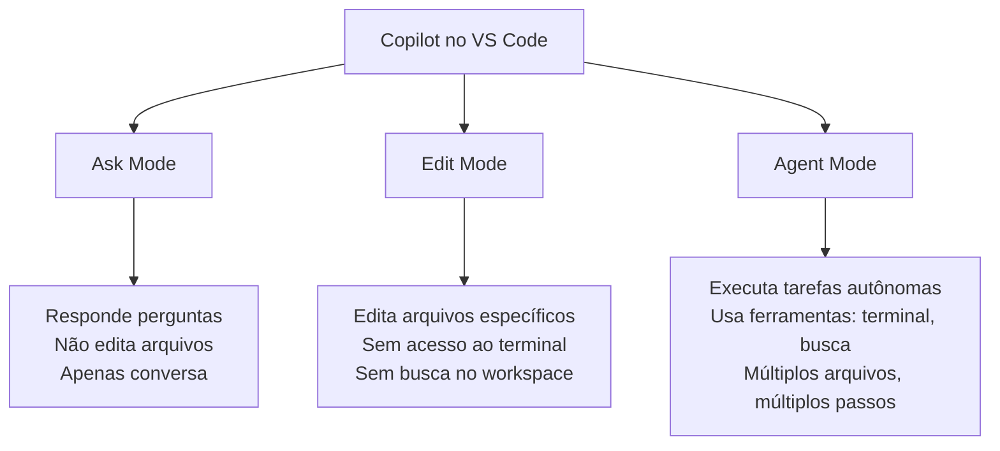
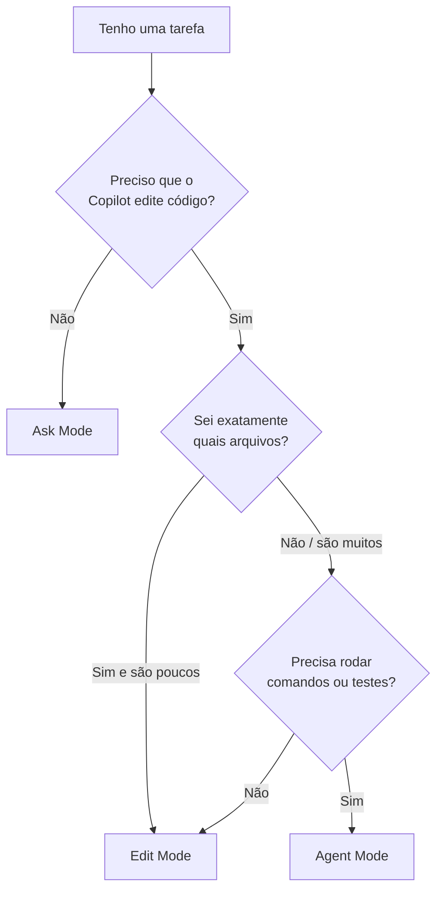

# 01 — Edit Mode vs Agent Mode

> **Objetivo:** Entender as diferenças entre Edit Mode e Agent Mode e saber escolher o modo certo para cada tarefa.

---

## Os Modos de Operação do Copilot no IDE

O GitHub Copilot no VS Code opera em três modos distintos para edição de código:



> 📌 **Referência:** docs.github.com/en/copilot/using-github-copilot/using-copilot-coding-agent-in-the-ide

---

## Ask Mode

O modo padrão do Copilot Chat. Apenas conversa — não faz edições.

```
Quando usar:
✅ Explicações de código
✅ Perguntas arquiteturais
✅ Entender um bug antes de corrigi-lo
✅ Pesquisar padrões e abordagens

Não usar quando:
❌ Você quer que o Copilot aplique as mudanças
❌ A tarefa envolve múltiplos arquivos
```

---

## Edit Mode

Edit Mode permite que o Copilot aplique edições diretamente nos arquivos que você indicar.

```
Como ativar: Dropdown no chat → "Edit"
```

### Características do Edit Mode

| Aspecto | Comportamento |
|---------|--------------|
| Arquivos editados | Apenas os que você adicionar explicitamente |
| Acesso ao terminal | ❌ Não |
| Busca no workspace | ❌ Não |
| Execução de testes | ❌ Não |
| Revisão das mudanças | Diff visual antes de aceitar |
| Iteração | Você revisa e pede ajustes |

### Quando Usar Edit Mode

```
✅ Refatorações bem definidas em arquivos conhecidos
✅ Atualizar múltiplos arquivos com uma mudança específica
✅ Traduzir código de uma linguagem para outra
✅ Aplicar um padrão de código em arquivo(s) selecionado(s)
✅ Quando você quer controle total sobre quais arquivos são tocados
```

---

## Agent Mode

Agent Mode dá ao Copilot autonomia para planejar e executar tarefas de múltiplos passos, usando ferramentas como terminal, busca e edição de arquivos.

```
Como ativar: Dropdown no chat → "Agent"
```

### Ferramentas Disponíveis no Agent Mode

| Ferramenta | O que faz |
|-----------|-----------|
| Edição de arquivos | Lê, cria, modifica arquivos no workspace |
| Terminal | Executa comandos (com sua aprovação) |
| Busca no workspace | Encontra arquivos e símbolos relevantes |
| Erros de compilação | Detecta e corrige erros em tempo real |
| Execução de testes | Roda testes e analisa falhas |

> 📌 **Referência:** docs.github.com/en/copilot/using-github-copilot/using-copilot-coding-agent-in-the-ide#about-agent-mode

### Quando Usar Agent Mode

```
✅ Implementar uma feature completa do zero
✅ Corrigir um bug que envolve múltiplos arquivos
✅ Criar uma suite de testes para um módulo inteiro
✅ Refatorar uma estrutura de projeto
✅ Configurar tooling (ESLint, Docker, CI/CD)
✅ Tarefas onde você não sabe exatamente quais arquivos serão afetados
```

---

## Comparativo Completo

| Critério | Ask | Edit | Agent |
|---------|:---:|:----:|:-----:|
| Edita arquivos | ❌ | ✅ | ✅ |
| Você define quais arquivos | — | ✅ | ❌ (Copilot decide) |
| Acesso ao terminal | ❌ | ❌ | ✅ |
| Busca no workspace | ❌ | ❌ | ✅ |
| Roda testes | ❌ | ❌ | ✅ |
| Número de passos | 1 | 1-3 | Ilimitado |
| Consumo de tokens | Baixo | Médio | Alto |
| Controle do dev | Total | Alto | Compartilhado |
| Melhor para | Perguntas | Edições focadas | Tarefas abertas |

---

## Custo de Tokens por Modo

Agent Mode consome significativamente mais tokens por tarefa porque:

1. Faz múltiplas chamadas ao modelo (plan → execute → verify)
2. Lê vários arquivos para entender o contexto
3. Analisa erros e itera até a tarefa estar completa

```
Estimativa relativa de consumo:
Ask:   ████░░░░░░ (baixo)
Edit:  ████████░░ (médio)
Agent: ██████████ (alto — múltiplas iterações)
```

Essa é a razão para o Agent Mode estar disponível em planos pagos e ter limites de uso no plano Free.

---

## Decisão Rápida



---

## ✅ Pontos-chave do Capítulo

- Ask Mode é apenas conversacional — não toca arquivos
- Edit Mode edita arquivos que você seleciona explicitamente, sem acesso ao terminal
- Agent Mode executa tarefas autônomas usando terminal, busca e edição de múltiplos arquivos
- Agent Mode consome mais tokens; use para tarefas que justifiquem a autonomia
- Para tarefas simples e bem definidas, Edit Mode é mais eficiente e previsível
- Agent Mode não substitui revisão humana — sempre revise as mudanças aplicadas

---

## 🔗 Próxima Aula

👉 [02 — Configurando Agent Mode](./02-configurando-agent-mode.md)
