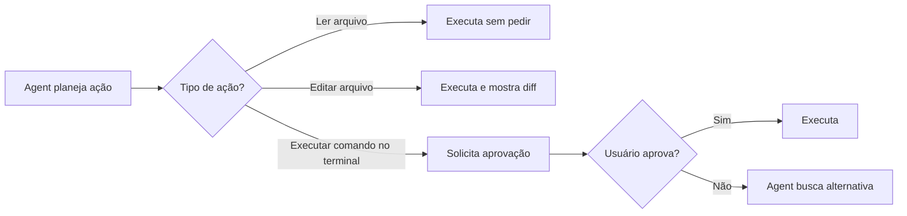
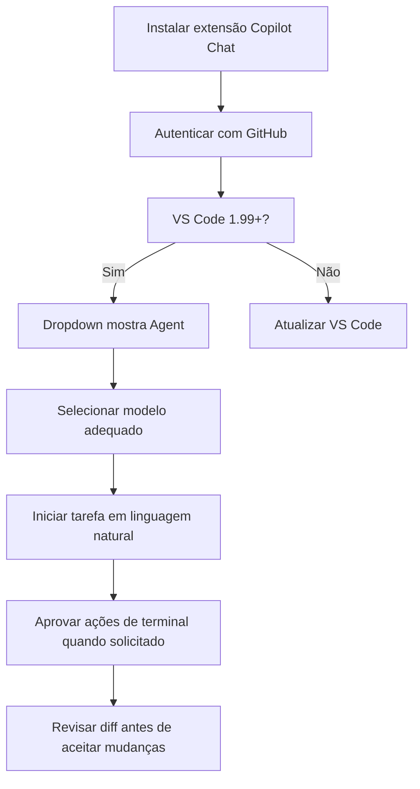

# 02 — Configurando Agent Mode

> **Objetivo:** Configurar o Agent Mode no VS Code e JetBrains, selecionar modelos e entender as opções de controle de execução.

---

## Requisitos

| Requisito | Detalhe |
|-----------|---------|
| Plano Copilot | Free (limitado), Pro, Pro+, Business ou Enterprise |
| VS Code | Versão 1.99 ou superior |
| Extensão | GitHub Copilot Chat (versão atualizada) |
| JetBrains | IntelliJ IDEA 2024.1+ com plugin Copilot atualizado |

> 📌 **Referência:** docs.github.com/en/copilot/using-github-copilot/using-copilot-coding-agent-in-the-ide#prerequisites

---

## Ativar Agent Mode no VS Code

### Via Dropdown no Chat

```
1. Abra o Copilot Chat (Ctrl+Alt+I)
2. Clique no dropdown de modo (exibe "Ask" por padrão)
3. Selecione "Agent"
4. O chat agora opera em Agent Mode
```

### Verificar se está ativo

O chat exibe indicadores visuais quando em Agent Mode:
- O dropdown mostra "Agent"
- Ao executar uma tarefa, você vê as ferramentas sendo chamadas em tempo real
- Comandos de terminal aparecem com botão de aprovação antes de executar

---

## Selecionar o Modelo no Agent Mode

O Agent Mode permite escolher o modelo de IA subjacente:

```
No chat em Agent Mode:
1. Clique no seletor de modelo (ícone ao lado do input)
2. Escolha entre os modelos disponíveis no seu plano
```

| Modelo | Características no Agent Mode |
|--------|------------------------------|
| GPT-4o | Equilibrado, bom para maioria das tarefas |
| Claude Sonnet 3.7 | Forte em raciocínio e código complexo |
| Claude Opus 4 | Máxima capacidade (Pro+ apenas) |
| o3 / o4-mini | Raciocínio avançado para problemas difíceis |

> 📌 **Referência:** docs.github.com/en/copilot/using-github-copilot/ai-models/changing-the-ai-model-for-copilot-chat

---

## Configuração no JetBrains

```
1. Instale o plugin "GitHub Copilot" (JetBrains Marketplace)
2. Autentique: Tools → GitHub Copilot → Sign in
3. Abra o Copilot Chat (ícone na barra lateral direita)
4. Selecione "Agent" no dropdown de modo
```

> 📌 **Referência:** docs.github.com/en/copilot/using-github-copilot/using-copilot-coding-agent-in-the-ide#using-agent-mode-in-jetbrains

---

## Controles de Execução

O Agent Mode solicita aprovação antes de executar ações potencialmente destrutivas:



### Aprovação de Comandos no Terminal

Quando o Agent quer executar um comando, você vê:

```
┌─ Copilot wants to run: ──────────────────┐
│ npm run test                              │
│                                           │
│ [Continue]  [Continue Always]  [Cancel]  │
└───────────────────────────────────────────┘
```

- **Continue**: Executa esse comando e volta a pedir aprovação na próxima vez
- **Continue Always**: Executa sem pedir para comandos similares na sessão
- **Cancel**: Bloqueia e o Agent busca uma alternativa

> 📌 **Referência:** docs.github.com/en/copilot/using-github-copilot/using-copilot-coding-agent-in-the-ide#terminal-command-approval

---

## Configurar Ferramentas Disponíveis

No VS Code, é possível controlar quais ferramentas o Agent pode usar:

```json
// .vscode/settings.json
{
  "github.copilot.chat.agent.runTasks": true,
  "github.copilot.chat.codesearch.enabled": true
}
```

Você também pode gerenciar as ferramentas dentro do chat clicando no ícone de ferramentas (🔧) no painel de chat.

> 📌 **Referência:** docs.github.com/en/copilot/using-github-copilot/using-copilot-coding-agent-in-the-ide#configuring-tools-for-agent-mode

---

## Dicas de Configuração para Times

### Compartilhar configuração via `.vscode/settings.json`

```json
{
  "github.copilot.enable": {
    "*": true
  },
  "github.copilot.chat.agent.runTasks": true,
  "chat.agent.maxRequests": 20
}
```

### Definir limite de iterações do Agent

```json
{
  // Número máximo de chamadas de ferramenta por sessão de agent
  "chat.agent.maxRequests": 15
}
```

Limitar as iterações evita que o Agent entre em loops longos em tarefas ambíguas.

---

## Fluxo de Setup Completo



---

## ✅ Pontos-chave do Capítulo

- Agent Mode requer VS Code 1.99+ com a extensão Copilot Chat atualizada
- Ative pelo dropdown "Ask → Agent" no painel de chat
- O modelo pode ser trocado por sessão — Claude Sonnet 3.7 e Opus 4 têm forte desempenho em código
- Ações de leitura são automáticas; edições são exibidas como diff; terminal requer aprovação explícita
- `Continue Always` permite fluxo contínuo em tarefas que envolvem muitos comandos
- `chat.agent.maxRequests` limita iterações para evitar loops em tarefas abertas

---

## 🔗 Próxima Aula

👉 [03 — Ferramentas do Agente](./03-ferramentas-do-agente.md)
