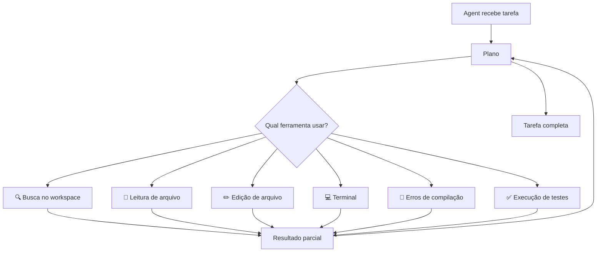

# 03 — Ferramentas do Agente

> **Objetivo:** Conhecer as ferramentas disponíveis no Agent Mode, entender o que cada uma faz e como o Agent as combina para completar tarefas.

---

## Visão Geral das Ferramentas

O Agent Mode do Copilot opera com um conjunto de ferramentas que ele escolhe e combina autonomamente para completar a tarefa. Você pode observar cada chamada de ferramenta em tempo real no painel de chat.



> 📌 **Referência:** docs.github.com/en/copilot/using-github-copilot/using-copilot-coding-agent-in-the-ide#about-agent-mode

---

## Ferramenta: Busca no Workspace

O Agent pode buscar arquivos e símbolos no workspace para entender o contexto antes de agir.

```
O que faz:
- Encontra arquivos por nome, padrão ou conteúdo
- Localiza definições de funções, classes e interfaces
- Entende a estrutura do projeto sem que você precise indicar os arquivos

Quando o Agent usa:
- No início de qualquer tarefa — mapeia o projeto
- Quando precisa entender como um módulo é usado
- Ao procurar exemplos de padrões existentes no código
```

**Como aparece no chat:**
```
> Searching workspace for "authentication middleware"
  Found: src/middleware/auth.ts, src/middleware/jwt.ts
```

---

## Ferramenta: Leitura de Arquivo

Lê o conteúdo completo de arquivos específicos.

```
O que faz:
- Lê código, configurações, documentação
- Não requer aprovação — é uma operação de leitura

Quando o Agent usa:
- Após a busca, para entender o conteúdo exato
- Para verificar imports e dependências
- Para entender testes existentes antes de gerar novos
```

---

## Ferramenta: Edição de Arquivo

Cria, modifica ou remove arquivos no workspace.

```
O que faz:
- Aplica mudanças em arquivos existentes
- Cria novos arquivos
- Exibe diff antes de confirmar

Quando o Agent usa:
- Para implementar a solução
- Para aplicar correções de bug
- Para gerar boilerplate e testes
```

**Controle:** Mudanças são exibidas como diff e podem ser aceitas ou descartadas arquivo por arquivo.

```
┌─ Copilot edited: src/services/payment.ts ──┐
│ - const fee = amount * 0.03;               │
│ + const fee = amount * getFeeRate(type);   │
│                                            │
│ [Accept]  [Discard]  [Show Changes]       │
└────────────────────────────────────────────┘
```

---

## Ferramenta: Terminal

Executa comandos no terminal integrado do VS Code.

```
O que faz:
- Instala dependências (npm install, pip install)
- Roda build e compilação
- Executa testes
- Executa scripts e utilitários CLI

Sempre pede aprovação:
- Mostra o comando antes de executar
- Você pode aprovar, bloquear ou "Continue Always"
```

**Exemplos de uso pelo Agent:**

```bash
# Instalar dependências após criar package.json
npm install

# Verificar se o projeto compila
npm run build

# Rodar testes para validar a implementação
npm test -- --coverage

# Inicializar configuração de ferramenta
npx eslint --init
```

> 📌 **Referência:** docs.github.com/en/copilot/using-github-copilot/using-copilot-coding-agent-in-the-ide#terminal-command-approval

---

## Ferramenta: Erros de Compilação

O Agent detecta e analisa erros de compilação em tempo real enquanto edita.

```
Fluxo:
1. Agent edita um arquivo
2. TypeScript / compilador sinaliza erro
3. Agent detecta o erro automaticamente
4. Agent propõe ou aplica correção
5. Ciclo se repete até zero erros de compilação
```

**Por que isso importa:** O Agent não para na primeira compilação quebrada — ele itera até o código compilar, o que é especialmente valioso em TypeScript e outras linguagens fortemente tipadas.

---

## Ferramenta: Execução de Testes

O Agent pode rodar a suite de testes e usar os resultados para iterar.

```
Fluxo com testes:
1. Agent implementa a solução
2. Agent roda testes: npm test (ou equivalente)
3. Analisa falhas
4. Corrige o código
5. Roda testes novamente
6. Repete até passar (ou reporta blocker)
```

**Habilitação:**

```json
// .vscode/settings.json
{
  "github.copilot.chat.agent.runTasks": true
}
```

---

## Como o Agent Combina as Ferramentas

Exemplo de execução de uma tarefa real:

```
Tarefa: "Adicione validação de CPF na criação de usuário"

Agent executa:
1. 🔍 Busca workspace — encontra userController.ts, userService.ts, user.test.ts
2. 📄 Lê userService.ts — entende a estrutura atual
3. 📄 Lê user.test.ts — entende os padrões de teste existentes
4. ✏️ Edita userService.ts — adiciona função validateCPF + integração
5. 🔨 Detecta erro de tipo — UserInput não tem campo "cpf"
6. ✏️ Edita user.types.ts — adiciona campo "cpf" à interface
7. ✏️ Edita user.test.ts — adiciona testes de CPF válido/inválido
8. 💻 npm test — roda testes
9. 🔍 Analisa falha — regex de CPF não cobre caso com pontos/traços
10. ✏️ Corrige validateCPF — melhora o regex
11. 💻 npm test — todos passam
✅ Tarefa concluída
```

---

## Ferramentas MCP no Agent Mode

O Agent Mode também pode usar servidores MCP configurados no VS Code, expandindo suas capacidades:

```
Exemplos de ferramentas via MCP:
- Banco de dados: consultar schema, listar tabelas
- GitHub: criar issues, comentar em PRs
- Figma: extrair design tokens
- APIs internas: consultar documentação
```

> 📌 **Referência:** docs.github.com/en/copilot/using-github-copilot/using-extensions/using-copilot-with-mcp

---

## ✅ Pontos-chave do Capítulo

- O Agent opera com 6 ferramentas principais: busca, leitura, edição, terminal, erros e testes
- Leitura e busca são automáticas; edições mostram diff; terminal pede aprovação
- O Agent detecta erros de compilação e itera automaticamente até o código compilar
- A combinação de ferramentas permite o Agent completar tarefas end-to-end
- Servidores MCP ampliam as ferramentas disponíveis para o Agent
- Você pode observar cada chamada de ferramenta no painel de chat em tempo real

---

## 🔗 Próxima Aula

👉 [04 — Sessões Paralelas no Agent Mode](./04-mission-control.md)
