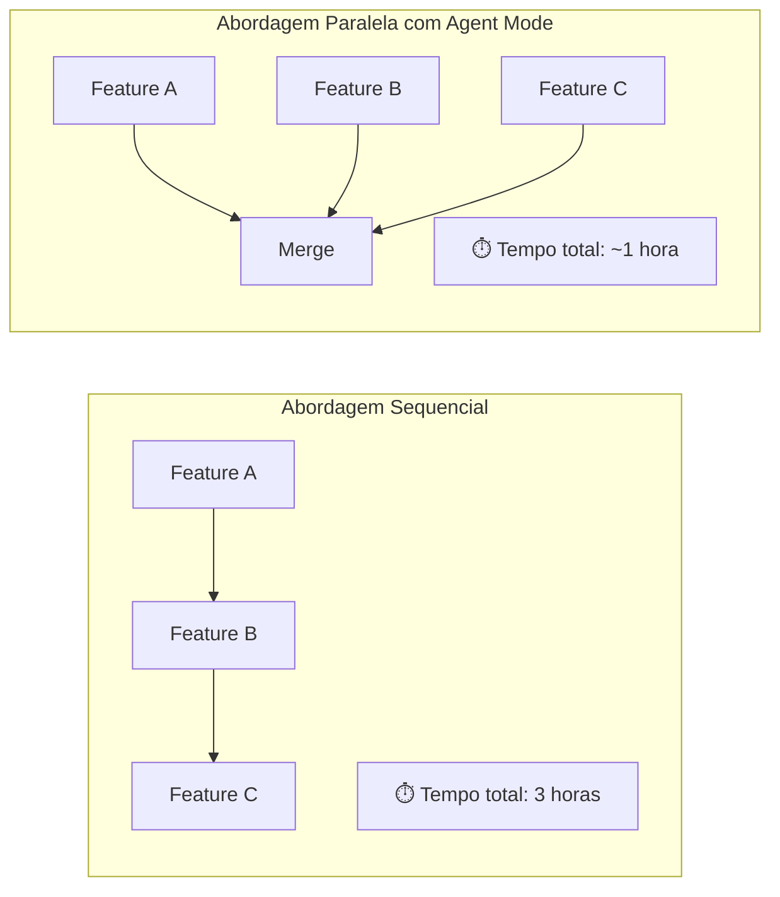
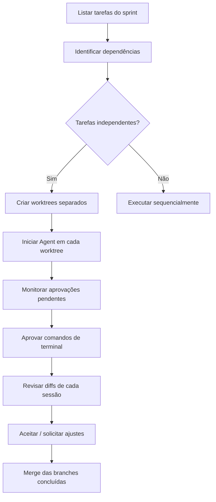

# 04 — Sessões Paralelas no Agent Mode

> **Objetivo:** Entender como executar múltiplas sessões do Agent Mode em paralelo para acelerar o desenvolvimento de features independentes.

---

## Por que Paralelizar Sessões de Agente

Tarefas de desenvolvimento frequentemente têm partes independentes que não dependem uma da outra. Em vez de executar sequencialmente, o Agent Mode permite iniciar múltiplas sessões simultâneas — cada uma em sua própria ramificação de trabalho.



> 📌 **Referência:** docs.github.com/en/copilot/using-github-copilot/using-copilot-coding-agent-in-the-ide

---

## Iniciando Múltiplas Sessões

No VS Code, cada sessão de Agent Mode pode operar em uma janela ou workspace separado:

### Opção 1: Múltiplas Janelas do VS Code

```
1. Abra uma janela do VS Code para cada tarefa independente
2. Em cada janela, ative Agent Mode no chat
3. Dê tarefas diferentes para cada janela
4. Monitore o progresso em paralelo
5. Revise e integre os resultados
```

### Opção 2: Worktrees do Git + VS Code

```bash
# Crie worktrees separados para cada feature
git worktree add ../feature-auth -b feature/auth
git worktree add ../feature-payments -b feature/payments
git worktree add ../feature-notifications -b feature/notifications

# Abra cada worktree em uma instância do VS Code
code ../feature-auth
code ../feature-payments
code ../feature-notifications
```

Cada worktree é uma cópia independente do repositório — o Agent em uma não interfere nas outras.

---

## Painel de Controle de Sessões

O VS Code exibe um painel para acompanhar múltiplas sessões ativas do Agent:

```
┌─ GitHub Copilot — Agent Sessions ─────────────────┐
│                                                    │
│ ● feature/auth          [Em execução] 4m           │
│   "Implementar JWT refresh token"                  │
│   Tools: file_edit, terminal (npm test)            │
│                                                    │
│ ● feature/payments      [Aguardando aprovação] 2m  │
│   "Adicionar gateway Stripe"                       │
│   ⚠️ Needs: npm install stripe                     │
│                                                    │
│ ✓ feature/notifications [Concluído] 8m             │
│   "Criar sistema de email com templates"           │
│   8 files changed, 340 insertions                  │
│                                                    │
└────────────────────────────────────────────────────┘
```

> 📌 **Referência:** docs.github.com/en/copilot/using-github-copilot/using-copilot-coding-agent-in-the-ide#managing-multiple-sessions

---

## Estratégia de Paralelização

### O que pode ser paralelizado

```
✅ Features independentes (sem dependência de código entre si)
✅ Criação de testes para módulos distintos
✅ Geração de documentação de diferentes partes do sistema
✅ Configuração de ferramentas (linting, build, CI)
✅ Migração de módulos independentes
```

### O que NÃO deve ser paralelizado

```
❌ Features que editam os mesmos arquivos (conflito de merge)
❌ Tarefas que dependem do resultado de outra
❌ Mudanças de schema de banco que afetam múltiplas features
❌ Alterações em interfaces/tipos compartilhados
```

---

## Fluxo Recomendado para Trabalho Paralelo



---

## Gerenciar Aprovações em Paralelo

Com múltiplas sessões simultâneas, aprovações de terminal aparecem em diferentes janelas. Boas práticas:

```
1. Use "Continue Always" para comandos recorrentes e seguros (npm test, npm run build)
2. Reserve aprovação manual para comandos destrutivos (rm, reset, migrate)
3. Configure allow list nas settings para comandos rotineiros:
```

```json
// .vscode/settings.json
{
  "github.copilot.chat.agent.autoApprove": [
    "npm test",
    "npm run build",
    "npm run lint"
  ]
}
```

---

## Integração com GitHub Copilot Cloud Agent

Para máximo paralelismo, combine sessões locais (Agent Mode no IDE) com o Cloud Agent (execução remota via GitHub Actions):

```
Sessão local (Agent Mode IDE):
→ Feature que precisa de feedback rápido / iteração

Sessão remota (Cloud Agent):
→ Tarefas mais longas / definidas que podem rodar assincronamente
→ Você trabalha em outra coisa enquanto o Cloud Agent termina
```

---

## ✅ Pontos-chave do Capítulo

- Múltiplas sessões do Agent Mode podem rodar em paralelo usando worktrees do Git
- Cada worktree é uma cópia independente — sem conflitos entre sessões paralelas
- O painel de sessões do VS Code permite monitorar o status de cada agente em execução
- Paralelize apenas tarefas que editam arquivos diferentes para evitar conflitos de merge
- `Continue Always` e a allow list reduzem o atrito de aprovação em sessões paralelas
- Combine Agent Mode local com Cloud Agent para máximo paralelismo em times

---

## 🔗 Próximo Módulo

👉 [Cloud Agent — O que é o Cloud Agent](../cloud-agent/01-o-que-e-cloud-agent.md)
