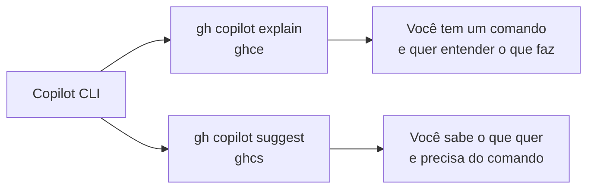

# 02 — Fluxos no Terminal com Copilot CLI

> **Objetivo:** Usar o Copilot CLI para acelerar tarefas no terminal — git, Docker, cloud CLI, scripts e debugging de comandos.

---

## Os Dois Modos de Uso



---

## `gh copilot explain` — Entender Comandos

Use quando você encontra um comando que não conhece ou quer entender o que ele faz antes de executar.

### Sintaxe

```bash
gh copilot explain "COMANDO"
# ou com alias:
ghce "COMANDO"
```

### Exemplos

```bash
# Entender um comando git complexo
ghce "git log --oneline --graph --decorate --all"

# Entender uma pipeline de shell
ghce "find . -name '*.log' -mtime +7 -exec rm {} \;"

# Entender uma flag de docker
ghce "docker run --rm -it -v $(pwd):/app -w /app node:20 bash"

# Entender um comando kubectl
ghce "kubectl rollout restart deployment/api-service -n production"
```

### Output típico

```
Explanation:
  • git log: exibe o histórico de commits
  • --oneline: cada commit em uma única linha (hash curto + mensagem)
  • --graph: desenha o grafo de branches com caracteres ASCII
  • --decorate: mostra os nomes de branches e tags ao lado dos commits
  • --all: inclui todas as branches, não apenas a atual

  Resultado: visualização completa do histórico de commits com todas as branches
  em formato de grafo compacto — útil para entender a estrutura de merges.
```

> 📌 **Referência:** docs.github.com/en/copilot/using-github-copilot/using-github-copilot-in-the-command-line#explaining-commands

---

## `gh copilot suggest` — Gerar Comandos

Use quando você sabe o que quer fazer, mas não sabe o comando exato.

### Sintaxe

```bash
gh copilot suggest "DESCRIÇÃO DO QUE VOCÊ QUER FAZER"
# ou:
ghcs "DESCRIÇÃO"
```

O Copilot pergunta o tipo de comando antes de sugerir:

```
? What kind of command would you like to suggest?  [Use arrows to move, type to filter]
> generic shell command
  gh command
  git command
```

### Exemplos por Categoria

#### Git

```bash
ghcs "criar uma branch a partir da tag v2.3.0 e fazer checkout"
# → git checkout -b hotfix/v2.3.1 v2.3.0

ghcs "revertir apenas as mudanças de um arquivo específico para o último commit"
# → git checkout HEAD -- src/config.ts

ghcs "listar todos os arquivos modificados entre duas tags"
# → git diff --name-only v2.2.0 v2.3.0
```

#### Docker

```bash
ghcs "remover todas as imagens Docker não utilizadas"
# → docker image prune -a

ghcs "ver logs de um container específico em tempo real com timestamps"
# → docker logs -f --timestamps nome-do-container

ghcs "copiar um arquivo do container para a máquina local"
# → docker cp container-name:/path/to/file ./local-path
```

#### Cloud / AWS CLI

```bash
ghcs "listar todos os buckets S3 com o tamanho total de cada um"
# → aws s3 ls --recursive s3:// | awk '{sum+=$3} END {print sum}'

ghcs "forçar uma nova implantação de um serviço ECS sem mudar a task definition"
# → aws ecs update-service --cluster meu-cluster \
#     --service meu-servico --force-new-deployment
```

#### Scripts e Shell

```bash
ghcs "encontrar os 10 arquivos maiores em ordem decrescente no diretório atual"
# → find . -type f -printf '%s %p\n' | sort -rn | head -10

ghcs "monitorar uso de CPU e memória de um processo pelo nome"
# → watch -n 1 "ps aux | grep nome-do-processo | grep -v grep"
```

> 📌 **Referência:** docs.github.com/en/copilot/using-github-copilot/using-github-copilot-in-the-command-line#suggesting-commands

---

## Fluxo de Suggest com Execução Interativa

Após gerar uma sugestão, o Copilot CLI oferece opções interativas:

```
$ ghcs "fazer squash dos últimos 3 commits em um só"

Suggestion:
  git rebase -i HEAD~3

? Select an option  [Use arrows to move, type to filter]
> Copy command to clipboard
  Explain command
  Execute command
  Revise command (e.g. be more specific)
  Exit
```

| Opção | Quando usar |
|-------|-------------|
| **Copy command to clipboard** | Para colar em outro contexto |
| **Explain command** | Para entender antes de executar |
| **Execute command** | Para executar diretamente |
| **Revise command** | Para refinar a descrição e tentar novamente |

---

## Padrão de Uso: Debugging de Erros no Terminal

```bash
# 1. Copie o comando que deu erro
# 2. Peça explicação da mensagem de erro

ghce "npm ERR! code EACCES npm ERR! syscall access npm ERR! path /usr/local/lib/node_modules"

# Output:
# O erro EACCES indica falta de permissão para escrever no diretório de módulos globais.
# Causas comuns:
# - npm global está em diretório do sistema (/usr/local/lib)
# - O usuário atual não tem permissão de escrita
# Solução: configure o diretório global do npm para uma pasta do usuário:
#   mkdir ~/.npm-global
#   npm config set prefix '~/.npm-global'
#   export PATH=~/.npm-global/bin:$PATH
```

---

## Integração com Pipe

O Copilot CLI pode receber input via pipe para explicar output de comandos:

```bash
# Explicar a saída de um comando
docker ps --format "{{.Names}}\t{{.Status}}" | ghce -

# Explicar um script de um arquivo
cat deploy.sh | ghce -
```

---

## ✅ Pontos-chave do Capítulo

- `gh copilot explain` (ou `ghce`) explica qualquer comando em linguagem natural antes de você executar
- `gh copilot suggest` (ou `ghcs`) gera comandos a partir de uma descrição em português
- O Copilot pergunta o tipo de comando (shell, git, gh) para calibrar a sugestão
- Após sugerir, oferece opções: copiar, explicar, executar ou refinar
- Use `ghce` para debugar mensagens de erro de terminal — contexto imediato sem sair do shell
- A opção "Explain command" dentro do suggest é valiosa antes de executar comandos destrutivos

---

## 🔗 Próxima Seção

👉 [Exercícios do Capítulo 07](../05-exercicios.md)
