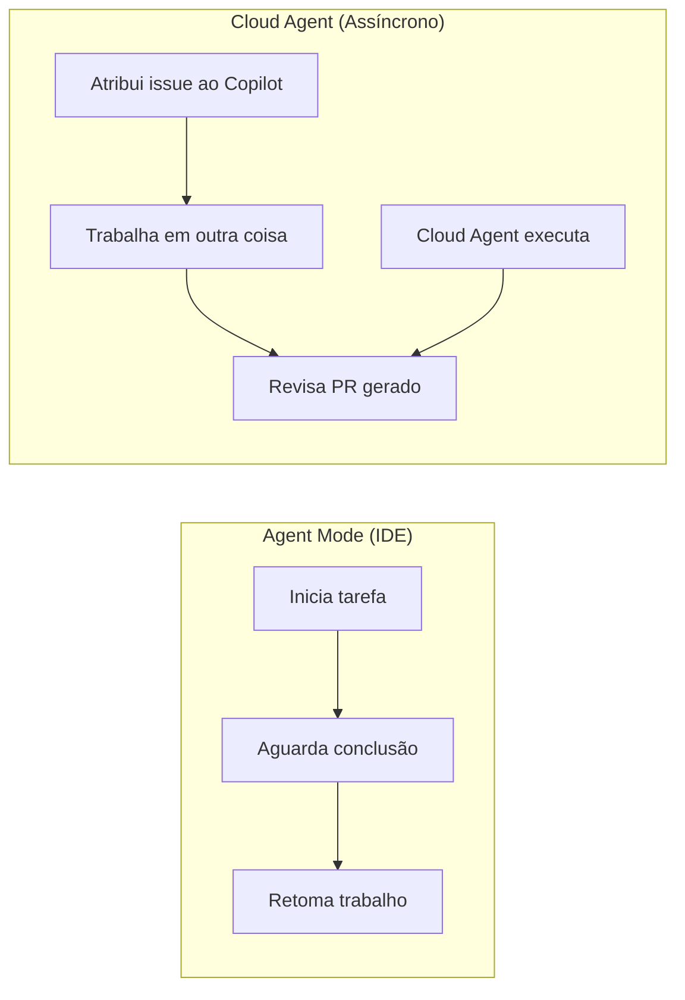
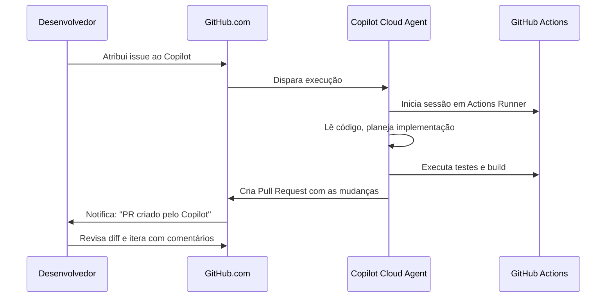
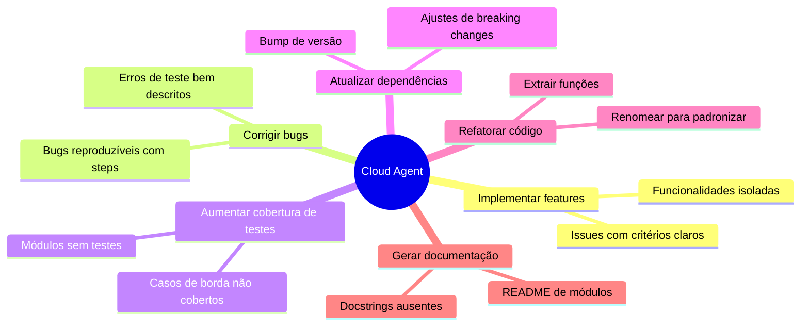

# 01 — O que é o GitHub Copilot Cloud Agent

> **Objetivo:** Entender o Cloud Agent — o agente assíncrono do GitHub Copilot que executa tarefas no background via GitHub Actions.

---

## O Problema que o Cloud Agent Resolve

O Agent Mode no IDE é síncrono: você inicia uma tarefa e espera ela terminar antes de seguir em frente. O Cloud Agent muda esse paradigma:

> 📌 **Referência:** docs.github.com/en/copilot/using-github-copilot/using-copilot-for-pull-requests/using-copilot-coding-agent-to-work-on-tasks

---

## Como Funciona o Cloud Agent

O Cloud Agent executa inteiramente em infraestrutura do GitHub — sem consumir recursos locais.

> 📌 **Referência:** docs.github.com/en/copilot/using-github-copilot/using-copilot-for-pull-requests/using-copilot-coding-agent-to-work-on-tasks#about-copilot-coding-agent

---

## Requisitos

| Requisito | Detalhe |
|-----------|---------|
| Plano | Copilot Pro, Pro+, Business ou Enterprise |
| Repositório | Público ou privado no GitHub |
| GitHub Actions | Habilitado no repositório |
| Permissão | Copilot precisa de permissão para criar PRs |

> 📌 **Referência:** docs.github.com/en/copilot/using-github-copilot/using-copilot-for-pull-requests/using-copilot-coding-agent-to-work-on-tasks#prerequisites

---

## O que o Cloud Agent Pode Fazer

| Capacidade | Detalhe |
|-----------|---------|
| Ler o repositório completo | Acessa todo o código, não só o contexto local |
| Criar e editar arquivos | Implementa a solução completa |
| Instalar dependências | Roda `npm install`, `pip install`, etc. |
| Executar testes | Valida a implementação antes de criar o PR |
| Rodar build | Garante que o código compila |
| Criar Pull Request | PR com descrição detalhada das mudanças |
| Iterar via comentários | Você comenta no PR e o Copilot aplica ajustes |

---

## Comparativo: Agent Mode IDE vs Cloud Agent

| Critério | Agent Mode (IDE) | Cloud Agent |
|---------|:----------------:|:-----------:|
| Onde executa | Sua máquina local | GitHub Actions (cloud) |
| Modo de uso | Síncrono (você acompanha) | Assíncrono (background) |
| Entrada da tarefa | Prompt no chat | Issue do GitHub |
| Resultado | Edições no workspace local | Pull Request no GitHub |
| Iteração | Conversa no chat | Comentários no PR |
| Necessita IDE aberta | ✅ Sim | ❌ Não |
| Recurso local usado | CPU/RAM local | GitHub Actions minutes |
| Melhor para | Tarefas interativas / rápidas | Tarefas longas / bem definidas |

---

## Casos de Uso Ideais para o Cloud Agent

---

## Limites e Restrições

| Limitação | Detalhe |
|-----------|---------|
| Tarefas mal definidas | Issues vagas produzem PRs pobres |
| Mudanças de arquitetura | Cloud Agent não substitui decisões de design |
| Acesso a sistemas externos | Não acessa bancos de dados de produção |
| Segredos | Não deve receber credenciais na issue |
| Conflitos de merge | Se base branch mudar durante a execução |

---

## ✅ Pontos-chave do Capítulo

- Cloud Agent executa tarefas de desenvolvimento de forma assíncrona via GitHub Actions
- Você atribui uma issue ao Copilot e recebe um Pull Request quando a tarefa termina
- Não requer o IDE aberto — executa inteiramente na infraestrutura do GitHub
- Ideal para tarefas bem definidas, longas ou que podem ser paralelizadas com seu trabalho atual
- A iteração acontece via comentários no PR, não via chat
- Requer Copilot Pro ou superior e GitHub Actions habilitado no repositório

---

## 🔗 Próxima Aula

👉 [02 — Atribuir Issues ao Copilot](./02-assignar-issues-ao-copilot.md)
