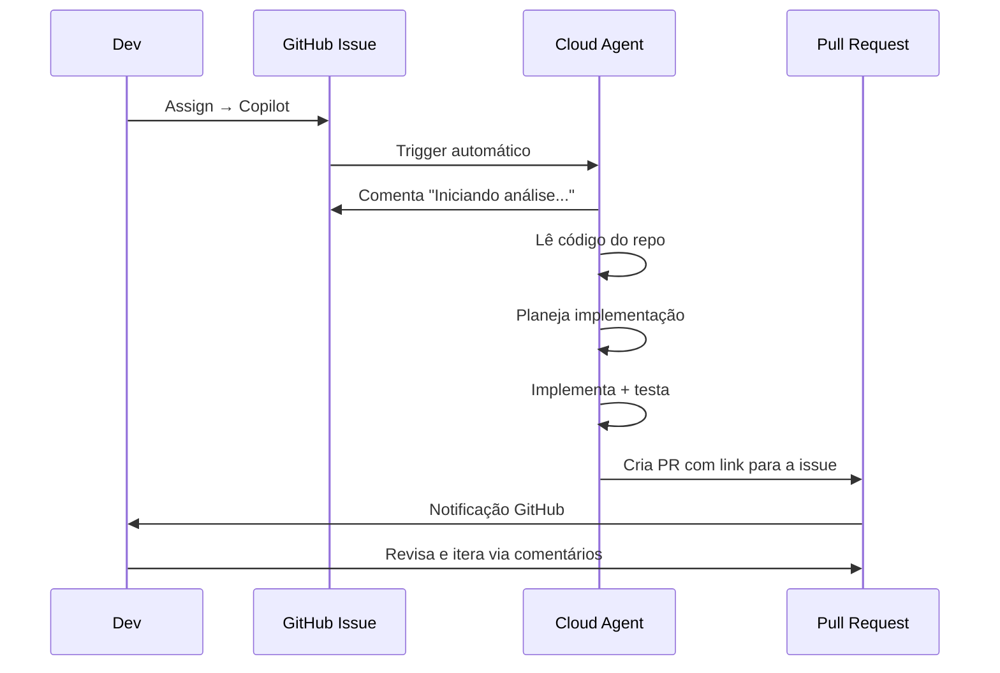

# 02 — Atribuir Issues ao Copilot

> **Objetivo:** Saber como delegar issues ao Cloud Agent e escrever issues de qualidade que produzam PRs úteis.

---

## Como Atribuir uma Issue ao Copilot

### Método 1: Via Interface do GitHub

```
1. Abra qualquer issue no repositório
2. No painel lateral direito, clique em "Assignees"
3. Selecione "Copilot" na lista de assignees
4. O Cloud Agent inicia automaticamente
```

### Método 2: Via Comentário na Issue

```
Em qualquer comentário da issue, escreva:
@github-copilot implement this

O Cloud Agent detecta o @mention e inicia a execução.
```

### Método 3: Via Painel de Issues

```
Na lista de issues do repositório:
1. Selecione uma ou mais issues (checkbox)
2. Menu → Assign → Copilot
```

> 📌 **Referência:** docs.github.com/en/copilot/using-github-copilot/using-copilot-for-pull-requests/using-copilot-coding-agent-to-work-on-tasks#assigning-a-task-to-copilot

---

## O que Acontece após a Atribuição



---

## Anatomia de uma Issue de Qualidade

A qualidade do PR gerado depende diretamente da clareza da issue. Uma boa issue para o Cloud Agent tem:

### ✅ Estrutura recomendada

```markdown
## Objetivo
[Uma frase clara descrevendo o resultado esperado]

## Contexto
[Por que essa mudança é necessária / qual problema resolve]

## Comportamento esperado
[O que deve acontecer após a implementação]

## Critérios de aceite
- [ ] Critério mensurável 1
- [ ] Critério mensurável 2
- [ ] Testes unitários adicionados
- [ ] Build sem erros

## Arquivos/módulos relacionados (opcional)
- `src/services/payment.ts` — onde implementar
- `src/services/payment.test.ts` — onde adicionar testes

## Exemplo (opcional)
[Input/output esperado, ou exemplo de uso da nova funcionalidade]
```

---

## Comparativo: Issue Vaga vs Issue Bem Definida

### ❌ Issue vaga — produz PR de baixa qualidade

```
Título: "Melhorar validação"

Descrição:
A validação de usuários precisa ser melhorada.
```

O Cloud Agent não sabe:
- O que validar
- Onde implementar
- O que "melhor" significa
- Como saber se está correto

---

### ✅ Issue bem definida — produz PR útil

```
Título: "Adicionar validação de CPF no cadastro de usuário"

Descrição:
## Objetivo
Validar o CPF fornecido durante o cadastro antes de persistir o usuário.

## Comportamento esperado
- Campo `cpf` deve aceitar formatos: "123.456.789-09" e "12345678909"
- CPFs inválidos retornam HTTP 422 com mensagem: "CPF inválido"
- CPFs válidos prosseguem para criação normalmente

## Critérios de aceite
- [ ] Função `validateCPF(cpf: string): boolean` em `src/utils/validators.ts`
- [ ] Integração em `UserService.create()` em `src/services/user.ts`
- [ ] Testes para CPF válido, inválido, com e sem formatação
- [ ] Build TypeScript sem erros

## Referência do algoritmo
O dígito verificador do CPF segue o algoritmo da Receita Federal:
[link para documentação]
```

---

## Boas Práticas para Issues do Cloud Agent

| Prática | Por quê |
|---------|---------|
| Escreva critérios de aceite com checkboxes | O Agent usa para validar se completou |
| Indique os arquivos envolvidos | Reduz tempo de busca e escopo |
| Forneça exemplos de entrada/saída | Elimina ambiguidade na implementação |
| Mencione padrões existentes no código | O Agent seguirá o estilo do projeto |
| Limite o escopo a uma mudança por issue | PRs menores são mais fáceis de revisar |
| Não inclua segredos ou credenciais | Nunca — issues são potencialmente públicas |

---

## Monitorar o Progresso

Após atribuir ao Copilot:

```
Na issue:
→ O Copilot adiciona comentários automáticos descrevendo o progresso
→ "Analisando o repositório..."
→ "Implementando validação..."
→ "Rodando testes..."
→ "PR criado: #123"

Na aba Pull Requests:
→ Novo PR com título baseado na issue
→ Descrição gerada automaticamente
→ Link para a issue original
→ Status de CI/CD (se configurado)
```

> 📌 **Referência:** docs.github.com/en/copilot/using-github-copilot/using-copilot-for-pull-requests/using-copilot-coding-agent-to-work-on-tasks#monitoring-progress

---

## ✅ Pontos-chave do Capítulo

- Atribua issues ao Copilot via painel "Assignees" → "Copilot" na interface do GitHub
- O `@github-copilot implement this` em comentários também dispara o Cloud Agent
- Issues bem definidas com critérios de aceite geram PRs significativamente melhores
- Escopo pequeno por issue = PR menor = revisão mais rápida e confiável
- Nunca inclua credenciais ou segredos em issues — elas podem ser públicas
- O Copilot comenta no issue com updates de progresso durante a execução

---

## 🔗 Próxima Aula

👉 [03 — Revisão de Diffs e PRs](./03-revisao-de-diffs-e-prs.md)
