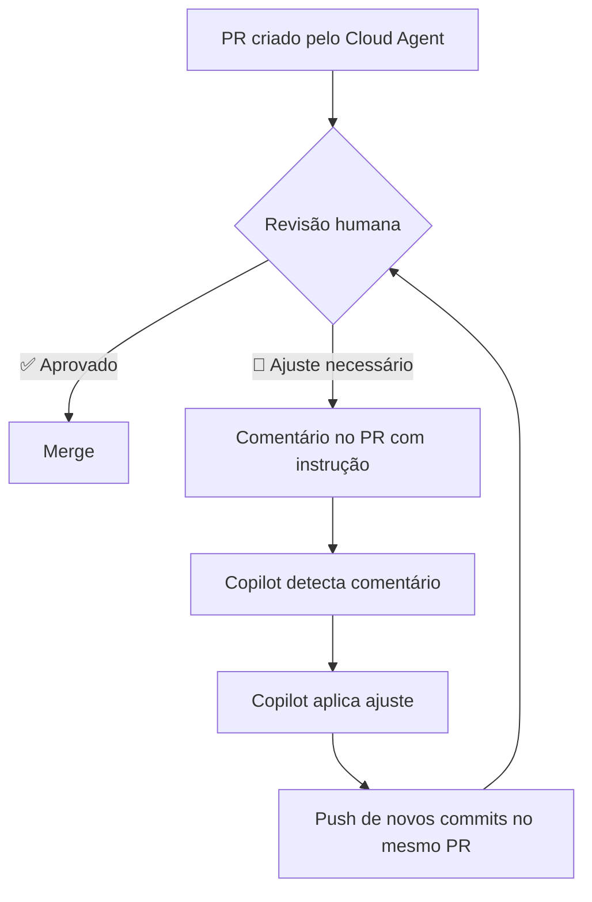

# 03 — Revisão de Diffs e PRs do Cloud Agent

> **Objetivo:** Revisar com eficiência os Pull Requests gerados pelo Cloud Agent e usar comentários para iterar sem abrir o IDE.

---

## Estrutura de um PR Gerado pelo Cloud Agent

O Cloud Agent cria PRs com uma estrutura padronizada:

```markdown
## Resumo
[Descrição do que foi implementado e por quê]

## Mudanças realizadas
- `src/utils/validators.ts` — adicionada função validateCPF
- `src/services/user.ts` — integração da validação em UserService.create()
- `src/utils/validators.test.ts` — 8 novos testes de validação

## Critérios de aceite verificados
- ✅ validateCPF implementada em src/utils/validators.ts
- ✅ Integração em UserService.create()
- ✅ Testes para CPF válido, inválido, com e sem formatação
- ✅ Build TypeScript sem erros

## Testes
Todos os 42 testes passam. Cobertura: 87%.

Closes #45
```

> 📌 **Referência:** docs.github.com/en/copilot/using-github-copilot/using-copilot-for-pull-requests/using-copilot-coding-agent-to-work-on-tasks#reviewing-and-iterating

---

## Checklist de Revisão

Ao revisar um PR do Cloud Agent, valide:

```
Corretude
□ A lógica implementa corretamente os critérios de aceite?
□ Os edge cases estão cobertos?
□ Há testes suficientes e adequados?

Qualidade de código
□ O código segue os padrões do projeto?
□ Nomenclatura consistente com o restante da codebase?
□ Sem código morto ou comentários desnecessários?

Segurança
□ Dados de input são validados/sanitizados?
□ Nenhuma credencial hardcoded?
□ Mudanças de permissão ou acesso são adequadas?

Impacto
□ Há breaking changes não sinalizados?
□ Dependências adicionadas são justificadas?
□ Performance: alguma N+1 query ou loop desnecessário?
```

---

## Iterar via Comentários no PR

A iteração com o Cloud Agent acontece através de comentários no PR — sem abrir o IDE.

### Comentário geral no PR

```markdown
@github-copilot O regex de CPF não está tratando o caso com pontos e traços juntos.
Exemplo que falha: "123.456.789-09" retorna inválido quando deveria ser válido.
```

### Comentário inline em linha específica do diff

```markdown
# Comentário na linha 47 de validators.ts:
Esta função não normaliza o input antes de validar.
Adicione: const normalized = cpf.replace(/[.\-]/g, '') antes da validação.
```

### Solicitar testes adicionais

```markdown
@github-copilot Adicione testes para:
- CPF com todos dígitos iguais (ex: "111.111.111-11") — deve ser inválido
- CPF com menos de 11 dígitos — deve ser inválido
- CPF vazio — deve retornar false, não lançar exceção
```

> 📌 **Referência:** docs.github.com/en/copilot/using-github-copilot/using-copilot-for-pull-requests/using-copilot-coding-agent-to-work-on-tasks#iterating-on-changes

---

## Fluxo de Iteração



O Cloud Agent detecta automaticamente comentários direcionados a ele (`@github-copilot`) e atualiza o PR com novos commits — sem criar um PR novo.

---

## Padrões de Comentário Eficazes

### ✅ Instrutivo e específico

```markdown
@github-copilot A função validateCPF está na camada errada.
Mova-a de userService.ts para um novo arquivo src/utils/validators.ts
e importe-a no userService.
```

### ✅ Com exemplo de resultado esperado

```markdown
@github-copilot O erro deve ser mais descritivo.
Mude de: throw new Error("Invalid CPF")
Para: throw new ValidationError("CPF inválido: formato deve ser XXX.XXX.XXX-XX", { field: "cpf" })
```

### ❌ Vago — pouco útil

```markdown
@github-copilot Isso está errado. Arrume.
```

---

## O que NÃO Delegar para o Cloud Agent via PR

| Situação | Por que não delegar |
|---------|---------------------|
| Decisões de arquitetura | Requerem contexto de negócio e trade-offs |
| Mudanças de banco de dados | Migrations requerem revisão cuidadosa |
| Código de autenticação crítico | Segurança requer revisão humana especializada |
| Alterações em contratos de API pública | Impacto em clientes externos |
| Remoção de features | Requer confirmação de que não há dependentes |

---

## Fechar o Loop: Aceitar ou Solicitar Revisão

```
Quando o PR está pronto:
1. Adicione reviewers humanos para aprovação final
2. Verifique se CI/CD passou
3. Faça squash/merge seguindo a política do projeto
4. A issue é fechada automaticamente (Closes #N no PR)
```

**Dica:** Configure branch protection rules para exigir ao menos uma revisão humana em PRs do Cloud Agent. Código gerado por IA deve sempre ter aprovação humana antes do merge.

---

## ✅ Pontos-chave do Capítulo

- PRs do Cloud Agent incluem resumo, lista de mudanças e verificação dos critérios de aceite
- Use `@github-copilot` em comentários do PR para iterar sem abrir o IDE
- Comentários inline no diff são mais precisos do que comentários gerais
- O Cloud Agent detecta comentários e atualiza o PR com novos commits no mesmo branch
- Sempre valide corretude, qualidade, segurança e impacto antes de mergear
- Configure branch protection para exigir aprovação humana em PRs criados pelo Copilot

---

## 🔗 Próxima Aula

👉 [04 — Agentic Memory](./04-agentic-memory.md)
