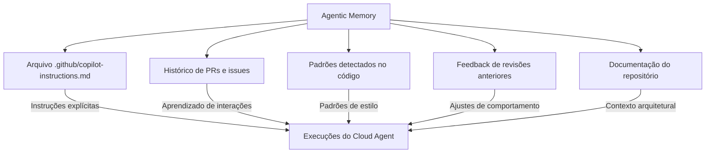

# 04 — Agentic Memory

> **Objetivo:** Entender como o Copilot acumula e usa conhecimento sobre o repositório para melhorar o contexto das execuções do Cloud Agent ao longo do tempo.

---

## O Problema de Contexto em Agentes

Cada execução do Cloud Agent começa do zero — sem memória das interações anteriores. Para projetos grandes e complexos, isso significa que o agente precisa "reaprender" o projeto a cada tarefa: padrões de código, convenções, arquitetura, dependências.

O **Agentic Memory** resolve isso criando e mantendo um repositório de conhecimento persistente sobre o projeto.

> 📌 **Referência:** docs.github.com/en/copilot/using-github-copilot/using-copilot-for-pull-requests/using-copilot-coding-agent-to-work-on-tasks

---

## Como o Copilot Acumula Contexto

O Cloud Agent utiliza múltiplas fontes de contexto persistente:



---

## Fontes de Contexto Persistente

### 1. `.github/copilot-instructions.md`

O principal mecanismo de memória explícita. O Copilot lê este arquivo em todas as execuções:

```markdown
# Instruções para o GitHub Copilot

## Padrões do projeto
- TypeScript strict mode habilitado — nunca use `any`
- Testes com Jest + Testing Library
- Nomenclatura: camelCase para variáveis, PascalCase para classes

## Arquitetura
- Controllers: apenas validação de request/response
- Services: lógica de negócio
- Repositories: acesso a dados

## Convenções de erro
- Use a classe CustomError em src/errors/CustomError.ts
- Nunca lance Error genérico
```

> 📌 **Referência:** docs.github.com/en/copilot/customizing-copilot/adding-repository-instructions-for-github-copilot

### 2. Histórico de PRs e Issues

O Cloud Agent pode analisar PRs anteriores (especialmente fechados) para inferir:
- Padrões de code review do time
- Tipos de mudanças aceitas vs rejeitadas
- Comentários recorrentes dos revisores

### 3. Documentação do Repositório

Arquivos como `README.md`, `CONTRIBUTING.md`, `ARCHITECTURE.md` e `docs/` são lidos automaticamente quando relevantes para a tarefa.

---

## Estruturando Memória Explícita no `.github/copilot-instructions.md`

Organize por categorias para maximizar utilidade:

```markdown
# GitHub Copilot Instructions

## Stack e versões
- Node.js 20 LTS
- TypeScript 5.x com strict: true
- PostgreSQL 15 (via Prisma ORM)
- Jest 29 para testes

## Estrutura de diretórios
src/
├── controllers/   # Apenas HTTP request/response
├── services/      # Lógica de negócio
├── repositories/  # Acesso ao banco via Prisma
├── errors/        # Classes de erro customizadas
└── utils/         # Funções puras e helpers

## Padrões de teste
- Descreva com: describe('ClassName') > it('should ...')
- Use factories em tests/factories/ para criar entidades
- Mock de banco de dados com: import { mockPrisma } from 'tests/mocks/prisma'
- Nunca use banco real nos testes unitários

## Convenções de erro
- Erros de validação: throw new ValidationError(message, { field })
- Erros de negócio: throw new BusinessError(message, { code })
- Nunca use: throw new Error()

## O que NÃO fazer
- Não adicionar console.log — use o logger em src/utils/logger.ts
- Não usar any no TypeScript
- Não instalar dependências sem mencionar na PR description
```

---

## Contexto de Repositório no Agent Mode do IDE

O contexto acumulado também beneficia o Agent Mode no IDE. Quando você usa `@workspace`, o Copilot analisa:

```
Fontes consultadas pelo @workspace:
├── .github/copilot-instructions.md  (alta prioridade)
├── README.md                         (contexto geral)
├── package.json / pyproject.toml     (dependências e scripts)
├── Arquivos abertos no editor        (contexto imediato)
└── Busca semântica no workspace      (código relacionado)
```

---

## Estratégias para Melhorar a Qualidade ao Longo do Tempo

### 1. Atualizar instruções após cada PR problemático

```
PR do Cloud Agent usa `any` no TypeScript?
→ Adicione em copilot-instructions.md:
   "TypeScript strict mode: nunca use `any`. Use `unknown` + type guard."
```

### 2. Documentar decisões de arquitetura

```markdown
## Decisão: serviços sem injeção de dependência direta
Usamos o padrão de factory function para criar serviços.
❌ Não: class UserService { constructor(private db: Database) {} }
✅ Sim: export function createUserService(db: Database): UserService { ... }

Razão: facilita testes sem frameworks de DI.
```

### 3. Manter exemplos de bom código

```markdown
## Exemplo de controller correto
Veja: src/controllers/userController.ts
É o padrão de referência para novos controllers.
```

---

## Limitações do Agentic Memory

| Limitação | Impacto |
|-----------|---------|
| Não persiste sessão-a-sessão automaticamente | Sem `.github/copilot-instructions.md`, cada execução recomeça |
| Não aprende de interações passadas por padrão | O arquivo de instruções precisa ser atualizado manualmente |
| Contexto limitado pelo tamanho da janela | Repositórios muito grandes podem não caber no contexto |
| Não acessa dados externos ao repositório | APIs, bancos de dados externos, etc. |

---

## ✅ Pontos-chave do Capítulo

- O Cloud Agent não tem memória automática entre execuções — `.github/copilot-instructions.md` é a memória explícita
- Quanto mais detalhado e atualizado o arquivo de instruções, melhores os PRs gerados
- Organize instruções por: stack, estrutura, padrões de teste, convenções de erro
- Após cada PR problemático, atualize as instruções para evitar o mesmo problema
- O `@workspace` no IDE também usa esse arquivo para enriquecer o contexto do chat
- PRs fechados e documentação do repo complementam a memória, mas não substituem instruções explícitas

---

## 🔗 Próximo Módulo

👉 [Customização — copilot-instructions.md](../customizacao/01-copilot-instructions-md.md)
