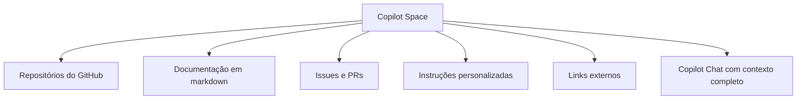
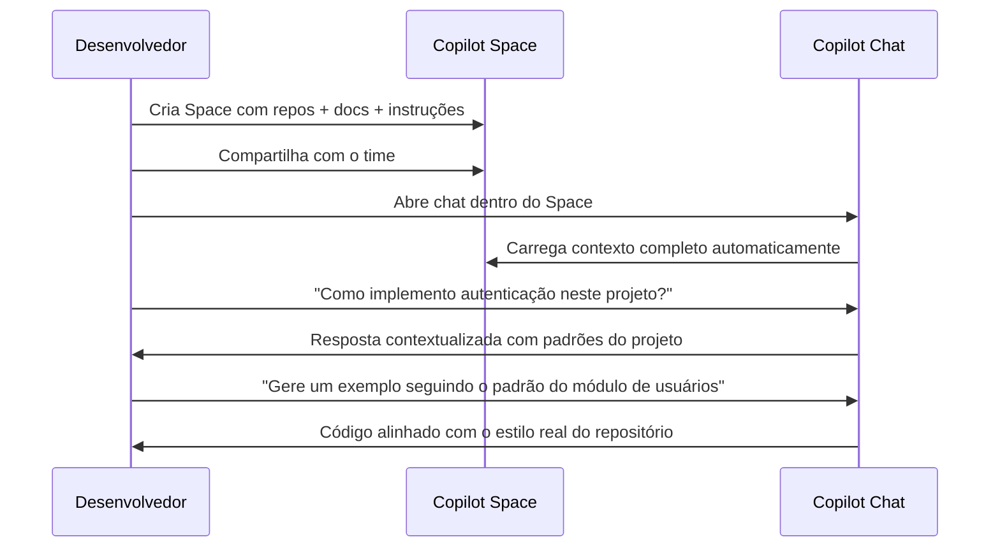

# 03 — Copilot Spaces

> **Objetivo:** Entender o que são Copilot Spaces, como criar workspaces com contexto persistente e quando usá-los para potencializar sessões de chat.

---

## O que são Copilot Spaces

Copilot Spaces são workspaces de contexto persistente dentro do GitHub Copilot Chat. Um Space agrega múltiplas fontes de conhecimento — repositórios, documentação, issues — em um único contexto que o Copilot usa em todas as conversas dentro daquele Space.



> 📌 **Referência:** docs.github.com/en/copilot/using-github-copilot/using-github-copilot-spaces

---

## Por que Usar Spaces

Sem Spaces, cada sessão de Copilot Chat começa do zero. Com Spaces:

| Sem Space | Com Space |
|-----------|-----------|
| Você explica o contexto a cada conversa | Contexto já está carregado |
| Respostas genéricas sem conhecimento do projeto | Respostas contextualizadas com seu domínio |
| Difícil compartilhar contexto com o time | Space é compartilhável com colaboradores |
| Sem memória entre sessões | Contexto persiste entre sessões |

---

## Criando um Space

```
1. Acesse github.com/copilot
2. Clique em "Spaces" no menu lateral
3. Clique em "New Space"
4. Dê um nome e descrição ao Space
5. Adicione fontes de contexto:
   - Repositórios
   - Arquivos markdown
   - URLs de documentação
   - Instruções customizadas
6. Clique em "Create Space"
```

> 📌 **Referência:** docs.github.com/en/copilot/using-github-copilot/using-github-copilot-spaces#creating-a-space

---

## Fontes de Contexto Suportadas

| Fonte | O que inclui |
|-------|-------------|
| **Repositório GitHub** | Código, README, estrutura de arquivos |
| **Arquivos de documentação** | `.md`, `.txt`, PDFs |
| **Issues e PRs** | Discussões, decisões documentadas |
| **Instruções do Space** | Texto livre para calibrar o comportamento |
| **Links externos** | Documentação pública (lida e indexada) |

---

## Casos de Uso

### 🔵 Space de Onboarding

```markdown
# Contexto do Space: Onboarding do Time

Fontes adicionadas:
- Repositório principal (repo-principal)
- CONTRIBUTING.md
- docs/architecture.md
- docs/runbooks/
- Instruções: "Você é um guia de onboarding. Responda como se
  estivesse explicando para um dev que acabou de entrar no time."
```

Uso: novos devs fazem perguntas sobre o projeto sem precisar de um colega dedicado.

---

### 🟢 Space de Revisão de RFC/ADR

```markdown
# Contexto do Space: Arquitetura

Fontes adicionadas:
- docs/rfcs/
- docs/adr/ (Architecture Decision Records)
- Instruções: "Ao analisar propostas, considere os trade-offs dos
  ADRs já registrados e sinalize conflitos com decisões anteriores."
```

---

### 🟡 Space de Suporte à API

```markdown
# Contexto do Space: API Reference

Fontes adicionadas:
- Repositório da API
- docs/openapi.yaml
- docs/changelog.md
- Instruções: "Responda sobre a API em português. Sempre inclua
  exemplos de código. Indique a versão mínima quando relevante."
```

---

## Compartilhar Spaces com o Time

```
No Space criado:
1. Clique em "Settings"
2. Em "Collaborators", adicione membros do GitHub
3. Defina permissão: "View" (apenas uso) ou "Edit" (pode modificar)

Compartilhamento em nível de organização:
- Planos Business/Enterprise permitem Spaces de organização
- Todos os membros da org têm acesso automático
```

> 📌 **Referência:** docs.github.com/en/copilot/using-github-copilot/using-github-copilot-spaces#sharing-a-space

---

## Fluxo de Trabalho com Spaces



---

## Limitações

| Limitação | Detalhe |
|-----------|---------|
| Disponibilidade | Planos Pro ou superior |
| Contexto em tempo real | Repositórios são indexados, não lidos ao vivo |
| Profundidade de busca | Limitada ao que cabe na janela de contexto |
| Execução de código | Spaces são apenas contexto, não executam código |

---

## ✅ Pontos-chave do Capítulo

- Spaces criam workspaces de contexto persistente que sobrevivem entre sessões de chat
- Agregam repositórios, documentação, issues e instruções customizadas em um único contexto
- Eliminam a necessidade de reexplicar o projeto a cada conversa
- São compartilháveis com o time — perfeitos para onboarding e suporte técnico
- Planos Business/Enterprise suportam Spaces de organização disponíveis para todos os membros
- Spaces não executam código — são contexto de leitura para o chat

---

## 🔗 Próxima Aula

👉 [04 — Skills no Copilot](./04-skills-no-copilot.md)
