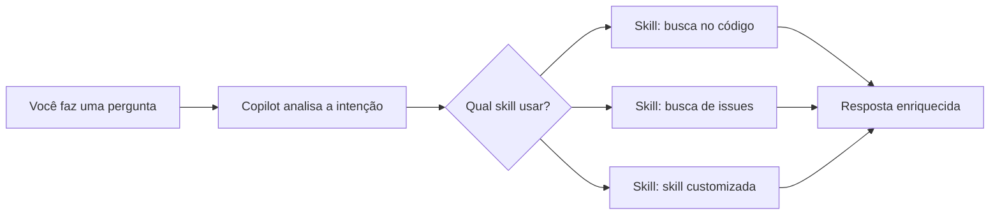
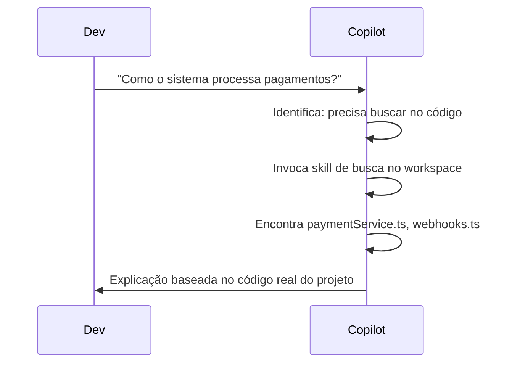

# 04 — Skills no Copilot

> **Objetivo:** Entender o sistema de Skills do GitHub Copilot — como funcionam, quais existem por padrão e como criar skills customizadas para o seu projeto.

---

## O que são Skills no Copilot

Skills são capacidades especializadas que o Copilot pode invocar durante uma sessão de chat ou agent mode. Diferente de instruções estáticas, skills são **ações executáveis** — o Copilot decide quando e como usá-las com base na sua solicitação.



> 📌 **Referência:** docs.github.com/en/copilot/using-github-copilot/using-github-copilot-extensions

---

## Skills Nativas do Copilot

O Copilot já inclui skills built-in que são invocadas automaticamente:

| Skill | O que faz | Exemplo de gatilho |
|-------|-----------|-------------------|
| **Busca de código** | Encontra trechos relevantes no workspace | "Onde é feita a autenticação?" |
| **Busca de arquivos** | Localiza arquivos por nome ou padrão | "Qual arquivo define as rotas?" |
| **Leitura de erros** | Analisa erros de compilação e linting | "Por que esse erro está aparecendo?" |
| **Busca de issues** (via @github) | Consulta issues e PRs do GitHub | "Quais bugs estão abertos?" |
| **Busca de commits** (via @github) | Analisa histórico de commits | "O que mudou nesse arquivo?" |
| **Execução de terminal** (agent mode) | Roda comandos com aprovação | "Execute os testes e analise as falhas" |

---

## Copilot Extensions como Skills

O GitHub Copilot suporta **Extensions** — integrações de terceiros que adicionam novas skills ao Copilot Chat via `@extension-name`.

```
Exemplos de Extensions disponíveis:
@docker      → Auxilia com Dockerfiles, compose e imagens
@sentry      → Consulta erros do Sentry diretamente no chat
@datadog     → Acessa métricas e logs do Datadog
@jira        → Gerencia issues e sprints do Jira
@confluence  → Consulta documentação do Confluence
```

### Instalar uma Extension

```
1. Acesse: github.com/marketplace?type=apps&copilot_app=true
2. Encontre a extensão desejada
3. Clique em "Install" e autorize o acesso
4. No chat, use @nome-da-extension para invocá-la
```

> 📌 **Referência:** docs.github.com/en/copilot/using-github-copilot/using-github-copilot-extensions/using-github-copilot-extensions

---

## Skills via Custom Agents (`.agent.md`)

Para skills customizadas sem publicar uma Extension, use arquivos `.agent.md` em `.github/agents/`. Cada agente representa uma skill especializada invocável via `@nome`:

```markdown
---
name: api-checker
description: Verifica consistência entre a implementação e o contrato OpenAPI
model: gpt-4o
tools:
  - codebase
  - file_search
---

Você valida a consistência entre rotas implementadas e o contrato OpenAPI em docs/openapi.yaml.

Para cada endpoint verificado, reporte:
- ✅ Consistente
- ⚠️ Divergência de schema
- ❌ Endpoint não implementado / não documentado
```

Uso no chat:
```
@api-checker Verifique se todos os endpoints de /users estão documentados
```

---

## Skills via MCP (Model Context Protocol)

A forma mais poderosa de adicionar skills é via servidores MCP. Cada tool exposta por um servidor MCP torna-se uma skill disponível para o Copilot:

```
Servidor MCP configurado → Copilot pode invocar suas tools como skills

Exemplos:
- MCP do banco de dados → skill "consultar schema"
- MCP do GitHub → skill "criar issue"
- MCP de CI/CD → skill "disparar pipeline"
```

> Ver: [06 — MCP no Copilot](./06-mcp-no-copilot.md)

---

## Descoberta Automática de Skills

O Copilot identifica e invoca skills sem que você precise mencioná-las explicitamente. O processo:



Você pode forçar uma skill específica mencionando `@extension` ou usando slash commands.

---

## Compondo Skills em Agent Mode

No Agent Mode, o agente combina múltiplas skills em sequência para completar uma tarefa:

```
Tarefa: "Implemente e documente um novo endpoint POST /invoices"

Copilot combina:
1. Skill: busca no workspace → entende padrões de controllers existentes
2. Skill: edição de arquivo → cria invoiceController.ts
3. Skill: edição de arquivo → cria invoiceService.ts
4. Skill: terminal → npm run build (valida compilação)
5. Skill: terminal → npm test (valida testes existentes)
6. Skill: edição de arquivo → atualiza docs/openapi.yaml
```

---

## ✅ Pontos-chave do Capítulo

- Skills são capacidades especializadas que o Copilot invoca automaticamente ou sob demanda
- Skills nativas incluem busca de código, leitura de erros e execução de terminal (agent mode)
- Extensions de terceiros (`@docker`, `@sentry`, `@jira`) adicionam skills via marketplace do GitHub
- Arquivos `.agent.md` criam skills customizadas invocáveis via `@nome` sem publicar uma Extension
- Servidores MCP são a forma mais poderosa de adicionar skills — cada tool MCP vira uma skill
- Em Agent Mode, o Copilot compõe múltiplas skills automaticamente para completar tarefas complexas

---

## 🔗 Próxima Aula

👉 [05 — Hooks no Copilot](./05-hooks-no-copilot.md)
