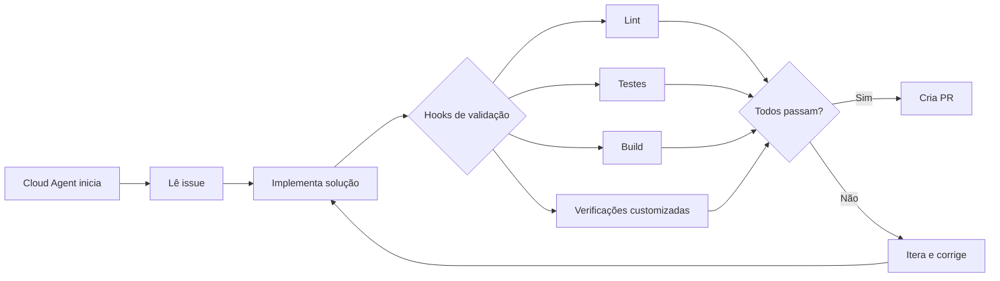
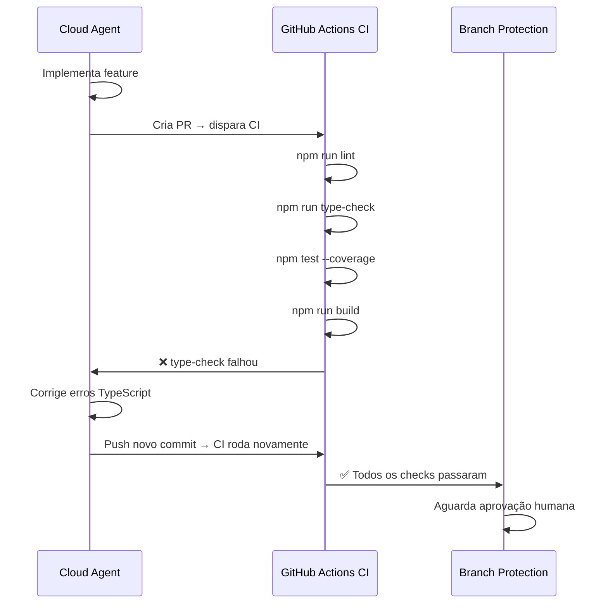

# 05 — Hooks no Copilot

> **Objetivo:** Entender como o GitHub Copilot Cloud Agent usa hooks para validar e automatizar etapas do fluxo de trabalho antes e depois de suas execuções.

---

## O que são Hooks no Contexto do Copilot

No contexto do GitHub Copilot Cloud Agent, hooks são **etapas automatizadas de validação e verificação** executadas durante o fluxo de trabalho do agente. Eles garantem que o código gerado passe por verificações definidas pelo time antes de ser submetido como Pull Request.



> 📌 **Referência:** docs.github.com/en/copilot/using-github-copilot/using-copilot-for-pull-requests/using-copilot-coding-agent-to-work-on-tasks

---

## Como o Cloud Agent Usa Hooks

O Cloud Agent executa em um ambiente GitHub Actions. Qualquer verificação configurada no CI/CD do repositório funciona como um "hook" que o agente precisa respeitar:

### Verificações Automáticas

| Verificação | Como configurar | Efeito no Agent |
|-------------|----------------|-----------------|
| Testes unitários | `npm test` no workflow | Agent itera até os testes passarem |
| Build da aplicação | `npm run build` no workflow | Agent corrige erros de compilação |
| Linting | `npm run lint` ou ESLint action | Agent corrige violações de estilo |
| Type checking | `tsc --noEmit` no workflow | Agent corrige erros de tipo |
| Verificação de cobertura | Jest coverage threshold | Agent adiciona testes se necessário |

---

## Configurar Verificações no Repositório

### GitHub Actions como hooks do Cloud Agent

O Cloud Agent respeita os checks do repositório. Configure workflows de CI para servir como validação automática:

```yaml
# .github/workflows/ci.yml
name: CI

on:
  pull_request:
    branches: [main]

jobs:
  validate:
    runs-on: ubuntu-latest
    steps:
      - uses: actions/checkout@v4
      - uses: actions/setup-node@v4
        with:
          node-version: '20'
      - run: npm ci
      - run: npm run lint
      - run: npm run type-check
      - run: npm test -- --coverage
      - run: npm run build
```

Quando o Cloud Agent cria um PR, todos esses checks rodam automaticamente. Se falharem, o agente pode iterar para corrigi-los.

---

## Branch Protection Rules como Hooks

Configure regras de proteção de branch para exigir que checks passem antes do merge:

```
Settings → Branches → Branch protection rules → main

Habilite:
✅ Require status checks to pass before merging
  ✅ lint
  ✅ type-check
  ✅ test
  ✅ build

✅ Require a pull request before merging
  ✅ Require approvals: 1
  ✅ Dismiss stale PR approvals when new commits are pushed

✅ Require conversation resolution before merging
```

Com essas regras, **nenhum PR do Cloud Agent pode ser mergeado sem passar por todas as verificações e ter aprovação humana**.

---

## Instruir o Agente sobre Verificações nas Instructions

Para que o Cloud Agent saiba quais verificações deve passar, documente-as no `.github/copilot-instructions.md`:

```markdown
## Verificações obrigatórias (CI/CD)

Todo código gerado deve passar nas seguintes verificações antes de criar o PR:
1. `npm run lint` — sem erros de ESLint
2. `npm run type-check` — sem erros TypeScript
3. `npm test` — todos os testes passando
4. `npm run build` — build sem erros

Cobertura mínima: 80% de lines coverage.
Se a cobertura cair abaixo de 80%, adicione testes.

Para rodar todas as verificações de uma vez: `npm run validate`
```

---

## Hooks no Agent Mode Local (IDE)

No Agent Mode do VS Code, o comportamento equivalente a hooks é configurado via allow list de comandos:

```json
// .vscode/settings.json
{
  "github.copilot.chat.agent.autoApprove": [
    "npm run lint",
    "npm run type-check",
    "npm test",
    "npm run build"
  ]
}
```

Com a allow list configurada, o Agent executa esses comandos automaticamente sem pedir aprovação a cada iteração — equivalente a hooks que rodam a cada ciclo.

---

## Comparativo: Hooks Claude Code vs Hooks Copilot

| Aspecto | Claude Code (hooks explícitos) | Copilot (CI + instructions) |
|---------|-------------------------------|----------------------------|
| Configuração | `settings.json` com eventos hook | GitHub Actions + branch rules |
| Granularidade | Por evento (PreToolUse, PostToolUse) | Por check de CI |
| Execução | Local, síncrona | Cloud, assíncrona |
| Customização | Scripts shell arbitrários | Workflows GitHub Actions |
| Visibilidade | Log local | Log do Actions na PR |

---

## Exemplo: Pipeline Completo de Validação



---

## ✅ Pontos-chave do Capítulo

- Hooks no Copilot Cloud Agent são implementados via GitHub Actions CI e branch protection rules
- O Cloud Agent respeita automaticamente os checks de CI configurados no repositório
- Branch protection com "require status checks" garante que PRs do agente precisam passar no CI
- Documente os comandos de validação no `copilot-instructions.md` para o agente saber o que rodar
- No Agent Mode local, a allow list de comandos automatiza validações sem interrupção
- Sempre exija pelo menos uma aprovação humana além dos checks automáticos

---

## 🔗 Próxima Aula

👉 [06 — MCP no Copilot](./06-mcp-no-copilot.md)
