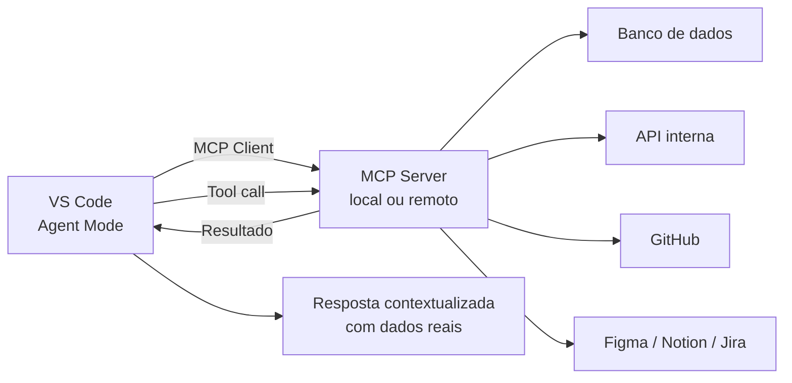

# 06 — MCP no Copilot

> **Objetivo:** Configurar servidores MCP no GitHub Copilot para o Agent Mode no VS Code, expandindo as capacidades do agente com ferramentas externas.

---

## MCP no GitHub Copilot

O GitHub Copilot suporta o Model Context Protocol (MCP) no Agent Mode do VS Code. Com servidores MCP configurados, o Copilot pode acessar ferramentas externas durante sessões de agent — banco de dados, APIs, sistemas internos — da mesma forma que o Claude Code.

> 📌 **Referência:** docs.github.com/en/copilot/using-github-copilot/using-extensions/using-copilot-with-mcp

---

## Arquitetura: MCP no Copilot Agent Mode



---

## Configurar MCP no VS Code

### 1. Via arquivo `.vscode/mcp.json` (nível de projeto)

```json
{
  "servers": {
    "github": {
      "command": "npx",
      "args": ["-y", "@modelcontextprotocol/server-github"],
      "env": {
        "GITHUB_PERSONAL_ACCESS_TOKEN": "${env:GITHUB_TOKEN}"
      }
    },
    "postgres": {
      "command": "npx",
      "args": ["-y", "@modelcontextprotocol/server-postgres"],
      "env": {
        "POSTGRES_CONNECTION_STRING": "${env:DATABASE_URL}"
      }
    },
    "filesystem": {
      "command": "npx",
      "args": [
        "-y",
        "@modelcontextprotocol/server-filesystem",
        "/workspace"
      ]
    }
  }
}
```

> 📌 **Referência:** docs.github.com/en/copilot/using-github-copilot/using-extensions/using-copilot-with-mcp#configuring-mcp-servers-in-visual-studio-code

### 2. Via configurações globais do VS Code (`settings.json`)

```json
// ~/.config/Code/User/settings.json
{
  "mcp": {
    "servers": {
      "sqlite": {
        "command": "uvx",
        "args": ["mcp-server-sqlite", "--db-path", "/tmp/dev.db"]
      }
    }
  }
}
```

### 3. Via Command Palette

```
Ctrl+Shift+P → "MCP: Add Server"
→ Selecione o tipo (stdio, SSE)
→ Preencha o comando e argumentos
```

---

## Variáveis de Ambiente em Configurações MCP

Nunca coloque credenciais diretamente no `mcp.json`. Use referências de variáveis de ambiente:

```json
{
  "servers": {
    "meu-servidor": {
      "command": "node",
      "args": ["./mcp-server/index.js"],
      "env": {
        "API_KEY": "${env:MINHA_API_KEY}",
        "DB_URL": "${env:DATABASE_URL}"
      }
    }
  }
}
```

Defina as variáveis no `.env` local (nunca commitado) ou nas variáveis de ambiente do sistema.

---

## Usar MCP no Agent Mode

Com servidores MCP configurados, o Agent Mode os descobre automaticamente e pode invocá-los:

```
Exemplos de interação com MCP ativo:

Com servidor GitHub MCP:
"Liste todas as issues abertas com label 'bug' no repositório"
→ Copilot invoca tool: list_issues(repo, labels=["bug"])

Com servidor PostgreSQL MCP:
"Quais tabelas existem no banco de dados?"
→ Copilot invoca tool: list_tables()
→ "Como está indexada a tabela users?"
→ Copilot invoca tool: describe_table("users")

Com servidor Filesystem MCP:
"Leia o arquivo de configuração em /etc/myapp/config.yaml"
→ Copilot invoca tool: read_file("/etc/myapp/config.yaml")
```

---

## Servidores MCP Recomendados para Desenvolvimento

| Servidor | Instalação | Uso |
|----------|-----------|-----|
| `@modelcontextprotocol/server-github` | `npx -y` | Issues, PRs, repos |
| `@modelcontextprotocol/server-filesystem` | `npx -y` | Leitura de arquivos do sistema |
| `@modelcontextprotocol/server-postgres` | `npx -y` | Consultas e schema PostgreSQL |
| `@modelcontextprotocol/server-sqlite` | `uvx` | Banco SQLite local |
| `@modelcontextprotocol/server-brave-search` | `npx -y` | Busca na web |

> 📌 **Referência:** modelcontextprotocol.io/docs/tools/inspector

---

## Verificar Servidores MCP Ativos

```
No VS Code:
1. Command Palette → "MCP: List Servers"
2. Lista os servidores configurados e seu status (running / stopped)

Ou via painel do Copilot Chat:
→ Ícone de ferramentas (🔧) → seção MCP Servers
```

---

## Diferença entre MCP no Claude Code e no Copilot

| Aspecto | Claude Code | Copilot (VS Code) |
|---------|------------|-------------------|
| Configuração | `claude mcp add` ou `~/.claude/settings.json` | `.vscode/mcp.json` ou `settings.json` |
| Escopo | Global ou por projeto | Workspace ou global |
| Disponível em | Toda sessão do Claude Code | Apenas Agent Mode |
| Cloud Agent (remoto) | N/A | Não suporta MCP diretamente |
| Descoberta de tools | Automática | Automática |

---

## ✅ Pontos-chave do Capítulo

- MCP está disponível no Copilot Agent Mode no VS Code — não no Cloud Agent remoto
- Configure servidores em `.vscode/mcp.json` (nível de projeto) ou `settings.json` (global)
- Nunca coloque credenciais diretas nas configs — use `${env:NOME_DA_VARIAVEL}`
- O Agent Mode descobre e invoca as tools dos servidores MCP automaticamente
- Servidores oficiais do MCP estão disponíveis via `npx -y @modelcontextprotocol/server-*`
- Verifique servidores ativos via Command Palette → "MCP: List Servers"

---

## 🔗 Próximo Módulo

👉 [CLI — Copilot CLI: Instalação](../cli/01-copilot-cli-instalacao.md)
