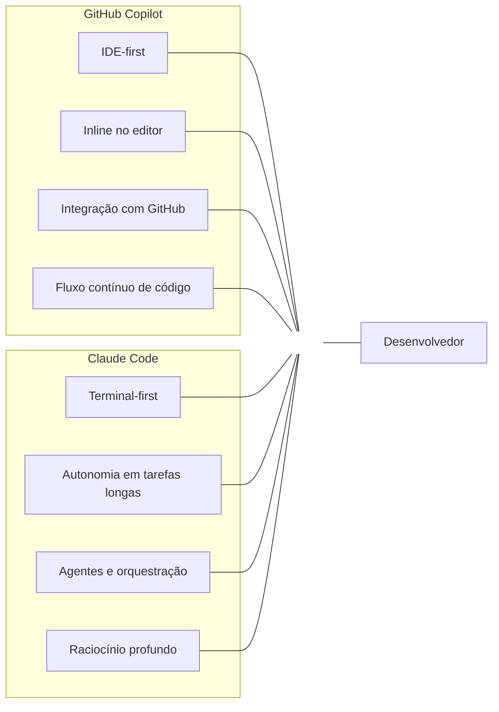
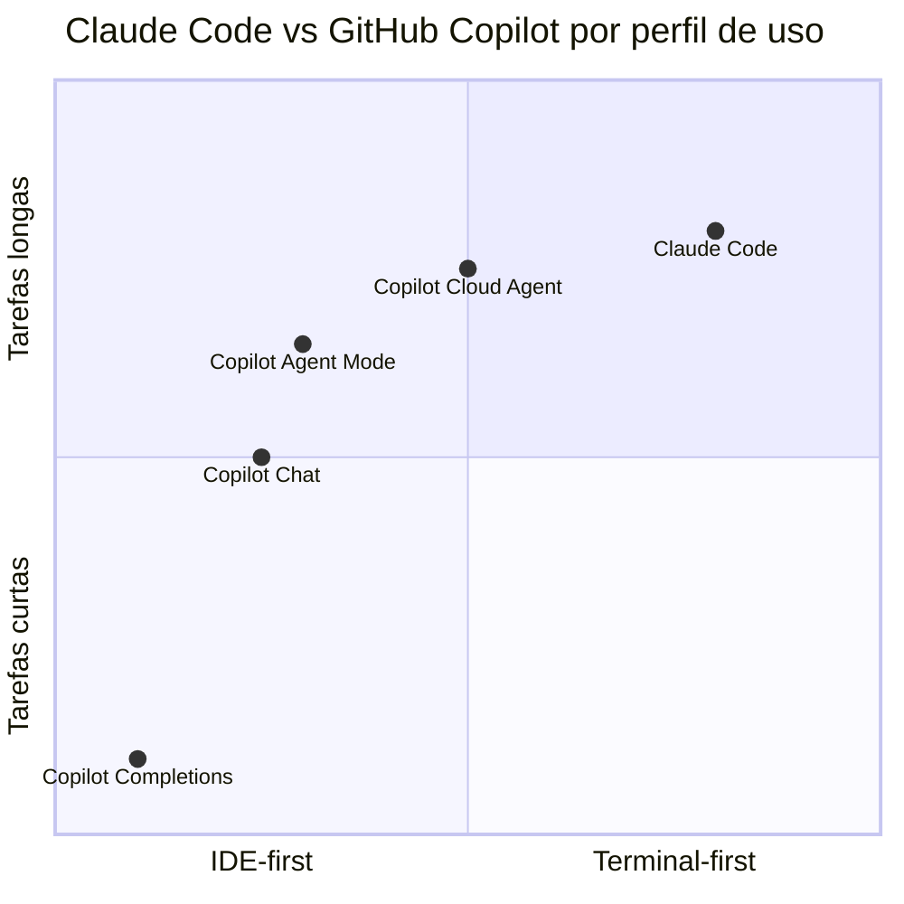

# 01 — Claude vs Copilot: Quando Usar Cada Um

> **Objetivo:** Entender as diferenças fundamentais entre Claude Code e GitHub Copilot e saber escolher a ferramenta certa para cada tipo de tarefa.

---

## Posicionamento das Ferramentas

Claude Code e GitHub Copilot não são concorrentes diretos — têm focos diferentes que se complementam:



> 📌 **Referência Copilot:** docs.github.com/en/copilot/about-github-copilot/what-is-github-copilot
> 📌 **Referência Claude Code:** docs.anthropic.com/en/docs/claude-code/overview

---

## Comparativo por Dimensão

### Modelo de Interação

| Dimensão | GitHub Copilot | Claude Code |
|----------|:--------------:|:-----------:|
| **Interface principal** | IDE (VS Code, JetBrains) | Terminal |
| **Modo primário** | Completions inline + chat | Sessão conversacional no terminal |
| **Integração com editor** | Nativa, em tempo real | Via MCP ou edição direta de arquivos |
| **Integração com GitHub** | Nativa (issues, PRs, repos) | Via MCP GitHub |
| **Portabilidade** | Depende do IDE instalado | Qualquer terminal, incluindo CI/CD |

---

### Autonomia e Complexidade de Tarefa

| Tipo de Tarefa | Copilot | Claude Code |
|----------------|:-------:|:-----------:|
| Completions inline enquanto digita | ✅ Ideal | ❌ Não faz |
| Refatoração pontual (1-3 arquivos) | ✅ Edit Mode | ✅ Funciona bem |
| Feature completa (5-15 arquivos) | ✅ Agent Mode | ✅ Forte |
| Tarefa longa com muitas iterações | ⚠️ Bom | ✅ Muito forte |
| Raciocínio arquitetural profundo | ⚠️ Adequado | ✅ Forte (Claude Opus) |
| Orquestração de múltiplos agentes | ❌ Não tem | ✅ Agent SDK |
| CI/CD headless (sem UI) | ⚠️ Parcial (Cloud Agent) | ✅ Modo headless nativo |

---

### Contexto e Memória

| Aspecto | Copilot | Claude Code |
|---------|:-------:|:-----------:|
| Instruções persistentes | `.github/copilot-instructions.md` | `CLAUDE.md` (global, projeto, pasta) |
| Memória entre sessões | Via instruções + Spaces | Via `CLAUDE.md` + memória de sessão |
| Contexto do repositório | `@workspace` (busca semântica) | Leitura direta de arquivos |
| Contexto de issues/PRs | Via `@github` | Via MCP GitHub |
| Servidores MCP | Agent Mode (VS Code) | Nativo (global ou por projeto) |

---

### Personalização

| Personalização | Copilot | Claude Code |
|----------------|:-------:|:-----------:|
| Instruções de projeto | `.github/copilot-instructions.md` | `CLAUDE.md` |
| Agentes customizados | `.agent.md` | Subagentes + Agent SDK |
| Skills/comandos | Extensions marketplace | Skills (arquivos `.md`) + slash commands |
| Hooks de automação | CI/CD + allow list | Hooks por evento (PreToolUse, PostToolUse...) |
| Distribuição de config | Via repositório | Via repositório ou plugin |

---

## Decisão por Caso de Uso

### ✅ Use Copilot quando...

```
📝 Você está escrevendo código novo no IDE
   → Completions inline aceleram o fluxo sem sair do editor

🔍 Você quer entender código existente rapidamente
   → /explain #file ou @workspace no chat

🐛 Você encontrou um bug e quer correção imediata
   → /fix #selection diretamente no editor

🎫 Sua tarefa começa como uma issue do GitHub
   → Cloud Agent: atribua e receba o PR

👥 Você trabalha em um time com repositório no GitHub
   → Copilot instructions + agents compartilhados no repo

⌨️ Você quer sugestões enquanto digita
   → Completions e NES são o diferencial do Copilot
```

### ✅ Use Claude Code quando...

```
🔧 Você está no terminal e não quer abrir o IDE
   → Claude Code opera nativamente no shell

🏗️ A tarefa envolve muitos arquivos e iterações longas
   → Janela de contexto extensa + raciocínio profundo

🤖 Você quer orquestrar múltiplos agentes em paralelo
   → Subagentes com worktrees isolados

⚙️ Você quer integrar IA em pipelines de CI/CD
   → Modo headless: claude -p "tarefa" --output-format json

🧠 A tarefa exige raciocínio arquitetural e trade-offs
   → Claude Opus tem capacidade analítica superior

🔌 Você usa muitos servidores MCP
   → MCP é nativo e mais flexível no Claude Code
```

---

## Quadro Resumo: IDE-first vs Terminal-first



---

## ✅ Pontos-chave do Capítulo

- Copilot é **IDE-first**: completions inline, chat integrado ao editor, integração nativa com GitHub
- Claude Code é **terminal-first**: sessões longas, orquestração de agentes, CI/CD headless
- Para escrever código no fluxo contínuo, Copilot vence pelo contexto em tempo real no editor
- Para tarefas longas e complexas com muitas iterações, Claude Code tem vantagem em autonomia e raciocínio
- Ambos suportam MCP e instruções personalizadas — a diferença é na profundidade nativa
- A escolha ideal para a maioria dos times é **usar os dois juntos**, não um ou outro

---

## 🔗 Próxima Aula

👉 [02 — Escolhendo o Modelo Certo](./02-escolhendo-o-modelo-certo.md)
