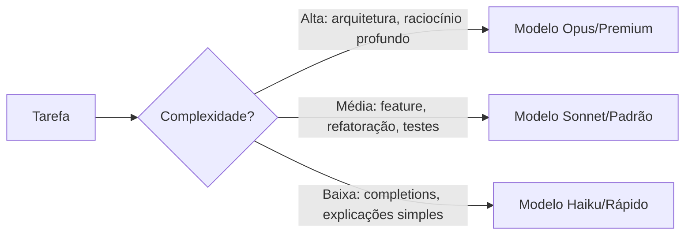
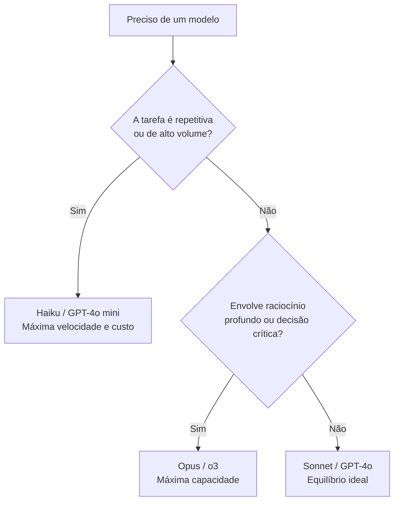

# 02 — Escolhendo o Modelo Certo

> **Objetivo:** Entender as diferenças práticas entre os modelos disponíveis no Claude e no Copilot, e saber qual selecionar para cada tipo de tarefa de desenvolvimento.

---

## Por que a Escolha de Modelo Importa

Nem toda tarefa de desenvolvimento precisa do modelo mais capaz — e usar o modelo errado tem custos reais: mais lento, mais caro ou respostas aquém do necessário. Entender o trade-off **velocidade × capacidade × custo** é essencial.



---

## Família Claude (Anthropic)

| Modelo | Velocidade | Capacidade | Custo relativo | Melhor para |
|--------|:---------:|:---------:|:--------------:|-------------|
| **Claude Haiku 4.5** | ⚡⚡⚡ | ⭐⭐ | $ | Completions rápidas, tarefas simples, alto volume |
| **Claude Sonnet 4.6** | ⚡⚡ | ⭐⭐⭐⭐ | $$ | Equilíbrio ideal — a maioria das tarefas de dev |
| **Claude Opus 4.7** | ⚡ | ⭐⭐⭐⭐⭐ | $$$$ | Raciocínio profundo, arquitetura, problemas difíceis |

> 📌 **Referência:** docs.anthropic.com/en/docs/about-claude/models

### Quando usar cada modelo Claude

**Haiku — use para:**
```
✅ Geração de boilerplate simples
✅ Explicações curtas de trechos de código
✅ Tarefas repetitivas de alto volume (batch processing)
✅ Quando latência é crítica (pipelines de CI rápidos)
```

**Sonnet — use para:**
```
✅ Implementação de features completas
✅ Refatorações com múltiplos arquivos
✅ Geração e revisão de testes
✅ Debugging de bugs moderadamente complexos
✅ A maioria das sessões interativas do Claude Code
```

**Opus — use para:**
```
✅ Decisões de arquitetura com múltiplos trade-offs
✅ Análise de segurança profunda
✅ Bugs difíceis que outros modelos não resolveram
✅ Revisão de código crítico (autenticação, criptografia, migrações)
✅ Problemas que exigem raciocínio em múltiplas etapas
```

---

## Modelos Disponíveis no GitHub Copilot

| Modelo | Provedor | Velocidade | Capacidade | Planos |
|--------|----------|:---------:|:---------:|--------|
| **GPT-4o** | OpenAI | ⚡⚡ | ⭐⭐⭐⭐ | Pro, Business, Enterprise |
| **GPT-4.1** | OpenAI | ⚡⚡ | ⭐⭐⭐⭐ | Pro+, Business, Enterprise |
| **Claude Sonnet 3.7** | Anthropic | ⚡⚡ | ⭐⭐⭐⭐ | Pro, Pro+, Business, Enterprise |
| **Claude Opus 4** | Anthropic | ⚡ | ⭐⭐⭐⭐⭐ | Pro+ |
| **Gemini 1.5 Pro** | Google | ⚡⚡ | ⭐⭐⭐⭐ | Pro+, Business, Enterprise |
| **o3 / o4-mini** | OpenAI | ⚡ | ⭐⭐⭐⭐⭐ | Pro+ |

> 📌 **Referência:** docs.github.com/en/copilot/using-github-copilot/ai-models/changing-the-ai-model-for-copilot-chat

---

## Comparativo de Modelos por Tarefa de Dev

| Tarefa | Melhor modelo (Claude Code) | Melhor modelo (Copilot) |
|--------|:---------------------------:|:-----------------------:|
| Completions inline rápidas | Haiku | GPT-4o (padrão) |
| Implementar feature | Sonnet | Claude Sonnet 3.7 |
| Gerar suite de testes | Sonnet | Claude Sonnet 3.7 |
| Revisão de código | Sonnet / Opus | Claude Opus 4 (Pro+) |
| Debugging difícil | Opus | o3 / Claude Opus 4 |
| Decisão arquitetural | Opus | o3 / Claude Opus 4 |
| Migração de framework | Sonnet | GPT-4.1 / Claude Sonnet 3.7 |
| Raciocínio matemático/algoritmo | Opus | o3 |
| Geração de documentação | Sonnet | GPT-4o |

---

## Extended Thinking (Raciocínio Estendido)

Claude Opus e alguns modelos OpenAI (o3, o4) têm modo de raciocínio estendido — o modelo "pensa" mais antes de responder:

```
Quando vale o custo extra de extended thinking:
✅ Bugs que envolvem interações complexas entre módulos
✅ Decisões arquiteturais com muitas restrições
✅ Algoritmos não triviais (grafos, otimização, concorrência)
✅ Análise de segurança que precisa considerar muitos vetores

Quando NÃO usar:
❌ Tarefas bem definidas com solução conhecida
❌ Geração de boilerplate
❌ Explicações simples de código
❌ Quando velocidade é mais importante que profundidade
```

> 📌 **Referência:** docs.anthropic.com/en/docs/build-with-claude/extended-thinking

---

## Custo vs Valor: Tomada de Decisão Prática



---

## Selecionando o Modelo na Prática

### No Claude Code

```bash
# Definir modelo padrão nas configurações
claude config set model claude-sonnet-4-6

# Usar modelo específico para uma sessão
claude --model claude-opus-4-7

# Para tarefas rápidas de alto volume (modo headless)
claude -p "gere um docstring para esta função" \
  --model claude-haiku-4-5 \
  --output-format text
```

### No Copilot Chat (VS Code)

```
1. No painel de chat, clique no seletor de modelo (ao lado do input)
2. Selecione o modelo para a sessão atual
3. A seleção persiste durante a sessão

Atalho prático:
- Inicie com GPT-4o ou Claude Sonnet (rápido)
- Se a resposta não for satisfatória, mude para Opus/o3 e repita
```

---

## ✅ Pontos-chave do Capítulo

- Haiku/rápidos para volume e latência; Sonnet/padrão para a maioria das tarefas; Opus/premium para raciocínio crítico
- Claude Sonnet é o ponto de equilíbrio ideal para o dia a dia de desenvolvimento
- Extended thinking (Opus, o3) vale o custo extra apenas para problemas genuinamente difíceis
- No Copilot, o modelo pode ser trocado por sessão — comece rápido, escale para premium se necessário
- A escolha de modelo tem impacto direto em custo e velocidade — calibre para a complexidade real da tarefa
- Modelos diferentes têm pontos fortes distintos: o3 para matemática/algoritmos, Claude Opus para raciocínio arquitetural

---

## 🔗 Próxima Aula

👉 [03 — Integrando as Duas Ferramentas](./03-integrando-as-duas-ferramentas.md)
