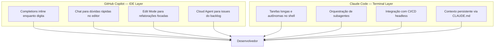
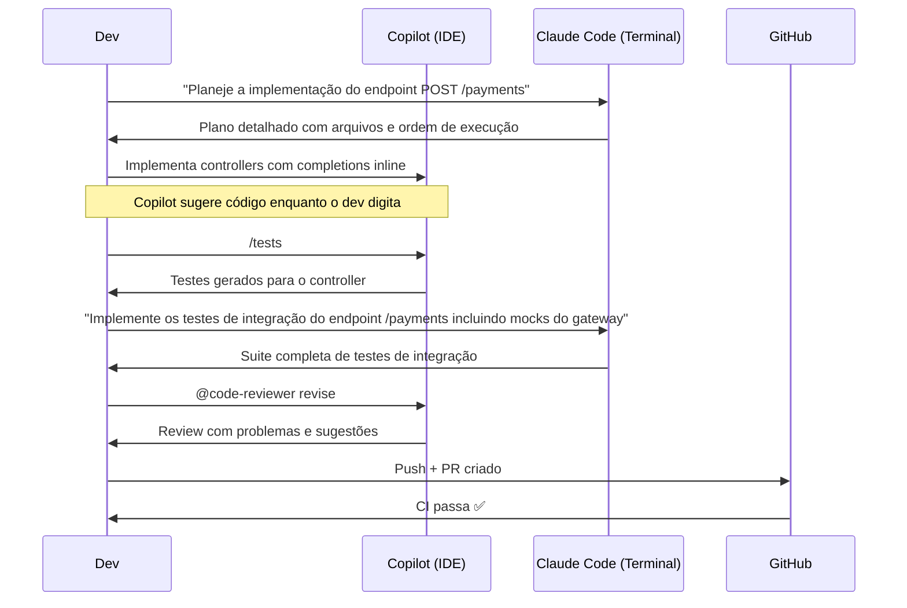
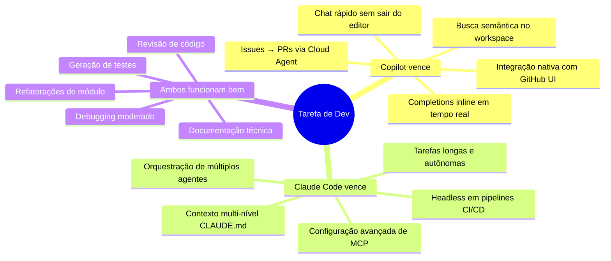

# 03 — Integrando as Duas Ferramentas

> **Objetivo:** Montar fluxos de trabalho híbridos que combinam GitHub Copilot no IDE com Claude Code no terminal, usando cada ferramenta onde ela é mais forte.

---

## O Princípio da Integração

A pergunta não é "Copilot ou Claude Code?" — é **"onde cada um agrega mais valor?"**. Os dois operam em camadas diferentes do fluxo de desenvolvimento e raramente conflitam:



---

## Fluxo Híbrido 1: Feature Development

Exemplo de como as ferramentas se complementam no desenvolvimento de uma feature:



---

## Fluxo Híbrido 2: Bug Investigation

```
1. Bug reportado em produção
   ↓
2. Copilot Chat no IDE
   → @workspace "Onde o cálculo de desconto é feito?"
   → /explain #file:discountService.ts
   → Identifica suspeitos rapidamente no contexto do editor
   ↓
3. Claude Code no terminal (se o bug for complexo)
   → Sessão longa para reproduzir + analisar o bug
   → Raciocínio profundo sobre interações entre módulos
   → Propõe correção com análise de impacto
   ↓
4. Copilot Edit Mode
   → Aplica a correção nos arquivos exatos
   → Revisa o diff antes de confirmar
   ↓
5. Claude Code gera testes de regressão
   → Garante que o bug não regride
```

---

## Fluxo Híbrido 3: Refatoração de Módulo

| Fase | Ferramenta | Por quê |
|------|-----------|---------|
| Entender o módulo atual | Copilot Chat `@workspace` | Rápido, contextual no IDE |
| Planejar a refatoração | Claude Code | Raciocínio profundo, sem pressa |
| Executar arquivos simples | Copilot Edit Mode | Edições rápidas com diff visual |
| Executar refatorações complexas | Claude Code Agent | Autonomia para mudanças em cadeia |
| Revisar resultado | Copilot `@code-reviewer` | Revisão estruturada e reutilizável |
| Gerar testes de cobertura | Claude Code | Suites completas com edge cases |

---

## Configuração de Contexto Compartilhado

Para que as duas ferramentas operem com o mesmo entendimento do projeto, mantenha documentação consistente:

```
Repositório
├── .github/
│   └── copilot-instructions.md    ← contexto para o Copilot
├── CLAUDE.md                       ← contexto para o Claude Code
└── docs/
    └── architecture.md             ← fonte única de verdade (ambos leem)
```

**Evite duplicação:** O `CLAUDE.md` e o `copilot-instructions.md` podem referenciar `docs/architecture.md` em vez de copiar o conteúdo. Isso garante consistência.

```markdown
# CLAUDE.md (exemplo)
Leia docs/architecture.md para entender a estrutura do projeto antes de qualquer tarefa.
Stack: TypeScript, Node.js 20, PostgreSQL via Prisma. Veja copilot-instructions.md
para padrões de código (mesmos aplicáveis aqui).
```

---

## Divisão de Responsabilidades por Perfil de Tarefa



---

## Evitando Conflitos e Redundâncias

### ❌ Anti-padrões comuns

```
Usar Copilot E Claude Code para a mesma tarefa ao mesmo tempo
→ Você vai gastar mais tokens e ter respostas conflitantes

Manter CLAUDE.md e copilot-instructions.md com informações contraditórias
→ Instrua os dois a ler a mesma fonte de verdade

Usar Claude Code para completions inline (não é o design)
→ Para isso, Copilot é muito superior

Usar Copilot para tarefas de orquestração multi-agente
→ Para isso, use o Agent SDK do Claude
```

### ✅ Boas práticas de integração

```
Defina critérios claros: qual ferramenta para qual tipo de tarefa
→ Documente no CLAUDE.md e copilot-instructions.md

Mantenha o contexto do projeto sincronizado entre as duas
→ docs/architecture.md como fonte única

Use o terminal para Claude Code, IDE para Copilot
→ Cada um no seu ambiente natural

Deixe o Copilot cuidar do fluxo inline, Claude Code das tarefas batch
→ Velocidade vs profundidade, não competição
```

---

## ✅ Pontos-chave do Capítulo

- Copilot e Claude Code operam em camadas diferentes — IDE vs terminal — e raramente conflitam
- Copilot é superior para completions inline, chat rápido no editor e integração com GitHub UI
- Claude Code é superior para tarefas longas, orquestração de agentes e pipelines CI/CD
- O fluxo híbrido ideal usa Copilot para o dia a dia no editor e Claude Code para tarefas autônomas complexas
- Mantenha uma fonte única de verdade para documentação de projeto que ambas as ferramentas consultam
- Evite usar as duas ferramentas para a mesma tarefa simultaneamente — defina papéis claros

---

## 🔗 Próxima Aula

👉 [04 — Stack Recomendada por Contexto](./04-stack-recomendada-por-contexto.md)
