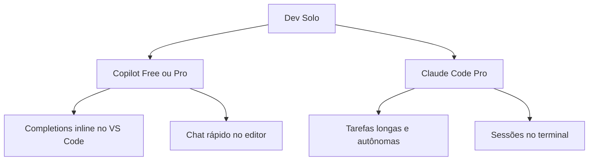
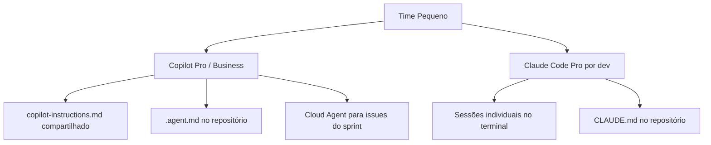
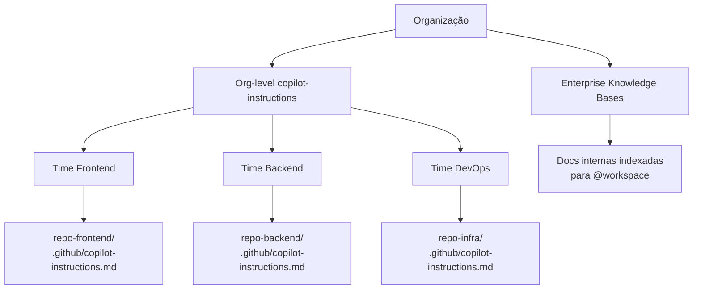

# 04 — Stack Recomendada por Contexto

> **Objetivo:** Receber recomendações concretas de configuração de ferramentas de IA para diferentes perfis: desenvolvedor solo, time pequeno e organização.

---

## Por que o Contexto Importa

Não existe uma stack de IA ideal universal. O que faz sentido para um dev solo freelancer é diferente do que faz sentido para um time de 30 pessoas em uma empresa regulamentada. As variáveis relevantes são:

- **Tamanho do time** (solo → squad → organização)
- **Tipo de projeto** (produto SaaS, consultoria, open source, enterprise)
- **Orçamento** (gratuito → individual pago → licença corporativa)
- **Necessidade de conformidade** (LGPD, SOC 2, regulações setoriais)
- **Perfil técnico** (IDE-heavy vs terminal-heavy vs full stack)

---

## Perfil 1: Desenvolvedor Solo

**Contexto:** Freelancer, indie hacker, dev de projeto pessoal. Orçamento limitado, máxima autonomia, sem burocracia.



### Stack Recomendada

| Ferramenta | Plano | Uso |
|-----------|-------|-----|
| GitHub Copilot | **Free** (ou Pro se uso intenso) | Completions inline + chat no IDE |
| Claude Code | **Pro** (claude.ai/upgrade) | Sessões longas, tarefas complexas |
| Claude CLI | Incluído no Pro | Terminal, CI/CD local |

**Custo estimado:** US$ 0–20/mês

### Configuração mínima

```
├── .github/copilot-instructions.md   ← stack e padrões do projeto
├── CLAUDE.md                          ← contexto para Claude Code
└── .claude/settings.json             ← permissões e MCP
```

### Prioridades

1. Configure `CLAUDE.md` e `copilot-instructions.md` logo no início do projeto
2. Invista em bons comentários e nomes de função — impacto imediato nas completions
3. Use Cloud Agent para tarefas de backlog enquanto trabalha em outra coisa
4. Claude Code Opus apenas para decisões arquiteturais críticas — Sonnet no dia a dia

---

## Perfil 2: Time Pequeno (2–15 pessoas)

**Contexto:** Startup, produto SaaS, agência de desenvolvimento. Consistência entre membros é importante, mas sem overhead de enterprise.



### Stack Recomendada

| Ferramenta | Plano | Uso |
|-----------|-------|-----|
| GitHub Copilot | **Pro** ou **Business** | IDE para todos os devs |
| Claude Code | **Pro** por dev | Sessões individuais no terminal |
| Copilot Cloud Agent | Incluído no Pro+ | Delegação de issues do sprint |

**Custo estimado:** US$ 20–60/dev/mês

### Configuração do repositório

```
repositório/
├── .github/
│   ├── copilot-instructions.md       ← padrões do time (versionado)
│   ├── agents/
│   │   ├── code-reviewer.agent.md    ← revisor padrão do time
│   │   ├── test-expert.agent.md      ← gerador de testes
│   │   └── planner.agent.md          ← planejador de features
│   └── workflows/
│       └── ci.yml                    ← CI que serve como hook do Cloud Agent
├── CLAUDE.md                         ← contexto para Claude Code (versionado)
└── docs/
    └── architecture.md               ← fonte única de verdade arquitetural
```

### Governança mínima para times

```
✅ Faça
- Versione copilot-instructions.md e CLAUDE.md no repositório
- Revise agentes customizados em PR como qualquer código
- Exija revisão humana em PRs criados pelo Cloud Agent (branch protection)
- Defina quais comandos de terminal o Agent pode executar sem aprovação

❌ Evite
- Copilot-instructions.md diferente por dev (inconsistência)
- Mergear PRs do Cloud Agent sem revisão
- Usar modelos premium para todas as tarefas (custo desnecessário)
```

---

## Perfil 3: Organização / Enterprise

**Contexto:** Empresa com 50+ devs, múltiplos times, requisitos de conformidade, auditoria, dados sensíveis.

### Stack Recomendada

| Ferramenta | Plano | Uso |
|-----------|-------|-----|
| GitHub Copilot | **Enterprise** | IDE para toda a organização |
| Claude Code | **Enterprise** (Anthropic) | Sessões individuais, pipelines |
| Knowledge Bases (Copilot) | Incluído no Enterprise | Documentação interna indexada |
| Copilot Spaces | Incluído no Enterprise | Workspaces por time/domínio |

**Custo estimado:** US$ 39–60+/dev/mês (varia com volume)

### Arquitetura de configuração



### Controles obrigatórios em enterprise

| Controle | Como implementar |
|----------|-----------------|
| **Audit log** | GitHub Enterprise: todas as interações com Copilot são logadas |
| **Política de dados sensíveis** | Definir no `copilot-instructions.md` org-level o que nunca compartilhar |
| **Modelos aprovados** | Administradores definem quais modelos os devs podem usar |
| **Branch protection** | PRs do Cloud Agent exigem aprovação de reviewer humano |
| **Exclusão de repositórios sensíveis** | Copilot pode ser desabilitado em repos específicos |
| **Network policies** | Claude Code pode ser configurado para rodar via proxy corporativo |

> 📌 **Referência Copilot Enterprise:** docs.github.com/en/copilot/managing-copilot/managing-copilot-for-your-enterprise
> 📌 **Referência Claude Enterprise:** anthropic.com/enterprise

---

## Comparativo de Stacks por Perfil

| Critério | Solo | Time Pequeno | Enterprise |
|----------|:----:|:------------:|:----------:|
| Copilot Free | ✅ Suficiente | ⚠️ Limitado | ❌ Inadequado |
| Copilot Pro | ✅ Ideal | ✅ Bom | ⚠️ Sem controles org |
| Copilot Business | — | ✅ Ideal | ⚠️ Sem Knowledge Bases |
| Copilot Enterprise | — | — | ✅ Ideal |
| Claude Code Pro | ✅ Suficiente | ✅ Por dev | ⚠️ Sem controles centrais |
| Claude Enterprise | — | — | ✅ Com controles |
| copilot-instructions.md | 1 por projeto | 1 por repo + org | Org-level + por repo |
| CLAUDE.md | Por projeto | Por repo | Por repo + global |
| Agentes customizados | Opcional | Recomendado | Necessário |
| CI como hooks | Opcional | Recomendado | Obrigatório |
| Branch protection | Boa prática | Recomendado | Obrigatório |
| Audit log | ❌ | ❌ (Business) | ✅ Enterprise |

---

## Roadmap de Adoção

Para times que estão começando, uma progressão recomendada:

```
Semana 1–2: Experimentação individual
→ Cada dev instala Copilot e Claude Code
→ Usa sem configuração elaborada para sentir o fluxo

Semana 3–4: Configuração do repositório
→ Cria copilot-instructions.md e CLAUDE.md no repo principal
→ Define padrões básicos: stack, estrutura, convenções

Mês 2: Padronização do time
→ Cria agentes customizados (.agent.md) para tarefas recorrentes
→ Configura CI para servir como gate de qualidade
→ Experimenta Cloud Agent em issues de menor risco

Mês 3+: Operação madura
→ Audita as instruções com base nos problemas encontrados
→ Mede impacto (tempo de ciclo, cobertura de testes, bugs em prod)
→ Escala para outros repositórios com a configuração testada
```

---

## ✅ Pontos-chave do Capítulo

- Não existe stack universal — o contexto (tamanho, orçamento, conformidade) determina a configuração ideal
- Solo: Copilot Free + Claude Code Pro é suficiente para a maioria dos casos, com custo de US$ 0–20/mês
- Times: versione `copilot-instructions.md`, `CLAUDE.md` e agentes no repositório para consistência
- Enterprise: Copilot Enterprise adiciona Knowledge Bases, audit log e políticas de organização essenciais
- A adoção gradual (experimentação → configuração → padronização → operação) reduz a resistência do time
- Em qualquer perfil, PRs gerados por agentes de IA devem ter revisão humana antes do merge

---

## 🔗 Próxima Seção

👉 [Exercícios do Capítulo 08](./05-exercicios.md)
