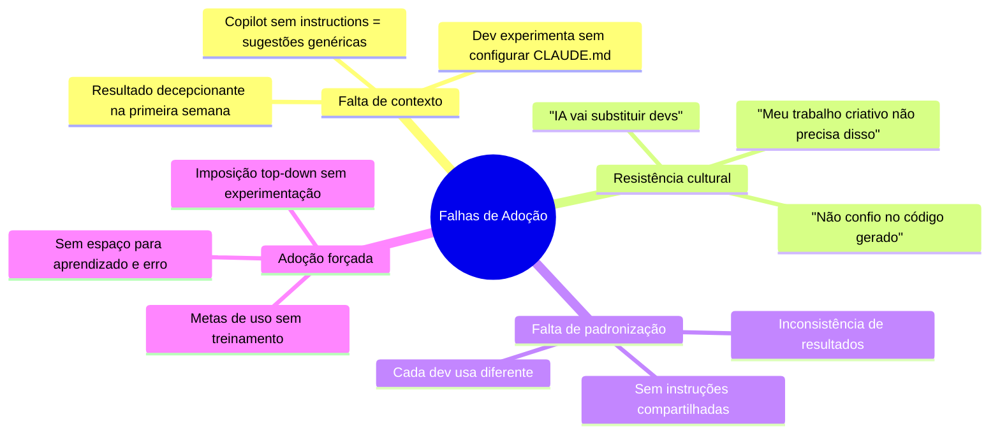
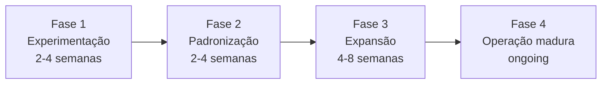

# 01 — Adoção de IA em Times de Desenvolvimento

> **Objetivo:** Entender as dinâmicas de adoção de ferramentas de IA em times, estratégias para superar resistência e como estruturar uma rollout gradual.

---

## Por que a Adoção Falha

A maioria dos problemas de adoção não é técnica — é cultural. Ferramentas de IA bem configuradas ainda falham quando:



---

## Modelo de Adoção em 4 Fases



### Fase 1 — Experimentação (individual)

**Objetivo:** Deixar os devs descobrirem o valor por conta própria, sem pressão.

```
Ações:
✅ Forneça licenças (Copilot, Claude Code)
✅ Organize 1 sessão de demo de 1 hora
✅ Defina um "campeão de IA" voluntário por squad
✅ Crie um canal de Slack/Teams para compartilhar descobertas

Evite:
❌ Métricas de uso nesta fase
❌ Obrigatoriedade
❌ Comparações entre devs
```

### Fase 2 — Padronização (squad)

**Objetivo:** Capturar o que funcionou na fase 1 e institucionalizar.

```
Ações:
✅ Crie copilot-instructions.md e CLAUDE.md no repositório principal
✅ Documente os casos de uso que geraram mais valor
✅ Defina quais tarefas sempre usam IA vs quais são melhor sem
✅ Crie os primeiros agentes customizados (.agent.md)
✅ Configure CI como gate de qualidade dos PRs de IA
```

### Fase 3 — Expansão (time)

**Objetivo:** Escalar para outros squads e repositórios.

```
Ações:
✅ Compartilhe as configurações do squad piloto como ponto de partida
✅ Treine os outros squads nas práticas que funcionaram
✅ Identifique diferenças de stack e adapte as instruções
✅ Meça impacto (tempo de ciclo, defeitos, cobertura de testes)
```

### Fase 4 — Operação madura

**Objetivo:** IA como parte do fluxo normal — não como "ferramenta especial".

```
Ações:
✅ Revise e atualize instruções trimestralmente
✅ Inclua configuração de IA no onboarding de novos devs
✅ Trate copilot-instructions.md e CLAUDE.md como código (PRs, revisão)
✅ Compartilhe aprendizados entre times regularmente
```

---

## Lidando com Resistência

### Resistência: "Não confio no código gerado"

```
✅ Resposta correta: "Nem eu. Por isso revisamos tudo."

A IA é um par de desenvolvimento, não um desenvolvedor autônomo.
Todo código gerado passa por revisão humana — exatamente como
qualquer código de outro desenvolvedor passaria.

Ação prática: Demonstre um caso real onde você identificou e corrigiu
um problema no código gerado. Isso valida a preocupação e mostra o fluxo correto.
```

### Resistência: "Fica mais lento ter que revisar o que a IA gera"

```
✅ Resposta correta: "No início, sim. Depois, não."

O tempo de revisão cai drasticamente quando:
- As instruções de contexto estão bem configuradas
- O dev aprendeu a dar prompts precisos
- O caso de uso está bem definido

Ação prática: Meça o tempo antes/depois em uma tarefa recorrente
do time (ex: geração de testes).
```

### Resistência: "Nossa stack é muito específica — IA não vai ajudar"

```
✅ Resposta correta: "É exatamente por isso que o contexto importa."

Um CLAUDE.md ou copilot-instructions.md bem configurado com os padrões
específicos da stack produz resultados muito melhores do que o uso genérico.

Ação prática: Mostre o antes/depois das sugestões com e sem as instruções
de contexto configuradas.
```

---

## Onboarding de Novos Devs com IA

Inclua no processo de onboarding:

```markdown
## Setup de IA para novos devs

### Dia 1
- [ ] Ative o GitHub Copilot com a conta da empresa
- [ ] Instale as extensões do Copilot no VS Code
- [ ] Leia o .github/copilot-instructions.md do repositório principal

### Dia 2-3
- [ ] Instale o Claude Code: npm install -g @anthropic-ai/claude-code
- [ ] Autentique: claude auth
- [ ] Leia o CLAUDE.md do repositório e o global em ~/.claude/CLAUDE.md

### Primeira semana
- [ ] Peça ao Copilot para explicar os módulos principais do projeto
- [ ] Use Agent Mode para uma tarefa de menor risco (ex: gerar testes)
- [ ] Participe do canal #ai-dev no Slack para compartilhar dúvidas
```

---

## ✅ Pontos-chave do Capítulo

- Falhas de adoção são principalmente culturais, não técnicas
- A adoção forçada top-down produz resistência; a experimentação voluntária produz defensores
- O modelo de 4 fases (experimentação → padronização → expansão → maturidade) reduz o risco
- Contexto bem configurado (instruções, CLAUDE.md) é o fator mais determinante na qualidade dos resultados
- Resistência legítima deve ser respondida com demonstrações práticas, não com argumentos teóricos
- Inclua a configuração de ferramentas de IA no onboarding de novos devs desde o primeiro dia

---

## 🔗 Próxima Aula

👉 [02 — Padrões e Governança](./02-padroes-e-governanca.md)
