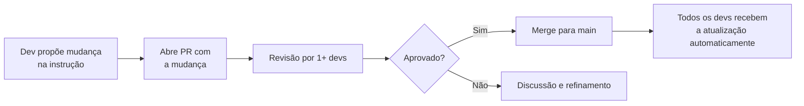

# 02 — Padrões e Governança

> **Objetivo:** Estabelecer padrões organizacionais para uso de IA no desenvolvimento — versionamento de instruções, processo de revisão e política de uso.

---

## Por que Governança Importa

Sem governança, o uso de IA em times escala de forma caótica:

```
Sem governança:
├── Dev A tem CLAUDE.md com padrões do projeto X
├── Dev B usa Copilot sem configuração
├── Dev C criou suas próprias instruções conflitantes com as do time
└── Resultado: código inconsistente, bugs difíceis de rastrear, instrução desatualizada

Com governança:
├── copilot-instructions.md versionado e revisado como código
├── CLAUDE.md no repositório, não no computador de um dev
├── Processo de PR para mudanças nas instruções
└── Resultado: consistência, rastreabilidade, evolução controlada
```

---

## Instruções como Código

O princípio mais importante: **trate arquivos de configuração de IA como código de produção**.



### O que versionar

```
✅ Sempre versionar no repositório:
├── .github/copilot-instructions.md
├── .github/agents/*.agent.md
├── CLAUDE.md
├── .claude/settings.json (sem segredos)
└── docs/ai-stack.md (decisões de configuração)

❌ Nunca versionar:
├── Chaves de API (ANTHROPIC_API_KEY, GITHUB_TOKEN)
├── Settings com caminhos locais absolutos
└── Configurações pessoais que variam por dev
```

---

## Estrutura de Governança por Tamanho de Time

### Time pequeno (até 10 devs)

```
Processo leve:
- PR para mudanças nas instruções (1 aprovador)
- Revisão mensal das instruções em retrospectiva
- Dono: tech lead ou engenheiro sênior voluntário
- Canal Slack dedicado: #ai-dev
```

### Time médio (10–50 devs)

```
Processo estruturado:
- PR para mudanças com template de "AI Config Change"
- Revisão a cada sprint das instruções mais usadas
- Comitê de 2-3 engenheiros sênior responsáveis
- Changelog de mudanças nas instruções (CHANGELOG-AI.md)
- Testes de regressão: após mudança de instrução, validar
  que o agente ainda segue padrões em tarefas de referência
```

### Organização (50+ devs)

```
Processo formal:
- org-level copilot-instructions.md gerenciado pelo time de plataforma
- Instruções de repositório herdam + estendem o org-level
- RFC process para mudanças de alto impacto
- Audit log de uso (Copilot Enterprise ou logging customizado)
- Política de uso aprovada pelo jurídico/compliance
```

---

## Template de PR para Mudanças de Configuração de IA

```markdown
## Mudança de Configuração de IA

### Tipo de mudança
- [ ] Nova instrução/padrão
- [ ] Atualização de instrução existente
- [ ] Novo agente customizado (.agent.md)
- [ ] Remoção de instrução desatualizada

### Motivação
[Por que esta mudança é necessária? Qual problema ela resolve?]

### Impacto esperado
[Como esta mudança afeta o comportamento do Copilot/Claude Code?]

### Testado com
- [ ] Testei a nova instrução com o Copilot Chat em ao menos 3 cenários
- [ ] Testei com o Claude Code em ao menos 1 sessão de Agent Mode
- [ ] O comportamento resultante está alinhado com o objetivo

### Riscos
[Há algum caso onde essa instrução pode produzir comportamento indesejado?]
```

---

## Política de Uso de IA — Pontos Essenciais

Toda organização deve ter uma política clara. Pontos mínimos:

### O que é permitido

```markdown
✅ Usar IA para geração, revisão e documentação de código
✅ Delegar issues bem definidas ao Cloud Agent
✅ Usar IA para geração de testes
✅ Usar IA para debugging e análise de logs
```

### O que requer aprovação especial

```markdown
⚠️ Usar modelos de IA com dados de clientes (verificar contrato/DPA)
⚠️ Integrar IA em pipelines que processam dados PII
⚠️ Usar servidores MCP que acessam sistemas de produção
⚠️ Publicar extensões/plugins de IA para uso externo
```

### O que é proibido

```markdown
❌ Compartilhar credenciais, tokens ou segredos com modelos de IA
❌ Incluir dados de clientes identificáveis em prompts
❌ Usar planos pessoais de IA para trabalho com dados corporativos
❌ Desativar revisão humana em PRs gerados por agentes
❌ Publicar código gerado por IA sem revisão
```

---

## Changelog de Instruções

Mantenha um histórico das mudanças de configuração:

```markdown
# CHANGELOG-AI.md

## 2026-04-15
### copilot-instructions.md
- Adicionado: padrão de erro com ValidationError após problema
  recorrente em PRs do Cloud Agent (ref: PR #234)
- Atualizado: versão do Node.js de 18 para 20

## 2026-03-01
### .github/agents/code-reviewer.agent.md
- Criado: agente de revisão especializado em segurança
  (autor: @carlos, aprovado: @ana)

## 2026-02-10
### CLAUDE.md
- Adicionado: documentação do MCP PostgreSQL disponível no projeto
- Atualizado: lista de comandos aprovados para execução sem confirmação
```

---

## ✅ Pontos-chave do Capítulo

- Trate arquivos de configuração de IA (CLAUDE.md, copilot-instructions.md) como código — com PR e revisão
- Versione tudo no repositório, exceto segredos e configurações pessoais
- O processo de governança deve ser proporcional ao tamanho do time — leve para times pequenos, formal para organizações
- Mantenha um changelog das mudanças de instrução para entender por que o agente se comporta de determinada forma
- Uma política de uso clara define o que é permitido, o que requer aprovação e o que é proibido
- Revisão humana de PRs gerados por IA deve ser não-negociável em qualquer contexto

---

## 🔗 Próxima Aula

👉 [03 — Instruções Compartilhadas](./03-instrucoes-compartilhadas.md)
