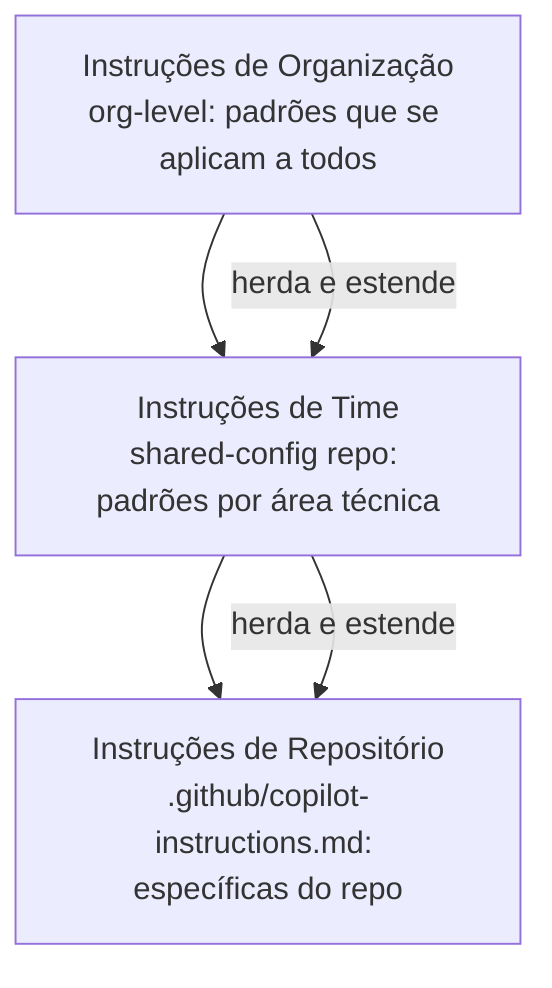

# 03 — Instruções Compartilhadas

> **Objetivo:** Estruturar um sistema de instruções, agentes e configurações compartilhadas entre múltiplos repositórios e times.

---

## O Problema de Escala

Um time com 5 repositórios e configurações de IA independentes em cada um inevitavelmente diverge:

```
repos/
├── backend/
│   └── .github/copilot-instructions.md   ← versão de março
├── frontend/
│   └── .github/copilot-instructions.md   ← versão de janeiro (desatualizada)
├── mobile/
│   └── .github/copilot-instructions.md   ← nunca atualizado
└── infra/
    └── (sem instruções)
```

A solução é centralizar o que é comum e permitir extensão para o que é específico.

---

## Arquitetura de Instruções em Camadas



### Camada 1 — Organização (org-level)

No GitHub Copilot Enterprise, as instruções podem ser configuradas no nível da organização e aplicadas a todos os repositórios automaticamente.

Para times sem Enterprise, use uma convenção: um repositório central que serve como fonte de templates.

```
organização/
└── shared-ai-config/          ← repositório centralizado
    ├── templates/
    │   ├── copilot-instructions-base.md
    │   ├── copilot-instructions-backend.md
    │   ├── copilot-instructions-frontend.md
    │   └── copilot-instructions-infra.md
    ├── agents/
    │   ├── code-reviewer.agent.md
    │   ├── test-expert.agent.md
    │   └── security-auditor.agent.md
    └── CLAUDE-base.md
```

### Camada 2 — Repositório (específico)

Cada repositório começa com o template da camada 1 e adiciona o que é específico:

```markdown
# .github/copilot-instructions.md

<!-- Conteúdo base importado do shared-ai-config -->
[inclua o conteúdo do template backend aqui]

## Especificidades deste repositório

### Stack adicional
- Redis 7 para cache (não usar para estado de sessão — use JWT)
- AWS SQS para filas assíncronas

### Padrões específicos
- Todos os handlers de SQS devem ter idempotência documentada no JSDoc
- Migrations Prisma: sempre reversíveis, revisão obrigatória antes do merge
```

---

## Distribuição via GitHub Actions

Automatize a propagação de atualizações do repositório central:

```yaml
# shared-ai-config/.github/workflows/distribute.yml
name: Distribute AI Config to Repos

on:
  push:
    branches: [main]
    paths:
      - 'templates/**'
      - 'agents/**'

jobs:
  distribute:
    runs-on: ubuntu-latest
    steps:
      - uses: actions/checkout@v4

      - name: Distribute to repos
        env:
          GH_TOKEN: ${{ secrets.ORG_TOKEN }}
        run: |
          repos=("backend" "frontend" "mobile" "infra")
          for repo in "${repos[@]}"; do
            # Cria PR no repo de destino com a versão atualizada
            gh workflow run update-ai-config.yml \
              --repo "org/$repo" \
              --field source_sha=${{ github.sha }}
          done
```

```yaml
# Cada repositório tem um workflow receptor:
# .github/workflows/update-ai-config.yml
name: Update AI Config from Shared

on:
  workflow_dispatch:
    inputs:
      source_sha:
        required: true

jobs:
  update:
    runs-on: ubuntu-latest
    steps:
      - uses: actions/checkout@v4

      - name: Fetch and PR updated config
        run: |
          # Baixa o template atualizado do repo central
          curl -H "Authorization: token ${{ secrets.GH_TOKEN }}" \
            "https://raw.githubusercontent.com/org/shared-ai-config/${{ inputs.source_sha }}/templates/copilot-instructions-backend.md" \
            > .github/copilot-instructions-base.md

          # Cria branch e PR com a atualização
          git checkout -b "chore/update-ai-config-${{ inputs.source_sha }}"
          git add .github/copilot-instructions-base.md
          git commit -m "chore: update shared AI config from ${{ inputs.source_sha }}"
          gh pr create --title "Update AI config from shared" --body "Automated update from shared-ai-config."
```

---

## CLAUDE.md Global vs por Repositório

O Claude Code suporta CLAUDE.md em múltiplos níveis:

```
Hierarquia de CLAUDE.md (todos são lidos e combinados):
1. ~/.claude/CLAUDE.md              ← global, aplica a todas as sessões
2. /workspace/CLAUDE.md             ← raiz do repositório
3. /workspace/src/api/CLAUDE.md     ← específico do subdiretório (se existir)
```

> 📌 **Referência:** docs.anthropic.com/en/docs/claude-code/memory

### Estratégia recomendada para times

```markdown
# ~/.claude/CLAUDE.md (global — instalado via script de onboarding)
Sou desenvolvedor em [Nome da Empresa]. Use português do Brasil.
Nunca compartilhe dados de clientes ou credenciais em respostas.
Para qualquer tarefa que envolva dados de produção, confirme comigo antes de prosseguir.

# /workspace/CLAUDE.md (por repositório)
Leia docs/architecture.md para entender este projeto.
Stack: TypeScript, Node.js 20, PostgreSQL.
[padrões específicos do repositório]
```

---

## Scripts de Onboarding Automatizados

Facilite o setup das configurações para novos devs:

```bash
#!/bin/bash
# scripts/setup-ai-tools.sh — executa no primeiro dia de um novo dev

echo "=== Configurando ferramentas de IA ==="

# Instalar Claude Code
npm install -g @anthropic-ai/claude-code
echo "✅ Claude Code instalado"

# Configurar CLAUDE.md global
mkdir -p ~/.claude
curl -s "https://raw.githubusercontent.com/org/shared-ai-config/main/CLAUDE-global.md" \
  > ~/.claude/CLAUDE.md
echo "✅ CLAUDE.md global configurado"

# Configurar MCP padrão da organização
claude mcp add github \
  -e GITHUB_PERSONAL_ACCESS_TOKEN="$GITHUB_TOKEN" \
  -- npx -y @modelcontextprotocol/server-github
echo "✅ MCP GitHub configurado"

echo ""
echo "=== Setup concluído ==="
echo "Próximos passos:"
echo "1. Configure ANTHROPIC_API_KEY no seu .bashrc/.zshrc"
echo "2. Leia o CLAUDE.md do repositório atual"
echo "3. Acesse #ai-dev no Slack para dúvidas"
```

---

## ✅ Pontos-chave do Capítulo

- Estruture instruções em camadas: org-level → time → repositório específico
- Um repositório central (`shared-ai-config`) é a fonte de verdade para templates e agentes compartilhados
- GitHub Actions pode propagar atualizações do repo central para todos os repos via PRs automáticos
- CLAUDE.md existe em 3 níveis (global, repositório, subdiretório) — todos combinados pelo Claude Code
- Scripts de onboarding automatizados garantem que novos devs tenham a configuração correta desde o dia 1
- Cada repositório deve herdar o template base e adicionar apenas o que é específico — evite duplicação

---

## 🔗 Próxima Aula

👉 [04 — Métricas de Produtividade](./04-metricas-de-produtividade.md)
