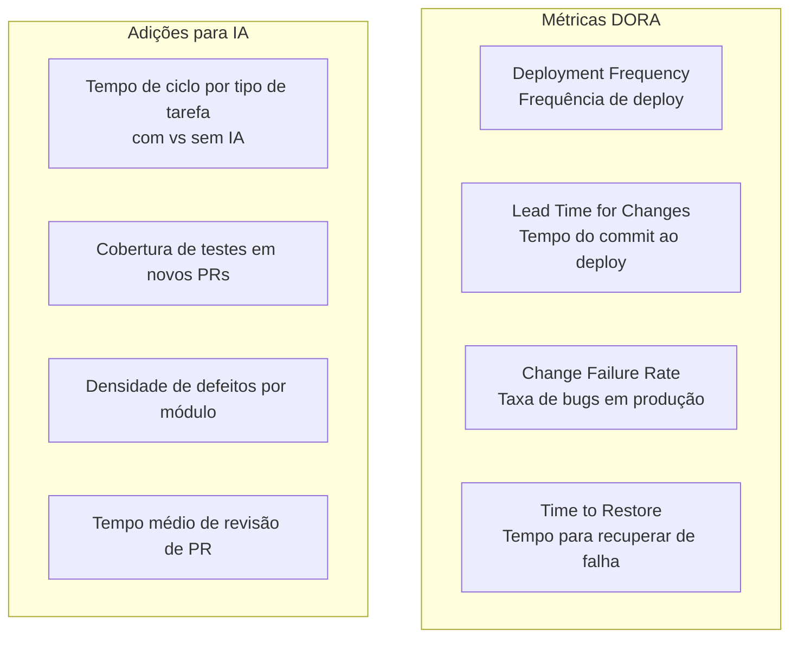

# 04 — Métricas de Produtividade com IA

> **Objetivo:** Entender quais métricas capturam o impacto real das ferramentas de IA no desenvolvimento de software, e quais métricas são enganosas ou contraproducentes.

---

## O Problema das Métricas Erradas

A métrica mais óbvia — **taxa de aceitação de completions** — é também a mais perigosa:

```
Taxa de aceitação alta NÃO significa:
❌ Que o código gerado é correto
❌ Que o dev está sendo mais produtivo
❌ Que a qualidade do software melhorou

Pode significar:
⚠️ O dev está pressionando Tab sem revisar
⚠️ O dev está evitando tarefas onde a IA é fraca
⚠️ A meta de aceitação está distorcendo o comportamento
```

> 📌 **Referência:** docs.github.com/en/copilot/rolling-out-github-copilot-at-scale/analyzing-your-copilot-usage

---

## Framework de Métricas: DORA + IA

As métricas DORA (DevOps Research and Assessment) são o padrão da indústria para saúde de entrega de software. Complemente-as para capturar o impacto da IA:



> 📌 **Referência:** dora.dev/research

---

## Métricas Recomendadas

### 1. Tempo de Ciclo por Tipo de Tarefa

Mede quanto tempo leva, em média, para um tipo específico de tarefa ir do início ao merge:

| Tipo de tarefa | Antes da IA | Com IA | Variação |
|----------------|:-----------:|:------:|:--------:|
| Geração de testes | ? horas | ? horas | ? |
| Nova feature pequena (1-3 arquivos) | ? | ? | ? |
| Correção de bug documentado | ? | ? | ? |
| Documentação de módulo | ? | ? | ? |

**Como medir:** Use as labels do GitHub + timestamps de criação e merge dos PRs.

---

### 2. Cobertura de Testes em Novos PRs

Mede se o uso de IA para geração de testes está se traduzindo em PRs com maior cobertura:

```yaml
# .github/workflows/coverage-report.yml
- name: Report coverage delta
  run: |
    BEFORE=$(git show HEAD^1:coverage-summary.json | jq '.total.lines.pct')
    AFTER=$(cat coverage/coverage-summary.json | jq '.total.lines.pct')
    echo "Coverage: $BEFORE% → $AFTER%"
```

---

### 3. Taxa de Revisão em PRs do Cloud Agent

Mede a qualidade dos PRs gerados automaticamente:

```
PRs do Cloud Agent
├── Taxa de aprovação na primeira revisão: X%
│   (alto = instruções bem configuradas)
├── Número médio de iterações até merge: X
│   (baixo = agente entende bem o contexto)
└── Taxa de rejeição/fechamento: X%
    (alto = issues mal definidas ou escopo errado)
```

---

### 4. Satisfação do Desenvolvedor (Developer Experience)

A métrica mais subestimada. Devs que se sentem mais produtivos com IA a usam mais e melhor.

```
Pesquisa trimestral — 5 perguntas:
1. Com que frequência você usa IA no trabalho? (nunca / raramente / às vezes / sempre)
2. Quanto a IA melhorou sua produtividade? (0-10)
3. Qual tarefa a IA mais te ajudou esta semana?
4. Qual tarefa a IA não ajudou ou atrapalhou?
5. O que mudaria nas nossas configurações de IA?
```

---

## Métricas que Parecem Boas mas São Enganosas

| Métrica | Por que é enganosa |
|---------|-------------------|
| **Taxa de aceitação de completions** | Aceitar sem revisar aumenta a métrica mas piora a qualidade |
| **Número de sessões de agent** | Quantidade não mede valor gerado |
| **Tokens consumidos** | Alto consumo pode indicar mau uso (prompts vagos) |
| **Velocidade de story points** | IA pode acelerar coding mas não resolve débito técnico |
| **PRs por dev por semana** | Mais PRs ≠ mais valor entregue |

---

## Como Estruturar a Medição

### Pré-requisito: baseline

Antes de medir o impacto da IA, meça o estado atual. Você não sabe se melhorou se não sabe de onde partiu.

```bash
# Extrair métricas históricas com GitHub CLI
# Tempo médio de PR (últimos 90 dias):
gh pr list --state merged --limit 200 \
  --json createdAt,mergedAt \
  | jq '[.[] | { delta: (((.mergedAt | fromdateiso8601) - (.createdAt | fromdateiso8601)) / 3600) }] | [.[].delta] | add / length'
```

### Ciclo de medição recomendado

```
Mês 1: Colete o baseline (sem IA ou com uso mínimo)
Mês 2-3: Adoção experimental
Mês 4: Compare com o baseline — ajuste instruções e processo
Mês 7: Segunda medição — avalie tendência
```

---

## O que a Pesquisa Diz sobre Produtividade com IA

Estudos publicados sobre o impacto de ferramentas de IA em desenvolvimento:

- Desenvolvedores completaram tarefas de código **55,8% mais rápido** com GitHub Copilot em ambiente controlado
- A aceleração foi maior em tarefas **bem definidas e isoladas** — menor em tarefas que exigem contexto amplo de sistema
- O benefício varia significativamente por nível de experiência e tipo de tarefa

> 📌 **Referência:** Peng, Z. et al. "The Impact of AI on Developer Productivity" — arxiv.org/abs/2302.06590

A principal limitação dos estudos: medem tarefas isoladas em laboratório. Em projetos reais, o contexto, a complexidade do legado e a necessidade de coordenação reduzem a aceleração observada.

---

## ✅ Pontos-chave do Capítulo

- Taxa de aceitação de completions é a métrica mais comum e uma das mais enganosas
- Métricas DORA (deployment frequency, lead time, change failure rate) são melhores indicadores de saúde
- Meça tempo de ciclo por tipo de tarefa antes e depois da adoção — é a comparação mais justa
- A satisfação do desenvolvedor é uma métrica subestimada mas altamente preditiva de adoção sustentável
- Sempre colete o baseline antes de medir impacto — sem referência, não há comparação válida
- Estudos indicam 55%+ de aceleração em tarefas bem definidas; em projetos reais, o ganho é menor mas real

---

## 🔗 Próxima Aula

👉 [05 — Segurança e Compliance](./05-seguranca-e-compliance.md)
