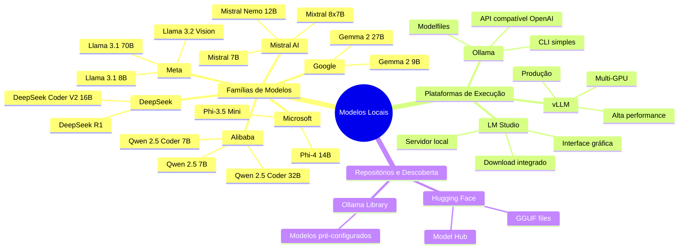

# Aula 01 — O que são Modelos Open Source e Open Weights

## Objetivo

Entender o ecossistema de modelos open source e open-weights, as diferenças fundamentais em relação a modelos proprietários e os critérios para decidir quando cada abordagem faz sentido para um desenvolvedor.

---

## Open Source vs Open Weights vs Proprietário

Nem todo modelo "aberto" é realmente open source no sentido clássico do termo. A distinção importa na prática:

| Categoria | O que está aberto | Exemplos | Pode usar comercialmente? |
|-----------|------------------|----------|--------------------------|
| **Proprietário** | Nada — acesso apenas via API | Claude, GPT-4, Gemini Pro | Mediante contrato/plano |
| **Open Weights** | Os pesos do modelo treinado | Llama 3.1, Mistral 7B, Qwen 2.5 | Depende da licença |
| **Open Source (stricto sensu)** | Pesos + dados de treino + código | Alguns modelos menores, Falcon 180B | Geralmente sim |

> 📌 **Referência:** A definição de Open Source Initiative (OSI) para IA exige abertura dos dados de treino, código e pesos. Llama 3.1 e a maioria dos modelos populares são "open weights", não open source completo: huggingface.co/blog/open-source-llms-as-agents

**Por que a distinção importa para devs:**
- Modelos open-weights podem ser rodados localmente e distribuídos (dentro dos termos da licença)
- Você não depende de uma API externa — o modelo roda no seu hardware
- Mas você não pode auditar o processo de treino nem os dados

---

## Por que Modelos Locais Importam para Desenvolvedores

Cinco razões concretas para considerar modelos locais no seu fluxo de trabalho:

**1. Privacidade e confidencialidade**
Código proprietário, dados de clientes, segredos industriais — nada sai da sua máquina. Ideal para projetos sob NDA ou com requisitos de compliance.

**2. Custo zero por token**
Após o custo de hardware (ou servidor), o custo marginal de cada token é zero. Para volumes altos (automações, CI/CD, pipelines de revisão), isso faz diferença financeira.

**3. Funcionamento offline**
Sem dependência de internet, sem timeout de API, sem interrupção por instabilidade de serviço externo. Importante em ambientes restritos ou durante viagens.

**4. Customização total**
Você pode fazer fine-tuning, criar Modelfiles com system prompts permanentes, ajustar parâmetros de inferência (temperature, context length) sem restrições de API.

**5. Experimentação sem custo**
Testar novos modelos, comparar respostas, iterar em prompts — tudo sem preocupação com custo por requisição.

---

## O Ecossistema Atual

> 📌 **Referência:** huggingface.co/models — repositório com mais de 900.000 modelos públicos, incluindo todos os citados acima

---

## Quando Usar Modelos Locais vs Modelos Cloud

Nem sempre modelos locais são a melhor escolha. A decisão depende do contexto:

| Critério | Modelo Local | Modelo Cloud (Claude/Copilot) |
|----------|-------------|-------------------------------|
| **Privacidade dos dados** | ✅ Dados ficam no hardware | ⚠️ Dados enviados ao provedor |
| **Custo a longo prazo** | ✅ Zero marginal após hardware | ⚠️ Custo por token/assinatura |
| **Qualidade em tarefas complexas** | ⚠️ Menor em modelos <70B | ✅ Claude Opus, GPT-4 são superiores |
| **Facilidade de setup** | ⚠️ Requer configuração de hardware | ✅ Funciona imediatamente |
| **Latência** | ✅ Zero rede (mas CPU/GPU limitada) | ⚠️ Dependente de rede |
| **Contexto longo (200K+ tokens)** | ❌ Maioria limitada a 32K–128K | ✅ Claude suporta 200K tokens |
| **Disponibilidade offline** | ✅ Funciona sem internet | ❌ Requer conexão |
| **Fine-tuning** | ✅ Possível | ❌ Não disponível para usuários |
| **Ferramentas de IDE integradas** | ⚠️ Requer extensões alternativas | ✅ Copilot/Claude Code integrados |

**Regra prática:** use modelos locais para tarefas rotineiras, dados sensíveis e automações de alto volume. Use Claude/Copilot para raciocínio arquitetural, código complexo e contextos longos.

---

## Limitações Honestas

É importante ser direto: modelos locais têm limitações reais que não desaparecem com hype.

**Capacidade:**
- Modelos até ~13B parâmetros ficam consistentemente abaixo de Claude Sonnet e GPT-4 em qualidade de raciocínio
- Para arquitetura de sistemas, debugging complexo e geração de código com múltiplas dependências, a diferença é perceptível

**Hardware:**
- Rodar um modelo 70B com qualidade decente requer 40GB+ de VRAM — hardware profissional, não um laptop
- Modelos menores (7B–13B) cabem em hardware comum mas com qualidade proporcional

**Manutenção:**
- Atualizar modelos, gerenciar versões e garantir compatibilidade com ferramentas é responsabilidade sua
- Não há suporte — apenas comunidade

**Velocidade de inferência:**
- Em CPU, a geração é lenta (5–15 tokens/segundo vs 50–100+ em GPU)
- Em GPU consumer (RTX 4090), velocidade é boa, mas ainda menor que APIs cloud com infraestrutura dedicada

> 📌 **Referência:** Comparativos independentes de qualidade em livecodebenches.io e lmsys.org/leaderboard confirmam a diferença de qualidade entre modelos <70B e os melhores proprietários.

---

## Pontos-Chave

- **Open weights ≠ open source** — a maioria dos modelos populares abre apenas os pesos, não os dados de treino
- **Privacidade é o caso de uso mais forte** para modelos locais — dados que não podem sair da organização
- **Custo vs qualidade** — modelos locais são economicamente atrativos para volume alto, mas tecnicamente inferiores para tarefas complexas
- **Hardware é o gargalo real** — um modelo 70B de qualidade requer hardware profissional

---

## Próxima Aula

👉 [Aula 02 — Principais Modelos para Desenvolvedores](./02-principais-modelos-para-desenvolvedores.md)
