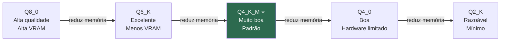

# Aula 02 — Principais Modelos para Desenvolvedores

## Objetivo

Conhecer os modelos open-weights mais relevantes para tarefas de desenvolvimento de software, entender os critérios de seleção e saber qual escolher para cada tipo de tarefa.

---

## Critérios de Seleção para Devs

Antes de escolher um modelo, avalie esses cinco critérios:

**1. Tamanho × VRAM disponível**
O tamanho em bilhões de parâmetros (B) determina quanto de VRAM GPU (ou RAM unificada em Apple Silicon) o modelo precisa. Um modelo que não cabe na memória degrada para CPU — lento e praticamente inutilizável para trabalho real.

**2. Qualidade em código**
Nem todo modelo generalista é bom em código. Modelos especializados (como Qwen Coder e DeepSeek Coder) superam modelos generalistas de mesmo tamanho em completion, geração e explicação de código.

**3. Velocidade de inferência**
Tokens por segundo determinam se o modelo é prático para uso interativo. Abaixo de ~10 tok/s a experiência começa a se tornar lenta demais para completions inline.

**4. Licença e uso comercial**
Apache 2.0 permite uso comercial irrestrito. Llama 3.1 Community License permite uso comercial até 700 milhões de usuários ativos mensais. Algumas licenças proíbem uso comercial — verifique sempre antes de usar em projetos de cliente.

**5. Suporte a português**
Para devs brasileiros que usam o modelo para documentação, explicações e comentários em PT-BR, o suporte multilíngue é relevante. Modelos treinados em dados mais diversificados têm melhor qualidade em português.

---

## Tabela Comparativa dos Principais Modelos

| Modelo | Tamanho | VRAM mín. | Forte em | Licença | PT-BR |
|--------|---------|-----------|----------|---------|-------|
| **Llama 3.1 8B** | 8B | 6 GB | Raciocínio geral, instrução | Llama 3.1 Community | ✅ Bom |
| **Llama 3.1 70B** | 70B | 40 GB | Raciocínio profundo | Llama 3.1 Community | ✅ Bom |
| **Qwen 2.5 Coder 7B** | 7B | 5 GB | Código especializado, fill-in-middle | Apache 2.0 | ✅ Bom |
| **Qwen 2.5 Coder 32B** | 32B | 20 GB | Código avançado, arquitetura | Apache 2.0 | ✅ Bom |
| **Mistral 7B Instruct** | 7B | 5 GB | Instrução rápida, JSON | Apache 2.0 | ⚠️ Básico |
| **Gemma 2 9B** | 9B | 7 GB | Multilíngue, raciocínio | Gemma Terms | ✅ Bom |
| **Phi-4** | 14B | 10 GB | Raciocínio, baixo hardware | MIT | ⚠️ Básico |
| **DeepSeek Coder V2 16B** | 16B | 12 GB | Código, fill-in-middle, debug | DeepSeek License | ⚠️ Básico |

> 📌 **Referências:** Model cards com benchmarks verificáveis em huggingface.co/meta-llama, huggingface.co/Qwen, huggingface.co/mistralai, huggingface.co/google, huggingface.co/microsoft, huggingface.co/deepseek-ai

---

## Modelos Especializados em Código

Modelos code-specific superam generalistas de mesmo tamanho porque:
- Foram treinados em proporção maior de código (GitHub, StackOverflow, documentações)
- Incluem dados de fill-in-middle (FIM) — técnica onde o modelo aprende a completar código com contexto antes E depois do cursor
- Têm tokenização otimizada para linguagens de programação

**Qwen 2.5 Coder** é o mais recomendado para a maioria dos devs em 2025:
- Versão 7B cabe em qualquer machine com GPU discreta moderna
- Versão 32B é competitiva com Claude Haiku em muitas tarefas de código
- Licença Apache 2.0 — uso comercial irrestrito
- Excelente suporte a Python, JavaScript/TypeScript, Java, Go, C++

**DeepSeek Coder V2** é forte alternativa:
- 16B parâmetros com qualidade acima do esperado para o tamanho
- Especialmente bom em debugging e compreensão de código existente
- Verifique a licença DeepSeek antes de uso comercial

> 📌 **Referências:** 
> - Qwen 2.5 Coder paper: arxiv.org/abs/2409.12186
> - DeepSeek Coder V2 paper: arxiv.org/abs/2406.11931

---

## Português no Contexto do Desenvolvedor Brasileiro

Para uso em documentação, comentários e explicações em PT-BR:

**Melhor suporte:**
- **Gemma 2** — treinado pela Google com dados multilíngues diversificados, qualidade consistente em português
- **Qwen 2.5** — dados de treino incluem grande volume em português e outras línguas além de inglês
- **Llama 3.1** — Meta investiu em multilíngue nas versões 3.x, PT-BR adequado

**Suporte básico:**
- **Mistral 7B** — foco em inglês e francês; português funcional mas não fluente
- **Phi-4** — Microsoft focou em inglês; português em tarefas simples funciona, mas evite documentação extensa

**Recomendação prática:** se PT-BR em respostas é importante, use Qwen 2.5 Coder (7B ou 32B) — combina qualidade em código com suporte ao português.

---

## Quantização: o que é e por que importa

Modelos são distribuídos em diferentes formatos de quantização — o processo de reduzir a precisão dos pesos para economizar memória, com tradeoff de qualidade.

**Nomenclatura GGUF (formato Ollama/llama.cpp):**

```
qwen2.5-coder:7b-q4_K_M
               ↑          ↑
               tamanho    quantização
```

| Quantização | VRAM aprox. (7B) | Qualidade | Caso de uso |
|-------------|-----------------|-----------|-------------|
| `Q8_0` | ~8 GB | ≈ original | Máxima qualidade, GPU com VRAM alta |
| `Q6_K` | ~6 GB | Excelente | Bom equilíbrio qualidade × memória |
| `Q4_K_M` | ~4.5 GB | Muito boa | **Padrão recomendado** |
| `Q4_0` | ~4 GB | Boa | Hardware mais limitado |
| `Q2_K` | ~3 GB | Razoável | Apenas se não houver alternativa |



**Regra prática:** use `Q4_K_M` como padrão — é o ponto ótimo na maioria dos casos.

> 📌 **Referência:** Documentação do formato GGUF e benchmarks de quantização: github.com/ggerganov/llama.cpp/blob/master/docs/quantization.md

---

## Escolhendo pelo Hardware Disponível

| Hardware | RAM/VRAM | Modelos recomendados |
|----------|----------|---------------------|
| MacBook Apple Silicon (16GB) | ~12GB disponível | Qwen 2.5 Coder 7B Q6_K, Phi-4 Q4_K_M |
| MacBook Apple Silicon (32GB) | ~24GB disponível | Qwen 2.5 Coder 14B Q8_0, Llama 3.1 13B |
| PC com RTX 3060 (12GB VRAM) | 12GB VRAM | Qwen 2.5 Coder 7B Q8_0, DeepSeek Coder 16B Q4_K_M |
| PC com RTX 4090 (24GB VRAM) | 24GB VRAM | Qwen 2.5 Coder 32B Q4_K_M, Llama 3.1 34B |
| Servidor com A100 (80GB) | 80GB VRAM | Llama 3.1 70B Q8_0, qualquer modelo |

---

## Pontos-Chave

- **Qwen 2.5 Coder** é a recomendação padrão para código: Apache 2.0, bom PT-BR, versões que cabem em hardware comum
- **Quantização Q4_K_M** é o ponto ótimo qualidade × memória para a maioria das situações
- **Modelos code-specific** superam generalistas de mesmo tamanho em tarefas de programação
- **Sempre verifique a licença** antes de usar em projetos de cliente ou comerciais

---

## Próxima Aula

👉 [Aula 03 — Executando Localmente com Ollama](./03-executando-localmente-com-ollama.md)
