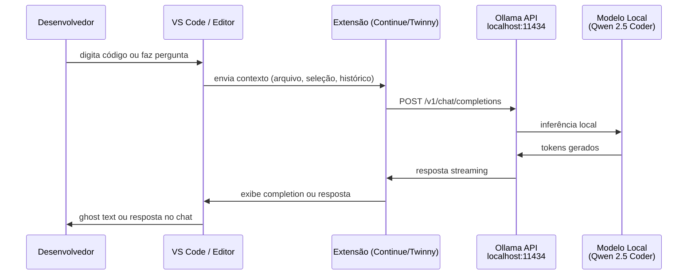

# Aula 03 — Executando Localmente com Ollama

## Objetivo

Instalar e usar o Ollama para rodar modelos de linguagem localmente, entender sua API compatível com OpenAI e criar modelos customizados com Modelfiles.

---

## O que é o Ollama

Ollama é uma ferramenta open source que simplifica o download, a execução e o gerenciamento de modelos de linguagem locais. Ele abstrai a complexidade do llama.cpp e outros backends de inferência em uma interface de linha de comando simples e uma API REST.

**Por que o Ollama se tornou o padrão:**
- Instalação em um comando
- Download automático de modelos do Ollama Library
- API REST local compatível com o formato da OpenAI — qualquer cliente que fala com OpenAI funciona com Ollama sem modificação
- Gerenciamento automático de VRAM (GPU offloading quando possível, fallback para CPU)
- Suporte a Modelfiles para customização de modelos

> 📌 **Referência:** github.com/ollama/ollama e ollama.com/docs

---

## Instalação

### macOS

```bash
# Via Homebrew (recomendado)
brew install ollama

# Ou download direto do site
# ollama.com/download
```

### Linux

```bash
# Script oficial de instalação
curl -fsSL https://ollama.com/install.sh | sh

# O serviço é iniciado automaticamente via systemd
# Para verificar:
systemctl status ollama
```

### Windows

Baixe o instalador em ollama.com/download — instala como serviço do Windows e adiciona `ollama` ao PATH automaticamente.

> 📌 **Referência:** ollama.com/download — instaladores oficiais para cada plataforma

---

## Comandos Essenciais

| Comando | O que faz |
|---------|-----------|
| `ollama pull <modelo>` | Baixa um modelo do Ollama Library |
| `ollama run <modelo>` | Baixa (se necessário) e inicia chat interativo |
| `ollama list` | Lista modelos instalados localmente |
| `ollama rm <modelo>` | Remove um modelo do disco |
| `ollama serve` | Inicia o servidor Ollama manualmente (normalmente automático) |
| `ollama ps` | Lista modelos carregados na memória agora |
| `ollama show <modelo>` | Exibe informações e parâmetros do modelo |

---

## Rodando o Primeiro Modelo

Exemplo completo com Qwen 2.5 Coder 7B — bom para código, cabe em GPUs com 6–8GB VRAM:

```bash
# 1. Baixar o modelo (primeira vez — ~4.7GB para Q4_K_M)
ollama pull qwen2.5-coder:7b

# 2. Iniciar chat interativo
ollama run qwen2.5-coder:7b

# 3. Na interface de chat, você pode digitar diretamente:
>>> Escreva uma função TypeScript que valida um email com regex
```

Para sair do chat: `/bye` ou Ctrl+D.

**Especificando quantização explicitamente:**

```bash
# Versão Q8_0 (maior qualidade, mais VRAM)
ollama pull qwen2.5-coder:7b-q8_0

# Versão padrão (Q4_K_M quando não especificado)
ollama pull qwen2.5-coder:7b
```

---

## API REST do Ollama

O Ollama expõe uma API local na porta `11434`. Ela tem dois formatos: o nativo do Ollama e um compatível com a API OpenAI.

### Endpoint nativo

```bash
# Geração simples
curl http://localhost:11434/api/generate \
  -d '{
    "model": "qwen2.5-coder:7b",
    "prompt": "Explique o que é uma closure em JavaScript",
    "stream": false
  }'
```

```bash
# Chat com histórico
curl http://localhost:11434/api/chat \
  -d '{
    "model": "qwen2.5-coder:7b",
    "messages": [
      { "role": "user", "content": "O que é injeção de dependência?" }
    ],
    "stream": false
  }'
```

### Endpoint compatível com OpenAI (`/v1/`)

Este é o formato mais útil na prática — qualquer SDK ou ferramenta que usa a API OpenAI funciona apontando para o Ollama local:

```javascript
// Node.js com openai SDK oficial
import OpenAI from "openai";

const client = new OpenAI({
  baseURL: "http://localhost:11434/v1",
  apiKey: "ollama", // qualquer string — Ollama ignora
});

const response = await client.chat.completions.create({
  model: "qwen2.5-coder:7b",
  messages: [
    {
      role: "user",
      content: "Escreva um middleware Express que valida JWT",
    },
  ],
});

console.log(response.choices[0].message.content);
```

```python
# Python com openai SDK
from openai import OpenAI

client = OpenAI(
    base_url="http://localhost:11434/v1",
    api_key="ollama",
)

response = client.chat.completions.create(
    model="qwen2.5-coder:7b",
    messages=[{"role": "user", "content": "Escreva um decorator Python que mede tempo de execução"}],
)

print(response.choices[0].message.content)
```

> 📌 **Referência:** ollama.com/docs/openai — documentação da compatibilidade com API OpenAI

---

## Personalização com Modelfile

Um Modelfile é um arquivo de configuração que define um modelo customizado — similar ao que um `CLAUDE.md` faz para o Claude Code, mas permanente e embutido no modelo.

**Caso de uso:** criar uma versão do modelo com system prompt fixo específico para o seu projeto.

```dockerfile
# Arquivo: Modelfile
FROM qwen2.5-coder:7b

# System prompt permanente — sempre presente, invisível para o usuário
SYSTEM """
Você é um assistente de desenvolvimento especializado neste projeto.

Stack:
- Backend: Node.js + TypeScript + Express + Prisma
- Frontend: React + Vite + Tailwind
- Banco: PostgreSQL
- Testes: Vitest + Supertest

Regras:
- Sempre use TypeScript com tipos explícitos, nunca 'any'
- Funções async sempre com try/catch ou Result<T, E>
- Nomes de variáveis em inglês, comentários em português
- Imports organizados: libs externas, libs internas, tipos
"""

# Parâmetros de inferência
PARAMETER temperature 0.1
PARAMETER num_ctx 8192
```

```bash
# Criar o modelo customizado
ollama create meu-projeto-coder -f ./Modelfile

# Usar o modelo customizado
ollama run meu-projeto-coder

# Listar para confirmar
ollama list
```

> 📌 **Referência:** ollama.com/docs/modelfile — referência completa do formato Modelfile

---

## Como o Ollama se Encaixa no Fluxo



Toda a comunicação acontece localmente — nenhum dado sai da máquina.

---

## Pontos-Chave

- **`ollama run`** é o comando mais usado: baixa se necessário e abre chat interativo
- **API compatível com OpenAI** em `/v1/` permite usar qualquer SDK existente sem modificação
- **Modelfile** é o mecanismo para criar versões do modelo com system prompt e parâmetros fixos — use para projetos específicos
- **Porta padrão 11434** — configure suas ferramentas para apontar para `http://localhost:11434`

---

## Próxima Aula

👉 [Aula 04 — LM Studio e Interfaces Gráficas](./04-lm-studio-e-interfaces-graficas.md)
