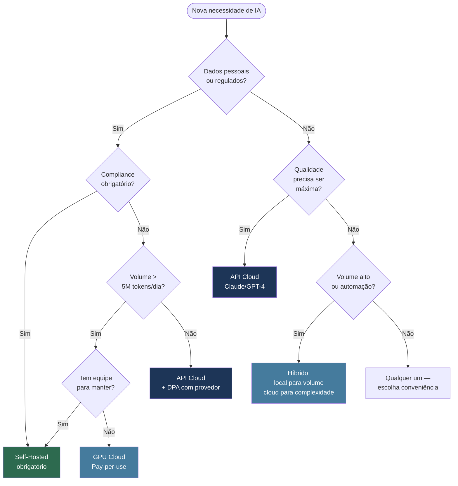

# Aula 06 — Privacidade, Compliance e Casos Enterprise

## Objetivo

Entender quando o self-hosted é a escolha tecnicamente necessária por razões de privacidade ou compliance, o que a LGPD implica para uso de IA, os requisitos de hardware para operar em escala e quando o custo se justifica.

---

## Quando Self-Hosted é Obrigatório

Em algumas situações, usar uma API cloud não é uma escolha — é uma violação de contratos, regulamentação ou política interna. Self-hosted se torna obrigatório quando:

| Situação | Por quê cloud não serve |
|---------|------------------------|
| **Dados de saúde (prontuários, laudos)** | LGPD + resolução CFM proíbem processamento por terceiros sem DPA específico |
| **Segredos industriais e IP** | Contratos de NDA frequentemente vedam envio a serviços de terceiros |
| **Código fonte de projetos sigilosos** | Contratos de desenvolvimento podem proibir exposição a fornecedores externos |
| **Dados financeiros regulados** | Compliance BACEN/CVM pode exigir processamento em infraestrutura própria |
| **Ambientes air-gapped** | Redes sem acesso à internet por requisito de segurança (governo, defesa, etc.) |
| **Dados de menores** | LGPD impõe restrições específicas que dificultam delegação a terceiros |

---

## LGPD e IA Self-Hosted

A Lei Geral de Proteção de Dados (Lei 13.709/2018) tem implicações diretas para o uso de IA em dados de pessoas físicas.

**Quando você envia dados pessoais para uma API cloud:**
- O provedor da API se torna um **operador** de dados no sentido da LGPD
- Você (o controlador) deve ter um **DPA** (Data Processing Agreement) com o provedor
- Deve registrar o uso no seu **RIPD** (Relatório de Impacto à Proteção de Dados)
- A transferência internacional de dados exige base legal específica (adequação, cláusulas contratuais)

**Quando você processa localmente (self-hosted):**
- O dado não sai da sua infraestrutura
- Não há operador externo — você é controlador e operador
- A obrigação de RIPD ainda existe, mas a base legal é mais simples
- Sem necessidade de DPA com fornecedor de IA

**Implicação prática para devs brasileiros:**

```
Regra de bolso:
- Nome, CPF, e-mail, telefone de clientes → use modelo local
- Código de lógica de negócio sem dados pessoais → API cloud é aceitável
- Dados de saúde, financeiros ou de menores → modelo local + consulte jurídico
```

> 📌 **Referência:** gov.br/anpd — ANPD (Autoridade Nacional de Proteção de Dados) — guias e orientações sobre LGPD e IA

---

## Requisitos de Hardware

A viabilidade de rodar modelos locais depende diretamente do hardware disponível. A tabela abaixo usa modelos quantizados em Q4_K_M (formato padrão Ollama):

| Perfil | Hardware | Modelos viáveis | Velocidade aprox. | Custo aprox. |
|--------|----------|----------------|------------------|--------------|
| **Dev solo (Apple Silicon)** | M2 Pro / M3 Pro 16GB | até 13B Q4_K_M | 25–40 tok/s | Hardware existente |
| **Dev solo (Apple Silicon)** | M2 Max / M3 Max 32GB | até 34B Q4_K_M | 20–35 tok/s | Hardware existente |
| **Dev solo (PC gaming)** | RTX 3060 12GB | até 13B Q8_0 | 40–60 tok/s | R$ 2.500–4.000 |
| **Dev solo (PC gaming)** | RTX 4090 24GB | até 34B Q4_K_M | 60–90 tok/s | R$ 6.000–10.000 |
| **Time pequeno (servidor)** | 2× RTX 4090 48GB | até 70B Q4_K_M | 30–50 tok/s | R$ 15.000–25.000 |
| **Time pequeno (servidor)** | 2× A6000 96GB | até 70B Q8_0 | 40–70 tok/s | R$ 40.000–70.000 |
| **Organização (cloud GPU)** | A100 80GB (cloud) | até 70B Q8_0 | 70–100 tok/s | ~USD 2–4/hora |
| **Organização (on-prem)** | 4× A100 320GB | 70B+ em FP16 | máxima | R$ 400.000+ |

> 📌 **Referência:** Benchmarks de velocidade de inferência por hardware em ollama.com/blog e github.com/ggerganov/llama.cpp/discussions

**Apple Silicon é a opção mais acessível para devs solo:** a RAM unificada permite que o modelo use toda a memória disponível sem separação CPU/GPU — um M3 Max com 64GB roda um 70B quantizado de forma usável.

---

## vLLM para Produção

Quando o Ollama não é suficiente — alto throughput, múltiplos usuários simultâneos, latência crítica — o **vLLM** é o servidor de inferência de referência para ambientes de produção.

**Quando considerar vLLM:**
- Mais de 10–20 usuários simultâneos
- Necessidade de batching automático de requisições
- Integração com sistemas de autenticação e rate limiting
- Ambientes Kubernetes / cloud-native

**Configuração básica com vLLM:**

```bash
# Instalação
pip install vllm

# Servir um modelo (requer GPU NVIDIA com CUDA)
python -m vllm.entrypoints.openai.api_server \
  --model Qwen/Qwen2.5-Coder-7B-Instruct \
  --host 0.0.0.0 \
  --port 8000 \
  --max-model-len 32768
```

O vLLM expõe a mesma API OpenAI-compatible na porta configurada — mesmas ferramentas e clientes funcionam sem modificação.

> 📌 **Referência:** github.com/vllm-project/vllm — documentação completa de instalação e configuração

---

## Análise de Custo: Self-Hosted vs API Cloud

O custo de self-hosted só se justifica em volume suficiente. Esta análise usa preços de referência de 2025:

**Referência de preços (Claude Sonnet via API):**
- Input: ~USD 3 por milhão de tokens
- Output: ~USD 15 por milhão de tokens

**Ponto de break-even (servidor RTX 4090, ~R$8.000):**

```
Volume mensal para amortizar em 12 meses:
- Custo mensal do hardware: R$667 (8000/12) + energia (~R$100) ≈ R$800/mês
- Equivalente em tokens Claude Sonnet: ~160 milhões de tokens de output/mês
- Ou ~5,3 milhões de tokens de output por dia
```

**Conclusão prática:**
- **Menos de 500K tokens/dia** → API cloud é mais barata e sem overhead de manutenção
- **500K–5M tokens/dia** → análise caso a caso; considere GPU cloud (pay-per-use)
- **Mais de 5M tokens/dia** → self-hosted começa a compensar financeiramente

**Fatores que mudam o cálculo:**
- Compliance obrigatório elimina a análise de custo — self-hosted é necessário independentemente
- GPU cloud (AWS, GCP, Lambda Labs) oferece meio-termo: sem CapEx, mas custo por hora de GPU

---

## Decisão Final: Local, Cloud ou Híbrido?



---

## Limitações que Permanecem

Mesmo com hardware profissional, algumas limitações são inerentes aos modelos self-hosted atuais:

**Qualidade:**
- Modelos até 70B ainda ficam abaixo de Claude Opus e GPT-4 em tarefas de raciocínio profundo, arquitetura de sistemas complexos e debugging multi-arquivo
- A diferença é menor em código rotineiro, mas perceptível em problemas genuinamente difíceis

**Manutenção:**
- Atualizar para novos modelos é manual — não há atualização automática
- Compatibilidade entre versões de ferramentas (Ollama, vLLM, llama.cpp) pode quebrar
- Segurança do servidor de inferência é responsabilidade sua — vLLM não tem autenticação por padrão

**Suporte:**
- Sem SLA — incidentes são resolvidos por você ou via comunidade open source
- Debugging de problemas de hardware (CUDA errors, OOM) requer conhecimento especializado

---

## Pontos-Chave

- **Compliance é o driver mais forte** para self-hosted — quando dados não podem sair da organização, a análise de custo é secundária
- **LGPD cria obrigações** mesmo com API cloud — DPA, RIPD e base legal para transferência internacional são necessários
- **Apple Silicon democratizou** execução local — um M3 Max 32GB roda modelos 32B com qualidade adequada para uso diário
- **vLLM para produção** quando Ollama não escala — API idêntica, muito mais throughput
- **Self-hosted financeiramente só compensa** acima de ~5M tokens/dia de output — abaixo disso, API cloud é mais barata sem o overhead

---

## Próximos Passos

👉 [Exercícios do Capítulo 11](./07-exercicios.md)
