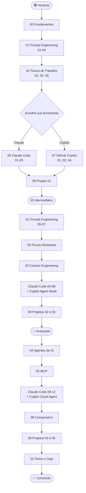

# AI-Driven Development — Curso Completo em Português 🤖

**EM DESENVOLVIMENTO **

Curso estruturado sobre **desenvolvimento com inteligência artificial**: do prompt engineering básico a agentes autônomos, context engineering e integração com **Claude Code** e **GitHub Copilot**. Conteúdo em português, baseado nas documentações oficiais da Anthropic e GitHub.

> **55+ aulas** · **5 projetos práticos** · **Gratuito e open source**

---

## Por que este curso?

A maioria dos materiais sobre IA para programadores está em inglês, é superficial ou fica desatualizado rápido. Este repositório resolve os três problemas:

- 🇧🇷 **Português do Brasil** — conteúdo nativo, não traduzido
- 📚 **Profundidade real** — do "o que é um token" até orquestração de agentes multi-step
- 🔗 **Fontes verificáveis** — cada afirmação tem referência na documentação oficial

Se você é desenvolvedor e quer usar IA de forma profissional — não apenas pedir "escreva um código pra mim" — este curso é para você.

---

## Para quem é este curso?

| Perfil                             | O que você vai ganhar                                       |
| ---------------------------------- | ----------------------------------------------------------- |
| **Dev que quer começar com IA**    | Fundamentos sólidos sem hype, primeiros fluxos reais        |
| **Dev que já usa Copilot/ChatGPT** | Técnicas avançadas: context engineering, agentes, MCP       |
| **Tech lead / arquiteto**          | Como adotar IA em times, governança, métricas               |
| **Dev focado em Claude Code**      | Guia completo: CLAUDE.md, skills, hooks, subagents          |
| **Dev focado em GitHub Copilot**   | Agent mode, cloud agent, customização, copilot-instructions |

**Pré-requisitos:** Programação básica em qualquer linguagem + linha de comando.

---

## O que você vai aprender

- 🧠 **Como LLMs funcionam** — tokens, janela de contexto, temperatura, alucinações
- ✍️ **Prompt engineering para código** — anatomia de prompts, técnicas avançadas, anti-patterns
- 🔄 **IA no ciclo de desenvolvimento** — TDD, code review, debugging, refatoração e testes com IA
- 🏗️ **Context engineering** — a habilidade que separa uso básico de uso avançado
- 🤖 **Agentes de IA** — topologias, multi-agent workflows, human-in-the-loop, segurança
- 🔌 **MCP (Model Context Protocol)** — conectar modelos a APIs, bancos de dados e ferramentas
- ⚡ **Claude Code** — CLAUDE.md, skills, hooks, subagents, MCP, fluxos avançados
- 🐙 **GitHub Copilot** — agent mode, cloud agent, customização, CLI
- ⚖️ **Quando usar cada ferramenta** — comparativo Claude vs Copilot por caso de uso
- 🏢 **Adoção em times** — padrões, governança, métricas, LGPD/GDPR

---

## 🗺️ Índice Completo

### 📚 [Capítulo 00 — Fundamentos](./00-fundamentos/)

> Conceitos base independentes de ferramenta. Leitura obrigatória antes de qualquer módulo.

| #   | Aula                                                                                              | Descrição                                                             |
| --- | ------------------------------------------------------------------------------------------------- | --------------------------------------------------------------------- |
| 01  | [O que é AI-Driven Development](./00-fundamentos/01-o-que-e-ai-driven-development.md)             | Definição, AI-assisted vs AI-driven, o novo papel do dev              |
| 02  | [Mental Models](./00-fundamentos/02-mental-models.md)                                             | Como pensar com IA: pair programmer, revisor, calibração de autonomia |
| 03  | [Como LLMs Funcionam para Devs](./00-fundamentos/03-como-llms-funcionam-para-devs.md)             | Tokens, contexto, temperatura — o essencial para usar bem             |
| 04  | [Limitações e Expectativas Realistas](./00-fundamentos/04-limitacoes-e-expectativas-realistas.md) | Alucinações, erros lógicos, limites de contexto                       |
| 05  | [Ética e Responsabilidade](./00-fundamentos/05-etica-e-responsabilidade.md)                       | IP, segurança, revisão obrigatória, uso responsável                   |
| 📝  | [Exercícios do Capítulo 00](./00-fundamentos/06-exercicios.md)                                    | Pratique os conceitos fundamentais                                    |

---

### ✍️ [Capítulo 01 — Prompt Engineering](./01-prompt-engineering/)

> A habilidade central do AI-driven developer. Agnóstico de ferramenta.

| #   | Aula                                                                                       | Descrição                                           |
| --- | ------------------------------------------------------------------------------------------ | --------------------------------------------------- |
| 01  | [Princípios Fundamentais](./01-prompt-engineering/01-principios-fundamentais.md)           | Clareza, especificidade, contexto, formato de saída |
| 02  | [Anatomia de um Prompt](./01-prompt-engineering/02-anatomia-de-um-prompt.md)               | Papel, Tarefa, Contexto, Formato, Restrições        |
| 03  | [Técnicas Avançadas](./01-prompt-engineering/03-tecnicas-avancadas.md)                     | Chain-of-thought, zero-shot, few-shot, ReAct        |
| 04  | [Prompts para Código](./01-prompt-engineering/04-prompts-para-codigo.md)                   | Geração, refatoração, debug, testes, docs           |
| 05  | [Chain-of-Thought e Reasoning](./01-prompt-engineering/05-chain-of-thought-e-reasoning.md) | Raciocínio passo a passo, extended thinking         |
| 06  | [Few-Shot e Exemplos](./01-prompt-engineering/06-few-shot-e-exemplos.md)                   | Calibrar o modelo com exemplos de entrada/saída     |
| 07  | [Anti-Patterns](./01-prompt-engineering/07-anti-patterns.md)                               | Prompts vagos, contexto excessivo, ambiguidade      |
| 📁  | [Exemplos Práticos](./01-prompt-engineering/exemplos/)                                     | Prompts prontos: refactor, debug, testes, review    |
| 📝  | [Exercícios do Capítulo 01](./01-prompt-engineering/08-exercicios.md)                      | Pratique prompt engineering                         |

---

### 🔄 [Capítulo 02 — Fluxos de Trabalho](./02-fluxos-de-trabalho/)

> Integração da IA no dia a dia do desenvolvimento.

| #   | Aula                                                                                           | Descrição                                               |
| --- | ---------------------------------------------------------------------------------------------- | ------------------------------------------------------- |
| 01  | [IA no Ciclo de Desenvolvimento](./02-fluxos-de-trabalho/01-ai-no-ciclo-de-desenvolvimento.md) | IA em cada fase: ideação, design, impl, revisão, deploy |
| 02  | [TDD com IA](./02-fluxos-de-trabalho/02-tdd-com-ia.md)                                         | Red-Green-Refactor assistido por IA                     |
| 03  | [Code Review com IA](./02-fluxos-de-trabalho/03-code-review-com-ia.md)                         | IA como primeiro revisor, checklist automatizado        |
| 04  | [Refatoração Assistida](./02-fluxos-de-trabalho/04-refatoracao-assistida.md)                   | Estratégias de refatoração incremental                  |
| 05  | [Documentação Automatizada](./02-fluxos-de-trabalho/05-documentacao-automatizada.md)           | Docstrings, READMEs, changelogs, diagramas              |
| 06  | [Debugging com IA](./02-fluxos-de-trabalho/06-debugging-com-ia.md)                             | Diagnóstico de erros, stack trace, root cause           |
| 07  | [Migração e Modernização](./02-fluxos-de-trabalho/07-migracao-e-modernizacao.md)               | Legado para moderno, migração de versões                |
| 08  | [Geração de Testes](./02-fluxos-de-trabalho/08-geracao-de-testes.md)                           | Cobertura automatizada, edge cases, mocks               |
| 📝  | [Exercícios do Capítulo 02](./02-fluxos-de-trabalho/09-exercicios.md)                          | Pratique os fluxos de trabalho                          |

---

### 🏗️ [Capítulo 03 — Context Engineering](./03-context-engineering/)

> A disciplina que diferencia o uso básico do avançado.

| #   | Aula                                                                                      | Descrição                                           |
| --- | ----------------------------------------------------------------------------------------- | --------------------------------------------------- |
| 01  | [O que é Context Engineering](./03-context-engineering/01-o-que-e-context-engineering.md) | Context vs prompt engineering, evolução do campo    |
| 02  | [Janela de Contexto](./03-context-engineering/02-janela-de-contexto.md)                   | Como funciona, o que cabe, prioridade de informação |
| 03  | [Como Estruturar Contexto](./03-context-engineering/03-como-estruturar-contexto.md)       | Hierarquia de informação, o que incluir e omitir    |
| 04  | [Memória e Persistência](./03-context-engineering/04-memoria-e-persistencia.md)           | Memória curto/longo prazo, arquivos de instrução    |
| 05  | [RAG para Devs](./03-context-engineering/05-rag-para-devs.md)                             | Documentação própria como contexto do modelo        |
| 📝  | [Exercícios do Capítulo 03](./03-context-engineering/06-exercicios.md)                    | Pratique context engineering                        |

---

### 🤖 [Capítulo 04 — Agentes e Automação](./04-agentes-e-automacao/)

> Fundamentos de agentes de IA aplicados ao desenvolvimento.

| #   | Aula                                                                            | Descrição                                              |
| --- | ------------------------------------------------------------------------------- | ------------------------------------------------------ |
| 01  | [O que são Agentes](./04-agentes-e-automacao/01-o-que-sao-agentes.md)           | Definição, chatbot vs agente, loop de execução         |
| 02  | [Topologias de Agentes](./04-agentes-e-automacao/02-topologias-de-agentes.md)   | Single agent, orquestrador + subagentes, rede de pares |
| 03  | [Multi-Agent Workflows](./04-agentes-e-automacao/03-multi-agent-workflows.md)   | Delegação, contexto isolado, paralelismo               |
| 04  | [Ferramentas e Tool Use](./04-agentes-e-automacao/04-ferramentas-e-tool-use.md) | Function calling, aprovação humana                     |
| 05  | [Loops Agênticos](./04-agentes-e-automacao/05-loops-agenticos.md)               | Observe → Plan → Act — o ciclo fundamental             |
| 06  | [Human-in-the-Loop](./04-agentes-e-automacao/06-human-in-the-loop.md)           | Controle humano, aprovações, checkpoints               |
| 07  | [Segurança em Agentes](./04-agentes-e-automacao/07-seguranca-em-agentes.md)     | Prompt injection, escalada de privilégio, sandboxing   |
| 📝  | [Exercícios do Capítulo 04](./04-agentes-e-automacao/08-exercicios.md)          | Pratique design de agentes                             |

---

### 🔌 [Capítulo 05 — MCP: Model Context Protocol](./05-mcp-model-context-protocol/)

> O protocolo aberto para conectar modelos de linguagem a ferramentas externas.

| #   | Aula                                                                                                     | Descrição                                         |
| --- | -------------------------------------------------------------------------------------------------------- | ------------------------------------------------- |
| 01  | [O que é MCP](./05-mcp-model-context-protocol/01-o-que-e-mcp.md)                                         | Problema que resolve, analogia USB-C, ecossistema |
| 02  | [Arquitetura Host-Client-Server](./05-mcp-model-context-protocol/02-arquitetura-host-client-server.md)   | Papéis e responsabilidades                        |
| 03  | [Servidores MCP Prontos](./05-mcp-model-context-protocol/03-servidores-mcp-prontos.md)                   | GitHub, Figma, Notion, DBs, Slack                 |
| 04  | [Criando seu Servidor MCP](./05-mcp-model-context-protocol/04-criando-seu-servidor-mcp.md)               | Tools, resources, prompts                         |
| 05  | [MCP no Fluxo de Desenvolvimento](./05-mcp-model-context-protocol/05-mcp-no-fluxo-de-desenvolvimento.md) | Casos práticos: issue tracker, CI/CD, DBs         |
| 📁  | [Exemplos](./05-mcp-model-context-protocol/exemplos/)                                                    | Configs MCP comentadas para cenários reais        |
| 📝  | [Exercícios do Capítulo 05](./05-mcp-model-context-protocol/06-exercicios.md)                            | Pratique integração via MCP                       |

---

### ⚡ [Capítulo 06 — Claude e Claude Code](./06-claude/)

> Claude.ai, família de modelos e Claude Code — do básico ao avançado.

| #   | Aula                                                                                 | Descrição                                          |
| --- | ------------------------------------------------------------------------------------ | -------------------------------------------------- |
| 01  | [Visão Geral e Modelos](./06-claude/01-visao-geral-e-modelos.md)                     | Opus, Sonnet, Haiku — quando usar cada um          |
| 02  | [Interface Claude.ai](./06-claude/02-claude-ai-interface.md)                         | Projects, artefatos, memória                       |
| 03  | [Projects e Contexto Persistente](./06-claude/03-projects-e-contexto-persistente.md) | Workspace, instruções persistentes, upload de docs |

**Claude Code — CLI para desenvolvimento com IA:**

| #   | Aula                                                                                 | Descrição                                            |
| --- | ------------------------------------------------------------------------------------ | ---------------------------------------------------- |
| 01  | [Instalação e Configuração](./06-claude/claude-code/01-instalacao-e-configuracao.md) | npm, auth, configuração inicial                      |
| 02  | [Primeiros Passos](./06-claude/claude-code/02-primeiros-passos.md)                   | Primeiras sessões, fluxo básico, comandos essenciais |
| 03  | [CLAUDE.md — Guia Completo](./06-claude/claude-code/03-CLAUDE-md-guia-completo.md)   | Para que serve, o que incluir, `/init`               |
| 04  | [Skills: Criando e Usando](./06-claude/claude-code/04-skills-criando-e-usando.md)    | Estrutura SKILL.md, biblioteca oficial               |
| 05  | [Hooks: Automação de Ciclo](./06-claude/claude-code/05-hooks-automacao-de-ciclo.md)  | Eventos, configuração em settings.json               |
| 06  | [Subagents e Paralelismo](./06-claude/claude-code/06-subagents-paralelismo.md)       | Worktrees, execução paralela                         |
| 07  | [Permissões e Modos](./06-claude/claude-code/07-permissoes-e-modos.md)               | Auto mode, sandbox, aprovação seletiva               |
| 08  | [MCP no Claude Code](./06-claude/claude-code/08-mcp-no-claude-code.md)               | `claude mcp add`, gestão de servidores               |
| 09  | [Plugins e Distribuição](./06-claude/claude-code/09-plugins-e-distribuicao.md)       | Bundling, compartilhamento de plugins                |
| 10  | [Slash Commands](./06-claude/claude-code/10-slash-commands.md)                       | Nativos e customizados                               |
| 11  | [Fluxos Avançados](./06-claude/claude-code/11-fluxos-avancados.md)                   | Headless mode, CI/CD, orquestração                   |
| 12  | [Segurança e Boas Práticas](./06-claude/claude-code/12-seguranca-e-boas-praticas.md) | Permissões, auditoria, injeção de prompt             |
| 📁  | [Templates](./06-claude/templates/)                                                  | CLAUDE.md base, fullstack, backend; hooks de exemplo |
| 📝  | [Exercícios do Capítulo 06](./06-claude/04-exercicios.md)                            | Pratique com Claude e Claude Code                    |

---

### 🐙 [Capítulo 07 — GitHub Copilot](./07-github-copilot/)

> Completions inline, Copilot Chat, agent mode, cloud agent e customização avançada.

| #   | Aula                                                                                       | Descrição                                 |
| --- | ------------------------------------------------------------------------------------------ | ----------------------------------------- |
| 01  | [Visão Geral e Planos](./07-github-copilot/01-visao-geral-e-planos.md)                     | Free, Pro, Business, Enterprise           |
| 02  | [Completions e Sugestões Inline](./07-github-copilot/02-completions-e-sugestoes-inline.md) | Atalhos, aceitação parcial, multi-linha   |
| 03  | [Next Edit Suggestions](./07-github-copilot/03-next-edit-suggestions.md)                   | Previsão de próximo edit                  |
| 04  | [Copilot Chat](./07-github-copilot/04-copilot-chat.md)                                     | `#file`, `#symbol`, variáveis de contexto |

**Agent Mode, Cloud Agent, Customização, CLI** — ver índice completo em [07-github-copilot/](./07-github-copilot/)

| 📝 | [Exercícios do Capítulo 07](./07-github-copilot/05-exercicios.md) | Pratique com GitHub Copilot |

---

### ⚖️ [Capítulo 08 — Comparativo: Claude vs Copilot](./08-comparativo-e-escolhas/)

> Quando usar cada ferramenta, como escolher modelos e como combinar as duas.

| #   | Aula                                                                                                         | Descrição                          |
| --- | ------------------------------------------------------------------------------------------------------------ | ---------------------------------- |
| 01  | [Claude vs Copilot — Quando Usar Cada](./08-comparativo-e-escolhas/01-claude-vs-copilot-quando-usar-cada.md) | Quadro comparativo por caso de uso |
| 02  | [Escolhendo o Modelo Certo](./08-comparativo-e-escolhas/02-escolhendo-o-modelo-certo.md)                     | Velocidade, capacidade, custo      |
| 03  | [Integrando as Duas Ferramentas](./08-comparativo-e-escolhas/03-integrando-as-duas-ferramentas.md)           | Fluxos híbridos                    |
| 04  | [Stack Recomendada por Contexto](./08-comparativo-e-escolhas/04-stack-recomendada-por-contexto.md)           | Solo dev, time, enterprise         |

---

### 🛠️ [Capítulo 09 — Projetos Práticos](./09-projetos-praticos/)

> Projetos do zero ao fim usando IA — com enunciado, passo a passo e solução.

| Projeto                                                                        | Descrição                                      | Nível         |
| ------------------------------------------------------------------------------ | ---------------------------------------------- | ------------- |
| [CLI Tool](./09-projetos-praticos/projeto-01-cli-tool/)                        | CLI funcional do zero com Claude Code e testes | Iniciante     |
| [API REST](./09-projetos-praticos/projeto-02-api-rest/)                        | API com autenticação usando Copilot agent mode | Intermediário |
| [Refatoração de Legado](./09-projetos-praticos/projeto-03-refatoracao-legado/) | Código legado → moderno com fluxo de agente    | Intermediário |
| [Cobertura de Testes](./09-projetos-praticos/projeto-04-cobertura-de-testes/)  | 80% de cobertura automatizada com IA           | Avançado      |
| [Agente de CI/CD](./09-projetos-praticos/projeto-05-agente-de-ci-cd/)          | Pipeline automatizado com MCP + agentes        | Avançado      |

---

### 🏢 [Capítulo 10 — Times e Organizações](./10-times-e-organizacoes/)

> Como adotar IA em times de desenvolvimento — padrões, governança e escala.

| #   | Aula                                                                                   | Descrição                                       |
| --- | -------------------------------------------------------------------------------------- | ----------------------------------------------- |
| 01  | [Adoção em Times](./10-times-e-organizacoes/01-adocao-em-times.md)                     | Estratégias graduais, treinamento, resistência  |
| 02  | [Padrões e Governança](./10-times-e-organizacoes/02-padroes-e-governanca.md)           | Padronizar instruções, versionamento            |
| 03  | [Instruções Compartilhadas](./10-times-e-organizacoes/03-instrucoes-compartilhadas.md) | Repositórios centrais, distribuição via plugins |
| 04  | [Métricas de Produtividade](./10-times-e-organizacoes/04-metricas-de-produtividade.md) | DORA metrics + IA, armadilhas de métricas       |
| 05  | [Segurança e Compliance](./10-times-e-organizacoes/05-seguranca-e-compliance.md)       | Dados sensíveis, auditoria, LGPD/GDPR           |

---

### 📖 [Referências](./99-referencias/)

| Arquivo                                                            | Descrição                                         |
| ------------------------------------------------------------------ | ------------------------------------------------- |
| [Glossário](./99-referencias/glossario.md)                         | Token, contexto, agente, MCP, skill, hook, RAG... |
| [Links Oficiais](./99-referencias/links-oficiais.md)               | Documentações oficiais Anthropic, GitHub, MCP     |
| [Leituras Recomendadas](./99-referencias/leituras-recomendadas.md) | Papers, posts, repositórios complementares        |
| [Changelog](./99-referencias/changelog.md)                         | Histórico de atualizações do curso                |

---

## 🛣️ Sequência de Estudo Recomendada

---

## Fontes e Confiabilidade

Todo o conteúdo é baseado em documentações oficiais verificáveis:

| Fonte                                                     | Cobertura no Curso                             |
| --------------------------------------------------------- | ---------------------------------------------- |
| [Anthropic Docs](https://docs.anthropic.com)              | Claude, Claude Code, API, modelos              |
| [GitHub Copilot Docs](https://docs.github.com/en/copilot) | Copilot, agent mode, cloud agent, customização |
| [MCP Specification](https://modelcontextprotocol.io)      | Arquitetura MCP, servidores, protocol          |
| [Anthropic Research](https://www.anthropic.com/research)  | Fundamentos, segurança, capacidades            |

Sem afirmações sem fonte. Cada aula indica a documentação oficial consultada.

---

## Contribuindo

Encontrou algo desatualizado ou incorreto? Abra uma issue ou PR. O conteúdo evolui junto com as ferramentas.

---

_"A IA não vai substituir programadores. Programadores que usam IA vão substituir os que não usam."_
